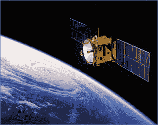

# 卫星系统介绍

> 原文：<https://www.javatpoint.com/satellite-systems-introduction>

*   卫星是有意放入任何天然卫星轨道的人造物体。卫星用于许多目的，即天气预报、数字传输、科学研究和开发等。
*   在通信方面，卫星是一种专门的无线发射器/接收器，由火箭发射并放置在环绕地球的轨道上。
*   卫星可以是天然的，比如月球，也可以是人造的。所以我们可以说卫星是一个绕着一颗行星以弯曲路径运动的物体。

*   卫星可以绕行星或恒星如太阳运行。所有的行星都是围绕太阳的卫星。
*   远离地球表面的卫星可以覆盖地球表面的广大区域。
*   月球是地球最初的天然卫星，有许多人造卫星，例如:人造卫星、回声卫星和同步卫星。

* * *