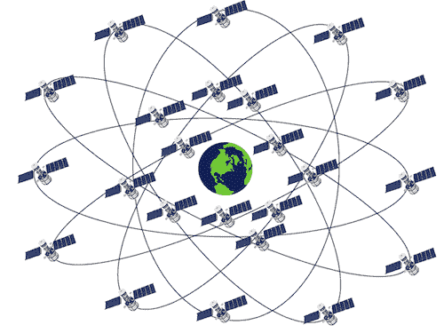
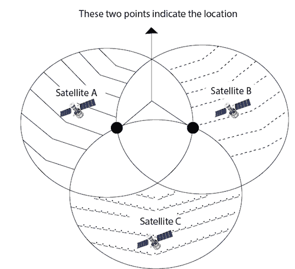

# 全球定位系统

> 原文：<https://www.javatpoint.com/global-positioning-systems>

全球定位系统，被广泛称为全球定位系统，自第二次世界大战以来一直非常重要。

虽然最初的重点主要是军事目标、车队管理和导航，但随着无线电定位的优势扩展到(但不限于)追踪被盗车辆并引导平民前往最近的医院、加油站、酒店等，商业用途开始变得相关。

一个全球定位系统由 24 颗轨道卫星组成的网络组成，称为 **NAVSTAR** (带有时间和测距的导航系统)，它们被放置在空间的六个不同轨道路径上，每个轨道平面上有四颗卫星，并且在它们的信号光束下覆盖整个地球。

这些卫星的轨道周期是 12 小时。

卫星信号可以在世界任何地方和任何时间接收。

卫星的间距是这样安排的，从地球上的每一点看，至少有五颗卫星。

第一颗全球定位系统卫星于 1978 年 2 月发射。

每颗卫星预计寿命约为 7.5 年，替代卫星不断被建造并发射到轨道上。

每颗卫星的高度约为 10，900 海里，重量约为 862 公斤。

包括太阳能电池板在内，这些卫星延伸到大约 5.2 米(17 英尺)的空间。每颗卫星以三种频率发射信号。

全球定位系统基于一个众所周知的概念，称为**三角测量技术**。

考虑将全球定位系统接收器放置在一个假想的球体上。假想球体的半径等于卫星“A”与地面接收器的距离(以卫星“A”为球体中心)。

现在，全球定位系统接收器 MS 也是另一个假想球体上的一个点，第二颗卫星“B”位于其中心。我们可以说，GPS 接收器在这两个球体相交形成的圆上的某个地方。

然后，通过测量与第三颗卫星“C”的距离，接收器的位置被缩小到圆上的两个点，其中一个点是虚构的，并从计算中消除。因此，从三颗卫星测量的距离足以确定全球定位系统接收器在地球上的位置。

## 全球定位系统的历史

*   1957 年的今天，苏联发射了人造卫星一号。
*   20 世纪 60 年代——美国海军用卫星导航跟踪美国潜艇。
*   1978 年的今天，NAVSTAR 一号全球定位系统卫星发射。
*   1983 年的今天，在韩国航空 007 航班被击落后，美国宣布将 GPS 用于民用。
*   1989 年的今天，麦哲伦推出了第一台手持 GPS 设备 NAV 1000。第一颗 Block II 卫星发射。
*   1993 年的今天，由 24 颗卫星组成的星座系统投入运行。
*   1995 年的今天，全面作战能力(FOC)被宣布。
*   2000 年-选择性供货被美国政府终止。
*   2004 年的今天，高通在手机上成功完成了实时辅助全球定位系统的测试。
*   2008 年的今天，Block II 卫星发射。
*   2016 年的今天，全球定位系统 IIF 卫星发射。

## 全球定位系统的受益者

*   开始时，购买了 1000 多台便携式商用全球定位系统接收机用于军事用途。
*   它们由士兵携带，附着在车辆、直升机和飞机仪表板上。
*   全球定位系统接收器被用于多架飞机，包括 B-2 轰炸机和 F-16 战斗机等。海军舰艇将它们用于会合、扫雷和飞机行动。
*   全球定位系统已经成为所有军事行动和武器系统的重要组成部分。此外，全球定位系统有利于非军事行动。
*   卫星上使用全球定位系统来获得高度精确的轨道数据，并控制航天器的方位。
*   全球定位系统在陆地、海洋和空中有各种各样的应用。
*   除了室内和由于自然或人为障碍物而无法接收全球定位系统信号的地方，全球定位系统可以在任何地方使用。
*   军用和商用飞机都使用全球定位系统进行导航。商业渔民和船夫也用它来辅助航行。
*   全球定位系统提供的精确定时能力被科学界用于研究目的。全球定位系统使测量单位能够帮助测量人员相当快地设置他们的测量地点。
*   汽车赛车手、徒步旅行者、猎人、山地自行车手和越野滑雪者也将全球定位系统用于非商业目的。
*   全球定位系统也有助于提供紧急路边援助，通过允许事故受害者按下按钮将其位置传输到最近的反应中心。
*   全球定位系统也有助于拯救生命。许多警察、消防和紧急医疗服务单位正在使用全球定位系统接收器来确定离紧急情况最近的警车、消防车或救护车的位置，从而能够在死亡或生命情况下做出最快的反应。
*   汽车制造商正在提供由全球定位系统接收器引导的移动地图显示，作为新车的一种选择。

## 全球定位系统的局限性

*   有几个因素会在全球定位系统位置计算中引入误差，并阻止我们获得最佳精度。
*   全球定位系统误差的一个主要来源是，无线电信号的速度只有在真空中是恒定的，这意味着距离测量值可能随着大气中信号速度值的变化而变化。
*   我们知道，大气由电离层和对流层组成。已知对流层的存在主要由水蒸气组成)会由于温度和压力的变化而导致误差，并且已知电离层中的粒子会导致显著的测量误差(就像坏时钟的情况一样！).

### 影响全球定位系统定位精度的因素如下:

| 误差系数 | 精度等级(米) |
| 标准全球定位系统 | 差分全球定位系统
(DGPS) |
| 大气条件(对流层) | 0.5-0.7 | Zero point two |
| 大气条件(电离层) | 5-7 | Zero point four |
| 多径衰落和阴影效应 | 0.6-1.2 | Zero point six |
| 接收机噪声 | 0.3-1.5 | Zero point three |
| 选择性可用性 | 24-30 | Zero |
| 原子钟误差 | One point five | Zero |
| 星历误差 | Two point five | Zero |

* * *