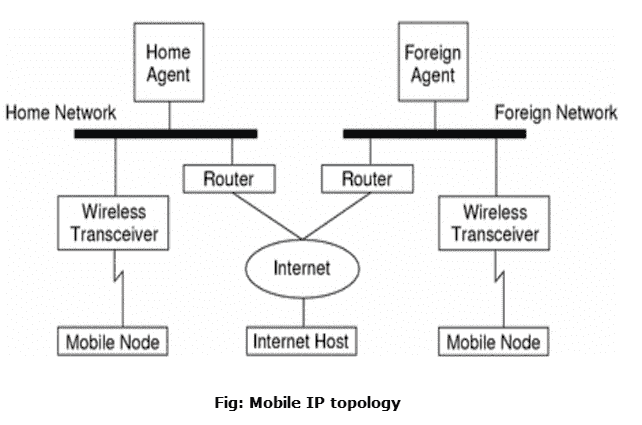
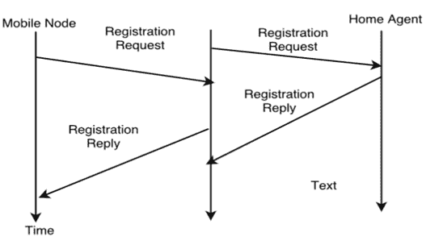

# 移动 IP

> 原文：<https://www.javatpoint.com/mobile-ip>

这是一个 **IETF(互联网工程任务组)**标准通信协议，旨在允许移动设备(如笔记本电脑、PDA、手机等。)用户从一个网络移动到另一个网络，同时保持他们的永久 IP(互联网协议)地址。

在 RFC(征求意见稿)2002 中定义，移动 IP 是互联网协议(IP)的增强，当移动设备(称为移动节点)通过家庭网络之外的网络进行连接时，它增加了向移动设备转发互联网流量的机制。

以下案例展示了数据报如何在移动 IP 框架内从一个点移动到另一个点。

*   首先，互联网主机使用移动节点的归属地址向移动节点发送数据报(正常的 IP 路由过程)。
*   如果移动节点在其归属网络上，则数据报通过正常的互联网协议过程被传送到移动节点。否则，本地代理将获取数据报。
*   如果移动节点在外地网络上，归属代理将数据报转发给外地代理。
*   外地代理将数据报传送到移动节点。
*   从移动网络到互联网主机的数据报是使用正常的 IP 路由过程发送的。如果移动节点在外部网络上，数据包将被传送到外部代理。FA 将数据报转发给互联网主机。

在无线通信的情况下，上面的图示描述了使用无线收发器向移动节点发送数据报。此外，互联网主机和移动网络之间的所有数据报都使用移动节点的归属地址，而不管移动节点是在归属网络上还是在外地网络上。转交地址(COA)仅用于与移动代理通信，互联网主机不会看到它。

## 移动 IP 的组成部分

移动 IP 有以下三个组件:

### 1.移动节点

移动节点是终端系统或设备，例如手机、PDA(个人数字助理)或笔记本电脑，其软件支持网络漫游功能。

### 2.本地代理人

归属代理为移动节点提供几种服务，并且位于归属网络中。去往移动节点的分组隧道从归属代理开始。归属代理维护一个位置注册表，即它被当前的 COA(转交地址)告知移动节点的位置。以下是实施高可用性的替代方案。

*   归属代理可以在负责归属网络的**路由器**上实现。这显然是最好的位置，因为如果不对移动 IP 进行优化，MN 的所有数据包无论如何都必须通过路由器。
*   如果改变路由器的软件是不可能的，归属代理也可以在子集中的任意节点**上实现。这种解决方案的一个最大缺点是，如果 MN 在外部网络中，数据包会双重穿越路由器。移动节点的分组通过路由器进入；高可用性通过隧道发送，隧道再次穿过路由器。**

### 3.外国代理人

外地代理可以在其访问外地网络期间向移动节点提供若干服务。FA 可以让 COA(转交或地址)充当隧道端点，并将数据包转发给 MN。外地代理可以是移动网络的默认路由器。

外地代理也可以提供安全服务，因为它们属于外地网络，而不是只访问的 MN。

简而言之，FA 是一种路由器，当移动节点漫游到外地网络时，它可以充当移动节点的连接点，将分组从归属代理传送到移动节点。

### 4.转交地址

转交地址从 IP 的角度定义了移动节点的当前位置。发送到移动网络的所有 IP 包都被传送到 COA，而不是直接传送到移动网络的 IP 地址。朝向移动节点的分组传递是使用隧道完成的。更准确地说，COA 标记了隧道的端点，即数据包离开隧道的地址。

转交地址的位置有两种不同的可能性:

1.  **外地代理 COA:**COA 可以位于外地代理，即 COA 是外地代理的 IP 地址。外地代理是隧道端点，将数据包转发给移动网络。许多使用 FA 的 MN 可以共享这个 COA 作为公共 COA。
2.  **协同定位的 COA:** 如果 MN 临时获取了一个充当 COA 的附加 IP 地址，那么 COA 就是协同定位的。这个地址现在在拓扑上是正确的，隧道端点在移动节点上。可以使用 DHCP 等服务获取同处一地的地址。与这种方法相关的一个问题是，如果 MNs 请求 COA，需要额外的地址。考虑到 IPv4 地址的稀缺，这并不总是一个好主意。

### 5.通信节点

沟通至少需要一个伙伴。通信节点代表移动网络的这个伙伴。通信节点可以是固定或移动节点。

### 6.家庭网络

归属网络是移动网络相对于其 IP 地址所属的子集。该网络不需要移动 IP 支持。

### 7.国外网络

外地网络是 MN 访问的当前子集，而不是归属网络。

## 移动 IP 的进程

移动 IP 流程有以下三个主要阶段，它们是:

### 1.代理发现

在代理发现阶段，HA 和 FA 通过使用 ICMP 路由器发现协议(IROP)在网络上通告它们的服务。

移动 IP 定义了两种方法:代理广告和代理请求，它们实际上是路由器发现方法加上扩展。

*   **代理广告:**对于第一种方法，FA 和 HA 使用特殊的代理广告消息周期性地通告他们的存在。这些消息广告可以看作是广播到子网中的信标。对于该广告，根据 RFC 1256 的互联网控制消息协议(ICMP)消息与一些移动性扩展一起使用。
*   **代理请求:**如果不存在代理广告或者到达间隔时间太高，并且 MN 没有接收到 COA，则移动节点必须发送代理请求。这些招标再次基于 RFC 1256 路由器招标。

### 2.登记

注册的主要目的是通知本地代理正确转发数据包的当前位置。

根据 COA 的位置，注册可以通过两种方式完成。

*   **如果 COA 在 FA** 处，MN 将其包含 COA 的注册请求发送给 FA，FA 将该请求转发给 HA。现在，高可用性建立了一个包含移动节点的归属 IP 地址和当前 COA 的**移动绑定**。

此外，移动性投标包含在注册过程中协商的注册寿命。注册在生存期后自动过期并被删除；所以移动节点应该在到期前注册。在建立移动性绑定之后，高可用性将回复消息发送回 FA，FA 将其转发给 MN。

*   **如果 COA 在同一地点**，注册可以非常简单。移动节点可以直接向高可用性发送请求，反之亦然。顺便说一下，这也是 MNs 返回其归属网络的注册过程。

### 3.开挖隧道

隧道用于在隧道入口和隧道端点之间为数据包建立虚拟管道。进入隧道的数据包在隧道内转发，不改变隧道。隧道，即通过隧道发送数据包是在封装的帮助下实现的。

隧道也称为“T0”端口转发“T1”是指仅在私有网络(通常是公司网络)中通过公共网络使用的传输和数据。

* * *