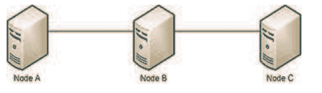
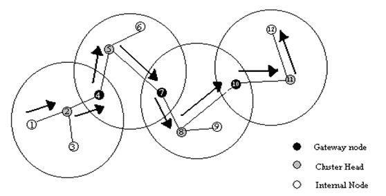
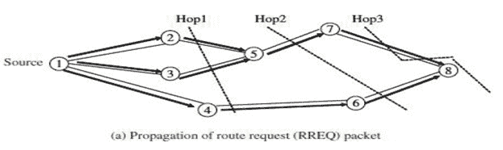
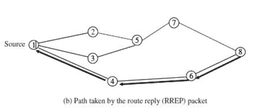

# 选择途径

> 原文：<https://www.javatpoint.com/mobile-communication-routing>

路由是为网络中或跨多个网络的流量找到最佳路径的过程。路线的作用类似于酒店的路线图。在这两种情况下，我们都需要在适当的位置以适当的方式传递信息。

移动自组织网络中的路由取决于许多因素，例如:

*   拓扑建模，
*   路由器的选择，
*   路由请求的发起，
*   以及具体的潜在特征，这些特征可以作为有效寻找路径的启发。

在移动自组网中，每个节点或设备都被期望充当路由器，并且从所有路由器执行相同的路由算法来计算通过整个网络的路径的意义上来说，每个路由器与另一个路由器是无法区分的。

## 路由需求

路由有以下需求:

*   由于在动态甚至小型网络中集中路由是不可能的，因此路由计算必须是分布式的。
*   路由计算不应该增加太多节点。
*   如果任何主机要求路由，它们必须能够快速访问。
*   全局状态的维护不应涉及路由计算。
*   每个节点都应该关心其路由的目的节点，并且不应该参与网络中那些没有流量的部分的频繁拓扑更新。
*   由于广播对于移动自组网来说可能很耗时，因此必须尽可能避免。
*   在路由中，当主路由失效时，必须有备用路由。

## 路由分类

路由协议可以分为:

1.  主动协议
2.  反应协议
3.  混合协议

### 1.主动协议

主动协议试图持续评估网络中的路由。这意味着主动协议持续维护路由信息，因此当数据包需要转发时，路径已经知道，可以立即使用。距离矢量协议系列是主动方案的一个例子。

主动方案的优点是，每当需要路由时，确定路由的延迟可以忽略不计。

不幸的是，在移动自组网环境中维护路由表是一个很大的开销。因此，这种类型的协议具有以下常见缺点:

*   需要更多的数据来维护路由信息。
*   重组网络的低反应和单个节点的故障。

### 2.反应协议

反应式协议不维护路由，而是仅在需要时调用路由确定过程，或者我们可以说反应式协议仅在需要时构建路由。因此，当需要路由时，会启动某种全局搜索过程。经典泛洪算法家族属于反应式协议组。反应式自组织网络路由协议的例子包括自组织按需距离矢量(AODV)和时间有序路由算法(TORA)。

**这些协议具有以下优点:**

*   不像主动协议那样需要大量开销来维护全局路由表。
*   对网络重组和节点故障反应迅速。
    尽管反应式协议已经成为 MANET 路由的主流，但它们仍然存在以下缺点:
*   路由查找的延迟时间很长
*   过度泛滥会导致网络堵塞。

### 3.混合协议

混合协议试图利用反应式和主动式方案的优势。这种协议背后的基本思想是按需启动路由发现，但搜索成本有限。区域路由协议是一种流行的混合协议。

**路由协议也可以分类如下:**

1.  表驱动协议
2.  源启动的按需协议

### 1.表驱动路由协议

*   这些协议被称为表驱动协议，因为每个节点都需要维护一个或多个包含网络中每隔一个节点的路由信息的表。
*   它们本质上是**主动的**，因此路由信息总是一致的和最新的。
*   协议通过在网络中传播更新吞吐量来响应网络拓扑的变化，以便每个节点都能一致地看到网络。

表驱动路由协议分类如下:

### 目的地排序的距离矢量路由

*   目的地顺序距离矢量路由(DSDV)是一种基于 Bellman-Ford 算法的表驱动路由协议。
*   DSDV 是由 c .帕金斯和 p .巴格瓦特在 1994 年开发的。该算法的主要贡献在于，即使在路由表中存在环路的情况下，该算法也能正常工作。
*   正如我们所知，每个移动节点都维护一个路由表，其中包含到网络中每个可能目的地的路由以及到目的地的跳数。
*   表中的每个条目都包含目标节点分配的序列号。
*   序列号允许节点区分陈旧路由和新路由，并有助于避免形成路由环路。
*   **新的路由广播包含:**
    *   目的地址。
    *   到达目的地所需的跳数。
    *   接收到的关于目的地的信息的序列号和广播特有的新序列号。
*   如果同一目的地有多条路线可用，则使用具有最新序列号的路线。如果两个更新具有相同的序列号，则使用度量较小的路由来优化路由。

例如，来自上述网络的节点 A 的路由表为:

| 目的地 | 下一跳 | 啤酒花数量 | 序列号 | 安装时间 |
| A | A | Zero | A46 | 001000 |
| B | B | one | B36 | 001200 |
| C | B | Two | C28 | 001500 |

基本上，该表存储了节点 A 可到达的所有可能路径的描述，以及跳数、跳数、序列号和安装时间。

**优势**

*   目的地排序距离矢量路由是早期可用的算法之一。它适用于创建节点数量较少的自组织网络。

**劣势**

*   目的地顺序距离矢量路由需要定期更新其路由表，即使在网络空闲时，也会使用更多的电池电量和少量的带宽。
*   该算法不适用于高动态网络。

### 簇头网关交换机路由

*   Cluster (ch) gateway switch routing (CGSR) protocol is different from destination sequential distance vector routing in addressing type and network organization scheme.
*   CGSR uses cluster heads instead of flat networks, and the cluster heads control a group of specific nodes, thus realizing the hierarchical framework of inter-cluster code separation, routing, channel access and bandwidth allocation.
*   The identification of suitable clusters and the selection of cluster heads are quite complicated. Once the cluster is defined, it is necessary to use distributed algorithm to select a node as the cluster head in the cluster.
*   The disadvantage of using cluster head scheme is that frequent changes will adversely affect the performance, because nodes spend more time selecting cluster heads instead of relaying packets. Therefore, every time the cluster members change, the minimum cluster change clustering algorithm is used instead of CH selection. With life cycle control, the life cycle will only change when two life cycles are in contact, or when a node is out of contact with all other life cycles.

*   In this scheme, each node must maintain a cluster member table (CMT), which stores the destination ch of each node in the network. The node uses DSDV algorithm to broadcast the cluster member table regularly.
*   When a node receives such a table from its neighbor, it can update its own information. As expected, each node also maintains a routing table to determine the next hop needed to reach any destination.

### 无线路由协议(WRP)

无线路由协议是一种面向移动自组网的主动单播路由协议。它使用距离矢量路由协议的增强版本，该协议使用贝尔曼-福特算法来计算路径。

对于无线路由协议(WRP)，每个节点维护 4 个表:

*   距离表
*   路由选择表
*   链接成本表
*   消息重传列表(MRL)表

消息重发列表中的每个条目都有一个更新消息的序列号、一个重发计数器、一个每个邻居一个条目的确认要求标志向量以及一个在更新消息中发送的更新列表。当任何节点收到来自新节点的 hello 消息时，它会将新节点添加到其路由表中，并向新节点发送其路由表的副本。节点必须在一定时间内向其邻居发送消息，以确保连通性。

**优势**

*   WRP 的优势与 DSDV 相似。此外，它具有更快的收敛速度和更少的表更新。

**劣势**

*   维护多个表的复杂性要求移动自组网中的节点具有大量的内存和更大的处理能力。
*   由于其可扩展性有限，因此 WRP 不适合高度动态和非常大的自组织无线网络。

### 2.源启动的按需协议

*   与表驱动路由不同，源发起的按需路由本质上是**反应式的**。这种类型的协议仅在源需要时才生成路由。
*   换句话说，当源节点需要到目的地的路由时，源节点在网络中启动路由发现过程。当发现一条通往目的地的路线或检查了所有可能的路线但没有成功时，此过程结束。
*   发现的路线由路线维护程序维护，直到不再需要或目的地变得不可访问。

按需启动的来源路由分类如下:

### 按需距离矢量路由(AODV)

*   AODV 协议是一种用于移动自组织网络和其他无线自组织网络的路由协议。
*   它是一种反应式路由协议；这意味着它只在需要时才建立到达目的地的路线。
*   AODV 路由建立在 DSDV 算法之上。这是对 DSDV 的重大改进。
*   不在特定路径上的设备不维护路由信息，也不参与路由表交换。
*   当源需要向目的地发送消息，但没有到达目的地的有效路由时，源会启动路由发现过程。
*   源向其所有邻居发送路由请求(RREQ)分组，后者将该请求转发给其所有邻居，以此类推，直到到达目的地或具有到目的地的“足够新”路由的中间移动(节点)。

上图说明了广播请求(RREQs)在网络中的传播。因为在 DSDV，目的地序列号用于确保所有路线都没有环路，并且包含最新的路线信息。每个节点都有一个唯一的序列号和一个广播标识，每次节点发起 RREQ 时，该标识都会递增。

广播标识与节点的 IP 地址一起，唯一地标识每个 RREQ。

只有当中间移动站有一条到目的地的路由，其序列号大于或至少等于 RREQ 中包含的序列号时，中间移动站才会回复。为了优化路由性能，中间节点记录地址。

从上图中可以看出，由于 RREP(路由回复数据包)在反向路径上返回，因此该路径上的节点会设置其正向路由条目，以指向刚刚接收到 RREP 的节点。这些前向路由记录指示活动的前向路由。RREP 继续沿着反向路径返回，直到到达路由发现的发起者。因此，AODV 只能支持使用对称链路。

### 动态源路由(DSR)

*   动态源路由是基于源路由的按需路由协议。
*   它与 AODV 非常相似，当传输计算机请求时，它会按需形成一条路由。但是，它使用源路由，而不是依赖每个中间设备的路由表。对动态源路由进行了许多连续的改进。
*   该协议分为两个主要阶段:
    *   路由发现
    *   路线维护
*   当节点有消息要发送时，它会联系路由缓存，以确定它是否有到目的地的路由。如果存在到目的地的活动路由，它将用于发送消息。
*   否则，节点通过广播路由请求分组来发起路由发现。路由请求存储目的地址、源地址和唯一标识号。
*   接收路由请求的每台设备都会检查是否有到达目的地的路由。如果没有，它会将自己的地址添加到数据包的路由记录中，然后在其传出链路上重新广播数据包。
*   为了最大限度地减少广播次数，移动设备只有在以前没有看到过数据包，并且自己的地址不在路由记录中的情况下才会重播数据包。

* * *