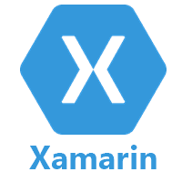

# Xamarin教程

> 原文：<https://www.javatpoint.com/xamarin>

Xamarin 教程提供了 xamarin 的基本和高级概念。Xamarin Forms 是一个允许开发人员快速创建跨平台用户界面的框架。

Xamarin 表单允许我们在 ios、Android 和 Windows 上创建本机控件。

我们的 xamarin 教程包括所有的主题，包括 xamarin 的介绍、xamarin 的安装、xamarin 表单、xamarin 布局、xamarin 视图、xamarin vs ionic 等。

## Xamarin 是什么？

Xamarin 是一家软件公司，起源于 2011 年。Xamarin 最近在 2016 年被微软收购。Xamarin 为开发人员提供了可用于跨平台移动应用程序开发的全套工具。

这是一个使用 C#开发跨平台移动应用的框架。有各种框架提供跨平台应用程序开发。它使用 HTML 和 JavaScript。使用这些框架，我们可以使用 JS 库开发像移动应用网站这样的应用，网站被打包在一个容器中，给人一种本地应用的感觉。

Xamarin 与众不同，因为它提供了单一语言 C#和运行时，可在三个移动平台(Android、iOS 和 Windows)上运行。通过 Xamarin，我们开发了一个外观和感觉完全是原生的移动应用。在 Xamarin 中，我们编写了一个 C#代码库，它可以访问本机 SDK 可用的所有功能。

Visual Studio 很容易下载 Xamarin 工具。要在 Windows 上使用 Xamarin，我们需要安装 Visual Studio，它可能是免费版本，也可能是高级许可证。之后，我们需要对其进行配置。

## 先决条件

在学习 Xamarin 之前，我们应该有 C#和 XAML 语言的基础知识。

## 观众

我们的 Xamarin 教程是为初学者和专业人士设计的。

## 问题

我们向您保证，您在 Xamarin 教程中不会发现任何问题。但是如果有任何错误，请在联系表格中发布问题。

* * *