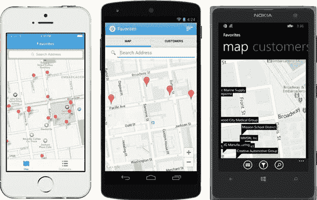
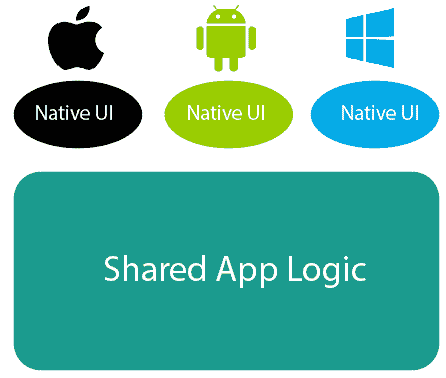
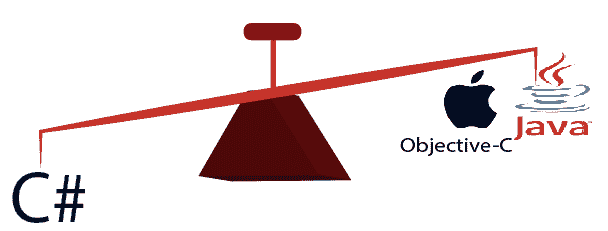

# Xamarin 简介

> 原文：<https://www.javatpoint.com/what-is-xamarin>

Xamarin 是一家成立于 2011 年的软件公司。微软最近在 2016 年收购了 Xamarin。Xamarin 为开发人员提供了广泛的工具，可用于跨平台移动应用程序的开发。

这是一个使用 C#开发跨平台移动应用程序的框架。有各种各样的框架，提供跨平台的应用开发。他们使用 HTML 和 JavaScript。在这个框架的帮助下，我们可以使用 JS 库为移动应用开发像网站这样的应用。网站装在一个容器里，给人一种原生应用的感觉。

Xamarin 与众不同，因为它提供了单一语言 C#和运行时，可在三个移动平台(Android、iOS 和 Windows)上运行。通过 Xamarin，我们开发了一个外观和感觉完全是原生的移动应用。在 Xamarin 中，我们编写了一个 C#代码库，可以访问本机 SDK 的所有功能。

要用 Visual Studio 下载，Xamarin 工具很容易获得。要在 Windows 上使用 Xamarin，我们需要安装 Visual Studio，它可能是免费版本，也可能是高级许可证。之后，我们需要对其进行配置。

[安装 Xamarin](installation-of-xamarin)

## 跨平台

对于移动、平板和桌面应用，Xamarin 提供了跨平台开发解决方案。

构建移动应用程序就像打开集成开发环境、编写和测试应用程序并提交到应用商店一样简单。它涉及一个过程，包括前期设计、可用性测试、成千上万台设备上的质量保证测试、完整的测试生命周期，然后以几种不同的方式进行部署。

当我们思考如何构建安卓和 iOS 应用程序时，许多人认为本地语言、objective-C、Swift、Java 和 Kotlin 是唯一的选择。

Xamarin 允许我们使用类库和运行时在 C#中开发，它可以在包括 ios、Windows 和 Android 在内的所有平台上工作。

Xamarin 结合了本机平台的所有能力，并添加了几个自己的强大功能，它们是:

**1)SDK 的完全绑定:** Xamarin 包含安卓和 iOS 上所有 SDK 的绑定。这些绑定是强类型的，这意味着它们易于导航和使用。Xamarin 在编译时和开发期间提供了健壮的类型检查。它导致运行时错误的减少和更高质量的应用。

**2) Objective-C、Java、C 和 C++互操作:** Xamarin 提供了直接调用 Objective-C、Java、C 和 C++库的工具。它让我们能够使用大量已经创建的第三方代码。有了这个，我们可以利用现有的用 Objective-C、Java 或 C/C++编写的 iOS 和 Android 库。此外，Xamarin 提供了绑定项目，这允许我们使用声明性语法高效地附加本机 Objective-C 和 Java 库。

**3)现代语言构造:** Xamarin 应用程序是用 C#编写的。C#是一种现代语言，它包含了对 Objective-C 和 Java 的重大改进。它包括*动态语言特性、诸如* Lambdas *的函数构造、LINQ、并行编程特性、复杂的*泛型等等。

**4)惊人的基类库:** Xamarin 应用程序使用。NET 密件抄送。一个广泛的类集合，具有全面和精简的特性，如强大的 XML、数据库、序列化、字符串、输入输出、网络支持等。现有的 C#代码可以被编译用于一个应用程序，该应用程序提供了对成千上万个库的访问，允许我们做 BCL 中没有涉及的事情。

**5)现代集成开发环境(IDE):** Xamarin 在 Windows 上使用 Visual Studio，在 macOS 和上使用 Visual Studio for Mac。这两个都是现代 IDEs。这些功能包括代码自动完成、复杂的项目和解决方案管理系统、全面的项目模板库、集成的源代码控制以及许多其他功能。

**6)移动跨平台支持:** Xamarin 为 iOS、Android 和 Windows 三大移动平台提供了完善的跨平台支持。应用程序可以被编写为共享高达 90%的代码。移动库提供了一个统一的应用编程接口来访问所有三个平台上的共享资源，因为它降低了移动开发人员的开发成本和上市时间。它瞄准了三个最受欢迎的移动平台。

> *Xamarin 最强大最全面的功能集就是为应用开发者填补了一个名额。他们想用现代的语言和平台来开发跨平台的移动应用。*

## Xamarin 的需求

Xamarin 结合了原生平台的所有功能，也包含了自己的特性。

*   Xamarin 应用程序是使用 C#开发的。C#是一种现代语言，它比 Objective-C 和 Java 有许多改进。
*   Xamarin 提供了直接包含 Objective-C、Java 和 C++库的工具。它使我们能够重用所有第三方代码库，它们是 Java、Objective-C 或 C++。
*   Xamarin 为三大移动平台(安卓、iOS 和 Windows)提供跨平台支持。应用程序可以共享 90%的代码库。
*   Xamarin 减少了移动应用程序开发的时间和成本。
*   Xamarin 提供了大量类库的集合。
*   Xamarin 提供了强大的编译时检查。它将导致更少的运行时错误和高质量的应用程序。

## Xamarin 的工作

Xamarin 提供两种商业产品:Xamarin。两者都建立在开源版本的 Mono 上。NET 框架，该框架基于已发布的。NET ECMA 标准。MONO 几乎和。NET 框架本身，运行在所有可以想象的平台上，包括 Linux、Unix、FreeBSD 和 macOS。

Xamarin 已经将安卓和 iOS 的 SDK 全部转换为 C#以使开发者熟悉。我们可以很容易地为两个平台使用同一个代码库，而无需一直记住不同语言的语法。用户界面保持不变。Xamarin 为两个平台分别构建，然后必须由共享的代码库来限定。以下是创建用户界面的两种方法。首先是使用原始的本机方法来构建用户界面。另一种是使用 **Xamarin。表格**。这些表单可以用来同时为不同的平台制作用户界面，如果选择它们而不是原生用户界面技术，则可以实现 100%的代码共享。当所有的用户界面工作完成后，最具挑战性的阶段是将用户界面连接到代码库。可以使用两种代码共享方法再次实现这种连接，这两种方法是:

1.  共享项目
2.  可移植类库。

## Xamarin 的特点

*   Xamarin 支持安卓穿戴和苹果手表等可穿戴设备。通过从**xamarico 组件商店**下载简单的插件，这些可穿戴设备在其本地应用中的功能被包括在内。
*   流行的插件是跨平台的，例如文本到语音和电池状态。特定于平台的插件也可以在 Xamarin 组件商店中找到，比如谷歌游戏计费支持插件。
*   基于 Xamarin 的跨平台应用程序可以很容易地与大多数流行的后端平台(如 Parse、微软 Azure 等)结合在一起。
*   Xamarin 中的应用程序索引允许这些应用程序出现在搜索结果中，用户使用几次后，这些应用程序通常会被遗忘。

> *Xamarin 移动应用开发提供了一个可想象的跨平台解决方案，可以跨多个操作系统和设备工作。自推出以来，Xamarin 被用作强大的跨平台应用程序开发平台，有助于为所有设备系统构建单一应用程序。但是，Xamarin App 开发有利有弊:*

## Xamarin 的优势

### 1)快速的应用开发周期

Xamarin App 开发平台最关键的部分是它包含了可重用的代码，其中 90%可以回收用于各种平台的应用开发。编码基于 C#语言和。网络图书馆。因为开发人员可以重用大量原始 Xamarin 代码来跨不同平台创建应用程序。由于简化了不同操作系统之间的代码共享，用户缩短了产品开发生命周期。

### 2)应用

任何应用程序的解决方案都是原生设计。这就是 Xamarin 及其独特方法出现的时候。Xamarin Studio 提供了原生用户界面的优势、对特定设备功能的访问以及最重要的原生性能。在不同平台之间共享代码是一项简单的任务，这有助于我们缩短开发生命周期。

### 3)共享应用逻辑

除了 Native UI 之外，Xamarin 最强大的特性是共享的，即 app 逻辑，这使得它成为最有用、最好用的跨平台开发工具。UI 层底层的应用程序逻辑，如输入验证、web 服务调用、数据库交互和后端企业集成，都用 C#编码一次。开发人员可以跨各种操作系统共享 75%的代码。它节省了在应用程序中记录的时间，并且出现错误的机会更少。

### 4)应用编程接口集成

Xamarin 绑定了相同的应用编程接口和用户界面控件，用于以各自特定于平台的语言构建 iOS、Android 和 Mac 应用程序。对于 windows 开发，Xamarin 结合微软 Visual Studio 提供了 windows 手机和 Windows 应用程序。使用可移植类库(PCL)和适当的应用程序架构，在 iOS、Android 和 Windows 之间共享代码。有了 Xamarin，支持就一直存在。这些独特的绑定技术使我们能够在设备的操作系统中提供对新功能的支持。点击各自的平台链接，获取最新的 iOS 8 和 Android L 支持包(支持可穿戴)。

### 5) Xamarin 组件存储

Xamarin 相信协作和组件共享。开发人员可以选择免费或付费的主机组件，包括用户界面控件、跨平台库和第三方网络服务，也可以选择只需几行代码的应用程序。组件存储是在 Xamarin 工作室和 Xamarin 的 Visual Studio 扩展中构建的。

### 6)c#的优势

C#是一种简单、现代、通用、类型安全、纯面向对象的编程语言。作为面向对象的，它是 C++的现代版本，允许简单的数据类型作为对象。C#的类型安全有助于防止类型错误。其简化的语法允许使用指针和标题。命名空间和引用运算符由句点替换。C#是跨平台开发的优秀编程语言。

## Xamarin 的缺点

### 1)不可避免的软件开销

尽管事实如此，Xamarin 移动应用程序开发通过为所有平台创建一个应用程序来节省时间。另一方面，它还涉及使用中的不同设备的目标操作系统环境之间的代码和引用的链接。Net 框架表明，这增加了启动和下载应用程序的时间。

### 2)用户界面开发的耗时性

时间成为 Xamarin 平台上 UI 开发必不可少的东西。Xamarin 提供了跨设备平台目标重用代码的工具。很难创建核心 UI 的可移植版本。这就是为什么 Xamarin 应用程序开发专家会为一个独立的平台彻底执行部分编码，这是一个耗时的过程。

### 3)应用文件大小问题

由于使用了 Xamarin 的核心库和错误应用文件大小的应用商店的功能，Xamarin 占用了更多的时间来存储应用文件大小。商店里的大小差距可能从 3MB 到 15MB 不等。

## 结论

Xamarin 也被称为跨平台应用开发之王。所有的丰富特性和由此带来的好处都指向跨平台的本机应用程序。除了 Xamarin 的优势之外，它还拥有 70，000 多名开发人员组成的不断增长的社区，他们不断协作和增强软件。

* * *