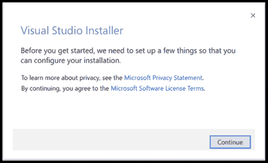

# Xamarin 的安装

> 原文：<https://www.javatpoint.com/installation-of-xamarin>

## 使用 Visual Studio 2019 安装 Xamarin

在这里，我们将学习如何在我们的电脑上安装 Xamarin。微软 Visual Studio 允许我们使用 C#和. Net 为 iOS 和安卓构建本地移动应用程序。开发使用 Xamarin 完成。Xamarin 应用程序是使用 Visual Studio 创建的。

**用 Visual Studio 安装 Xamarin 的步骤**

**安装 Visual Studio**

**第一步:**确保我们的电脑已经为 Visual Studio 做好准备

要下载 Visual Studio，我们应该关注在系统中安装 Visual Studio 的系统需求。

以下是产品支持最低系统要求是:

*   Visual Studio 企业版 2019
*   visual Studio Team Foundation Server Office 集成 2019
*   Visual Studio 专业版 2019
*   Visual Studio 社区 2019

| 支持的操作系统 | Visual Studio 2019 安装并运行在以下操作系统上(建议 64 位)。

*   Windows 10 1703 version 1703 or later: education, family, major and enterprise

Windows 8.1:核心、专业和企业
Windows Server 2012 R2:基本、标准和数据中心
Windows 7 SP1(带最新 Windows 更新):家庭高级版、专业版、企业版、终极版。 |
| 五金器具 | 

*   1.8 GHz or faster processor. Four or better recommendations
*   2GB memory; It is recommended to use 8GB of memory (if running on a virtual machine, the minimum is 2.5 GB).
*   Hard disk space: 800 MB minimum and 210 GB maximum available space, depending on the installed functions; Typical installation requirements
*   Hard disk speed: To improve performance, install Visual Studio and Windows on solid state disk (SSD).
*   The graphics card supports a minimum display resolution of 720p. Visual Studio will work best at WXGA (1366 times 768) or higher.

 |
| 支持的语言 | Visual Studio 提供英语、中文(简体)、中文(繁体)、捷克语、法语、德语、意大利语、日语、韩语、波兰语、葡萄牙语(巴西)、俄语、西班牙语和土耳其语版本。
我们可以在安装时选择 visual Studio 的语言。 |
| 附加要求 | 管理员需要安装 Visual Studio。
。安装 Visual Studio 需要. Net Framework 4.5。Visual Studio 要求。NET Framework 4.7.2，它将在安装过程中安装。
。NET Core 对于 windows 8.1 有特定的 Windows 先决条件。
Windows 10 企业版 LTSC 版，不支持 Windows 10 版进行开发。我们可能会使用 Visual Studio 2017 来构建在 windows 10 LTSC 和 Windows 10S 上运行的应用程序。
互联网相关场景需要 Internet Explorer 11 或 edge。除非安装了这些或更高版本，否则某些功能可能无法工作。
**对于仿真器支持**，需要 Windows 8.1 Pro 或企业版(x64)。还需要支持客户端 Hyper-V 和二级地址转换的处理器。
需要通用的 Windows 应用开发，包括编辑、设计和调试。
**Xamarin。安卓需要 64 位版本的 Windows 和 64 位 java 开发工具包(JDK)。**
Windows 7 上需要 Power shell 3.0 或更高版本才能安装带有 C++、JavaScript 或。净工作量。 |

**第二步:**下载 Visual Studio

接下来，下载 Visual Studio 引导程序文件。为此，请点击此链接[https://visualstudio.microsoft.com/downloads](https://visualstudio.microsoft.com/downloads)。选择 Visual Studio 的版本，选择“保存”，然后选择一个打开的文件夹。

**步骤 3:** 安装 Visual Studio 安装程序

运行引导程序文件以安装 Visual Studio 安装程序。这个轻量级安装程序包含了我们安装和定制 Visual Studio 所需的一切。

1)在下载文件夹中，双击与以下文件之一匹配或相似的引导程序:

*   **Vs_Community.exe** 适用于 Visual Studio 社区
*   **Vs_Professional.exe** 为 Visual Studio Professional
*   **Vs_Enterprise.exe** 适用于 Visual Studio Enterprise

如果我们收到用户账户控制通知，选择**是**。

2)接下来将显示确认微软许可条款

([https://visualstudio.microsoft.com/license-terms/](https://visualstudio.microsoft.com/license-terms/))和微软隐私声明([https://privacy.microsoft.com/en-GB/privacystatement](https://privacy.microsoft.com/en-GB/privacystatement))选择**继续**。

**步骤 4:** 选择工作负载

安装程序安装后，我们可以选择它，通过选择我们想要的功能集或工作负载来定制安装。以下是如何:

1)选择**移动开发。NET** 安装屏幕的工作量:

3)当我们准备开始 Visual Studio 2019 安装时，请单击右上角的安装按钮。

4)使用进度条监控安装:

5)Visual Studio 安装 2019 完成后，点击**启动**按钮，启动 Visual Studio:

* * *