# XamarinForms(跨平台)

> 原文：<https://www.javatpoint.com/xamarin-forms>

## Xamarin 的先决条件。表格(跨平台)

*   C#的基础知识
*   关于 Xaml 的一些知识

## 介绍

XamarinForms是 Xamarin 的一个特性。Xamarin 是流行的移动开发框架，它扩展了。网络开发平台，带有构建移动应用的工具和库。Xamarin。Forms 是微软收购的一个开源、跨平台框架，用于构建安卓、iOS 和 windows 应用程序。NET 从一个共享的代码库中。我们使用 XamarinForms内置页面、布局和控件，可通过高度可扩展的单一应用编程接口构建和设计移动应用。子类化任何控件来定制行为或定义我们的控件、布局、页面和单元格，以使我们的应用程序像素完美。

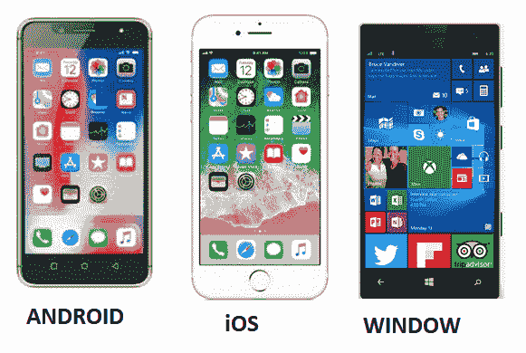

## Xamarin 形式结构

一开始，当我们打开任何设备、任何手机无论我们在屏幕上看到什么，可见区域都被称为**页面**。屏幕上所有可见的区域我们都认为它是一个页面，我们可以像只读存储器一样进行比较。然后我们如何构造页面上的东西，以及我们如何规划这些东西被称为**布局**。**视图**是我们将放在位置上的实际项目，或者我们将它们堆叠起来，放在左侧、右侧等。

## 视觉元素

在 Xamarin 中，显示在设备屏幕上的元素称为可视元素。在像手机这样的设备中，这些是可见的，或者我们可以看到的被称为视觉元素。

<u>**在 Xamarin 中有 4 个视觉元素。**T3】</u>

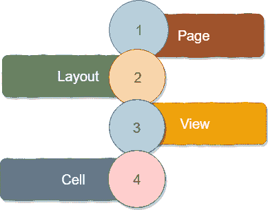

页

在一个设备中，从导航栏到屏幕末端称为**一页**。

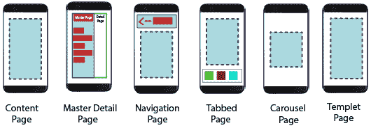

| 页 | 描述 |
| 内容页 | 内容页面包含一个视图。 |
| **主详细页** | MasterDetailPage 有两个页面窗格。母版页包含菜单，详细页包含内容。 |
| 导航页 | 导航页面包含导航栏。在导航页面中，我们将页面保存在堆栈上，并且可以从一个页面跳转到另一个页面。导航栏可以有导航按钮和标题。 |
| **选项卡式页面** | 选项卡页面是一个容器页面。选项卡式页面充当容器，保存与每个选项卡相关联的内容页面。 |
| **岩溶地貌** | 允许扫掠显示其他视图的页面。 |

**布局**

页面中的子元素称为**布局**

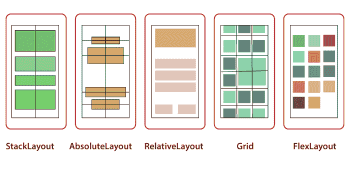

| 布局 | 描述 |
| **StackLayout** | 在 StackLayout 中，所有子元素都保持在一行中。StackLayout 是最常用的布局。 |
| **绝对自由** | 使用锚点定义位置和大小，将子布局定位在指定位置的视图。 |
| 相对布局 | 在 RelativeLayout 中，我们使用约束来相对于彼此定位元素。 |
| **网格** | 将多个视图排列成行和列，就像表格一样。 |

布局包含许多元素，称为**视图**。

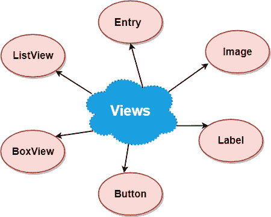

**细胞**

视图的子元素称为**单元格**。

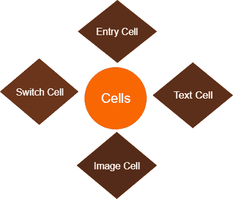

| 细胞 | 描述 |
| **虫草** | 该单元格包含标签和单行条目元素 |
| **开关小区** | 这个单元格和开关一样，但在此之前，有一个标签。 |
| **文本单元格** | 该单元格包含主字段和辅助字段。 |
| **图像单元** | 也包含图像的文本单元格 |

页

页面用于设计应用程序的屏幕。Xamarin 中有多种类型的“页面”。页面是一种父对象，它还包含一个子对象，可以是另一个页面或布局。一页占据了整个屏幕。

*   一页覆盖屏幕的整个区域。
*   页面包含布局和视图。
*   该应用程序可以有单个或多个页面。

**在 Xamarin 中，有六种类型的页面可用。**

*   内容页面
*   主详细信息页面
*   导航页面
*   选项卡式页面
*   模板页面
*   旋转木马页面

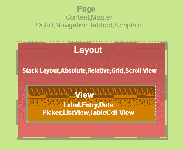

**内容页面**

内容页面在整个可见屏幕上显示单个视图或容器。

在这里，我们将借助 **Xamarin 研究**内容页面**的结构。Visual Studio 2017 中的表单**。

要在 Visual Studio 中创建页面，我们将遵循以下步骤。

### 页

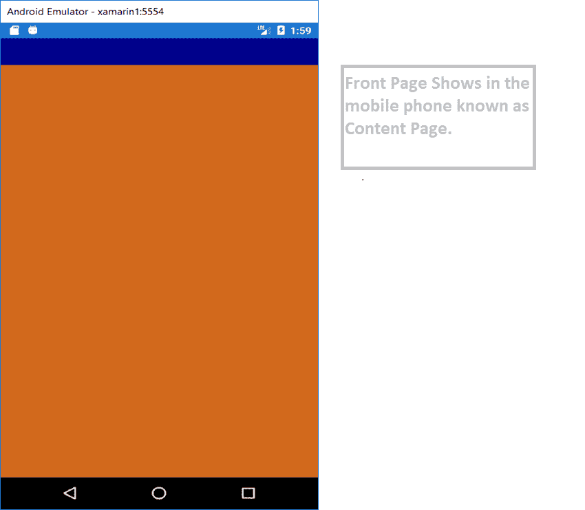

**创建内容页面的程序**

**点击文件- >新建- >项目**

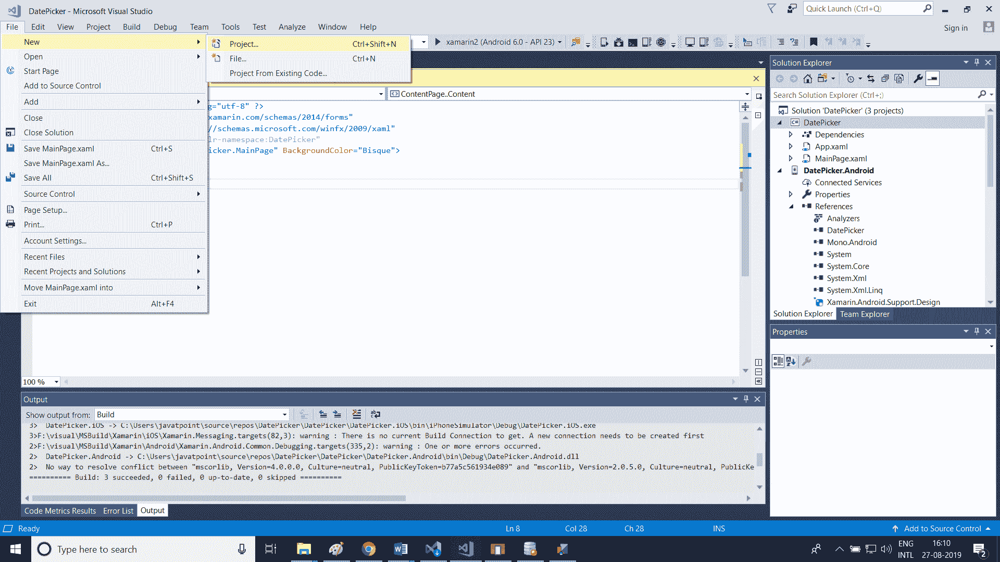

**点击 Visual C#- >选择跨平台- >选择手机 App (XamarinForms)**

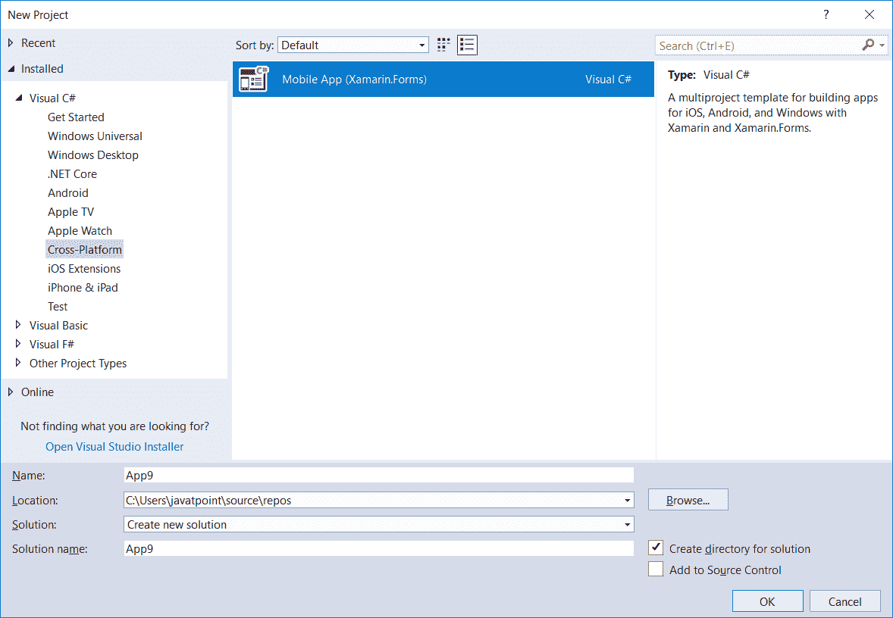

**给出应用名称- >点击确定**

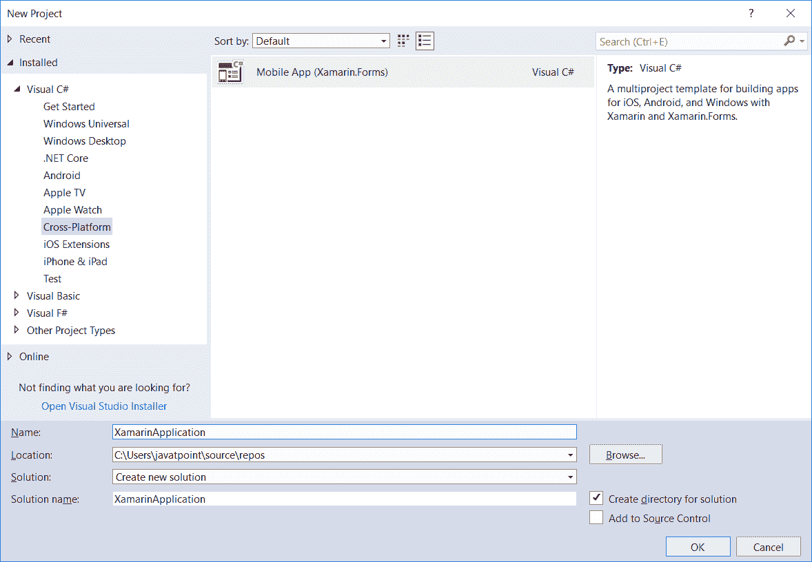

**选择空白模板创建 Xamarin 应用- >选择平台- >选择代码共享策略- >点击确定。**

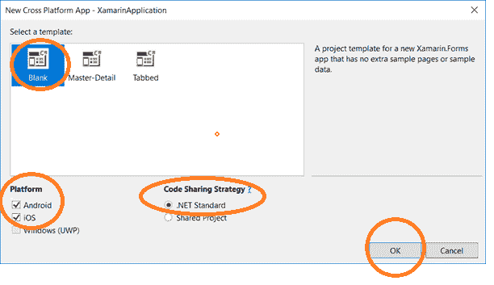

**打开解决方案浏览器- >点击主页。Xaml- >构建应用- >测试应用，点击安卓模拟器**

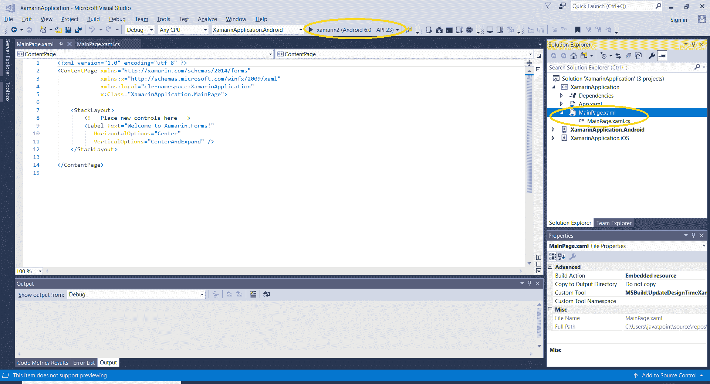

**输出**

**属性:**

在这里，我们将使用一些属性来增强页面的功能。

**边距:**边距属性表示元素与其相邻元素之间的距离。

**Padding:** Padding 表示元素与其子元素之间的距离，用于将控件与其自身内容分开。

### MainPage.XAML

```

<?xml version="1.0" encoding="utf-8" ?>
<ContentPage 
             xmlns:x="http://schemas.microsoft.com/winfx/2009/xaml"
             xmlns:local="clr-namespace:App15"
             x:Class="App15.MainPage" BackgroundColor="Aqua">
    <ContentPage.Content>
        <StackLayout Padding="10" Margin="30,20,20,10">
            <Entry Text="hey i am xamarin"></Entry>
            <DatePicker></DatePicker>
            <Editor Text="hey i am editor"></Editor>

        </StackLayout>
    </ContentPage.Content>

</ContentPage>

```

### MainPage.XAML.CS

```

using System;
using System.Collections.Generic;
using System.Linq;
using System.Text;
using System.Threading.Tasks;
using Xamarin.Forms;

namespace App15
{
    public partial class MainPage : ContentPage
    {
        public MainPage()
        {
            InitializeComponent();
        }

    }
}

```

**输出**

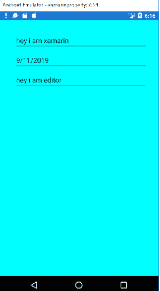

## XamarinForms母版详细信息页

XamarinForms主页详细信息页面是管理两个相关页面之间信息的页面，主页显示项目，详细信息页面显示主页上项目的详细信息。

在这里，我们将解释如何使用 MasterDetailPage 以及页面之间的导航。

*   该容器有两个页面:主页面和详细页面
*   主菜单包含菜单列表
*   详细信息页面显示返回主页的详细信息和链接。

项目列表的位置与每个平台相同，选择项目后将导航到相应的详细信息页面。母版页还有一个导航功能，即导航栏，其中包含一个按钮，可用于导航到活动的详细信息页。

*   在 iOS 上，导航栏位于页面顶部，在详细信息页面上有一个按钮。我们还可以通过向左滑动母版页来导航到活动的详细信息页。
*   在安卓系统上，导航栏位于页面顶部，显示标题、图标和导航到详细页面的按钮。图标是在修饰安卓平台中 MainActivity 类的[activity]属性中定义的。

### <u>首页.Xaml</u>

```

<?xml version="1.0" encoding="utf-8" ?>
<MasterDetailPage 
             xmlns:x="http://schemas.microsoft.com/winfx/2009/xaml"
             xmlns:local="clr-namespace:MasterPage"
             x:Class="MasterPage.MainPage">
    <MasterDetailPage.Master>
        <ContentPage Padding="10" BackgroundColor="Blue" Title="Master Page">
            <ContentPage.Content>
                <StackLayout Margin="5,30,5,5">
                    <Label Text="Master Page" FontSize="Large"></Label>
                </StackLayout>

            </ContentPage.Content>

        </ContentPage>

             </MasterDetailPage.Master>
    <MasterDetailPage.Detail>
        <ContentPage Padding="10" BackgroundColor="Yellow">
        <ContentPage.Content>
            <StackLayout Margin="5,30,5,5">
                <Label Text="Detail Page" FontSize="Large"></Label>
            </StackLayout>

        </ContentPage.Content>

        </ContentPage>

    </MasterDetailPage.Detail>

</MasterDetailPage>

```

### <u>首页.Xaml.CS</u>

```

using System;
using System.Collections.Generic;
using System.Linq;
using System.Text;
using System.Threading.Tasks;
using Xamarin.Forms;

namespace MasterPage
{
    public partial class MainPage : MasterDetailPage
    {
        public MainPage()
        {
            InitializeComponent();
        }
    }
}

```

**<u>输出</u>**

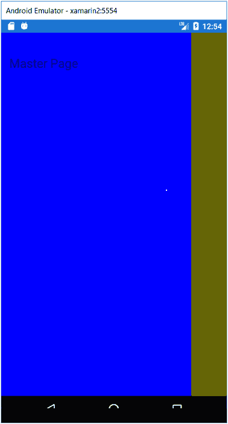

在这里，我们将在母版页上添加一些内容，并添加一些页面来浏览按钮

## 添加新页面(第 1 页。Xaml)

**右键单击项目名称- >添加- >内容页面- >添加页面名称(第 1 页)。**

```

<?xml version="1.0" encoding="utf-8" ?>
<ContentPage 
             xmlns:x="http://schemas.microsoft.com/winfx/2009/xaml"
             x:Class="MasterPage.Page1">
    <ContentPage.Content>
        <StackLayout>
            <Label Text="I am Page 1"
                VerticalOptions="CenterAndExpand" 
                HorizontalOptions="CenterAndExpand" />
        </StackLayout>
    </ContentPage.Content>
</ContentPage>

```

## 添加第 2 页。控件

```

<?xml version="1.0" encoding="utf-8" ?>
<ContentPage 
             xmlns:x="http://schemas.microsoft.com/winfx/2009/xaml"
             x:Class="MasterPage.Page2">
    <ContentPage.Content>
        <StackLayout>
            <Label Text="I am Page2"
                VerticalOptions="CenterAndExpand" 
                HorizontalOptions="CenterAndExpand" />
        </StackLayout>
    </ContentPage.Content>
</ContentPage>

```

## <u>首页.Xaml</u>

```

<?xml version="1.0" encoding="utf-8" ?>
<MasterDetailPage 
             xmlns:x="http://schemas.microsoft.com/winfx/2009/xaml"
             xmlns:local="clr-namespace:MasterPage"
             x:Class="MasterPage.MainPage"
                  Title="I am Master Page"
                  MasterBehavior="Popover">
    <MasterDetailPage.Master>
        <ContentPage Padding="10" BackgroundColor="Blue" Title="Master Page">
            <ContentPage.Content>
                <StackLayout Margin="5,30,5,5">
                    <Label Text="Master Page" FontSize="Large"></Label>
                    <Button Text="Menu Item 1" BackgroundColor="Yellow" TextColor="Blue" Clicked="Button_Clicked"></Button>
                    <Button Text="Menu Item 2" BackgroundColor="Yellow" TextColor="Blue" Clicked="Button_Clicked_1"></Button>
                </StackLayout>

            </ContentPage.Content>

        </ContentPage>

             </MasterDetailPage.Master>
    <MasterDetailPage.Detail>
        <ContentPage Padding="10" BackgroundColor="Yellow">
        <ContentPage.Content>
            <StackLayout Margin="5,30,5,5">
                <Label Text="Detail Page" FontSize="Large"></Label>
            </StackLayout>

        </ContentPage.Content>

        </ContentPage>

    </MasterDetailPage.Detail>
</MasterDetailPage>

```

### MainPage.Xaml.CS

```

<?xml version="1.0" encoding="utf-8" ?>
<MasterDetailPage 
             xmlns:x="http://schemas.microsoft.com/winfx/2009/xaml"
             xmlns:local="clr-namespace:MasterPage"
             x:Class="MasterPage.MainPage"
                  Title="I am Master Page"
                  MasterBehavior="Popover">
    <MasterDetailPage.Master>
        <ContentPage Padding="10" BackgroundColor="Blue" Title="Master Page">
            <ContentPage.Content>
                <StackLayout Margin="5,30,5,5">
                    <Label Text="Master Page" FontSize="Large"></Label>
                    <Button Text="Menu Item 1" BackgroundColor="Yellow" TextColor="Blue" Clicked="Button_Clicked"></Button>
                    <Button Text="Menu Item 2" BackgroundColor="Yellow" TextColor="Blue" Clicked="Button_Clicked_1"></Button>
                </StackLayout>

            </ContentPage.Content>

        </ContentPage>

             </MasterDetailPage.Master>
    <MasterDetailPage.Detail>
        <ContentPage Padding="10" BackgroundColor="Yellow">
        <ContentPage.Content>
            <StackLayout Margin="5,30,5,5">
                <Label Text="Detail Page" FontSize="Large"></Label>
            </StackLayout>

        </ContentPage.Content>

        </ContentPage>

    </MasterDetailPage.Detail>

</MasterDetailPage>

```

**输出**

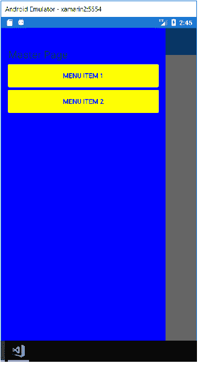

**当我们点击菜单项 1 时，我们将导航到第 1 页，当我们点击菜单项 2 时，我们将导航到第 2 页。**

**输出**

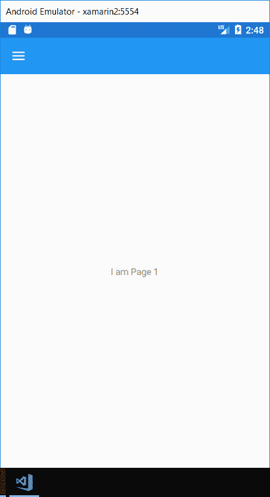

## 我们将学到什么

*   这里我们将学习如何使用 **Xamarin 开发跨平台应用。表格**。
*   我们如何为所有不同的平台设计本机用户界面，如安卓、iOS 和视窗。
*   这里我们将研究 Xamarin。不同控件的表单。
*   **导航，**这里我们将学习从一个页面到另一个页面的滚动、菜单和按钮导航。
*   数据绑定:在数据绑定中，我们支持 C#和 XAML 之间的通信。
*   这里我们还创建自定义控件。

为所有操作系统开发应用程序的最大问题是它们是不同的。

Xamarin 承诺提供共享代码库的移动应用；但是，共享代码是基于应用程序逻辑的。传统 Xamarin.iOS， **Xamarin。安卓**和 **Xamarin。UWP** 开发仍然要求用户界面可以相互独立编写，这不是一个小任务。

## Xamarin 基础知识。形式

XamarinForms是用于构建用户界面的移动应用程序框架。XamarinForms是一个跨平台的用户界面工具包，允许开发人员轻松创建可以在安卓、iOS 和视窗手机上共享的本地用户界面布局。

Xamarin。Forms 提供了 100%原生的 iOS、安卓和 UWP 应用，事实上，这是任何 Xamarin 的起点。Forms app 是项目的平台。

### XamarinForms不仅仅是控件

XamarinForms提供 20 多个跨平台用户界面控件；这些控件中的每一个都有一个特定于 Xamarin 的 API。形式，但作为其原生的 iOS、安卓或 UWP 版本发出。换句话说，一个 XamarinForms标签控件将作为 iOS 用户界面标签发出。

一些内置的 XamarinForms控件，在 iOS 和 Android 上本地呈现。

**XamarinForms远不止这些**

*   它还提供了几种不同的页面布局，包括控制其他页面导航堆栈的导航页面。选项卡式页面包含可以通过选项卡和主-详细信息页面访问的另一个页面。
*   XamarinForms提供了一种布局方式来控制页面内的布局，这种方式称为布局。
*   它还提供了绑定引擎，以便包含属性的类可以“绑定”到控件上的属性，就像标签上的文本属性一样。XamarinForms可以加快开发时间。
*   包括一个名为消息中心的消息服务，它允许不同的类和组件在不了解彼此的情况下进行通信。
*   效果是一种方法，通过它我们可以创建一个特定于平台的小用户界面来控制和应用于共享项目。
*   自定义呈现允许我们完全控制控件如何在 Xamarin 中呈现自己。因此，我们可以添加我们可能需要的功能的附加外观。
*   还有最新版本的 XamarinForms，我们甚至可以直接将只在一个平台上支持的控件，比如 Android Floating 动作按钮，直接添加到 XAML 文件中。

## 共享项目和可移植类库的区别

以下是分享项目的两种方式。这两者都允许我们在不同的平台之间共享项目，如安卓、iOS 和视窗。

**共享项目和 PCL(可移植类库)的区别是:**

| 共享项目 | 可移植类库 |
| **并排** | 

*   Each project will contain all resources within the shared project.
*   A portable assembly (DLL file) has already referenced all the objects.

 |
| **福利** | 

*   Shared codes can be branched.
*   Platform-specific reference can be added.
*   Refactoring always updates all references.
*   If we plan to share the result set with others

，这是一个很好的解决方案 |
| **缺点** | 

*   No output, which is not conducive to sharing with other developers.
*   The "inactive code" in the refactoring will not update it.
*   No platform-specific reference.
*   Just a subset of. NET framework is available.

 |

* * *

## 导航页面

导航页面管理页面之间的导航。它使用基于堆栈的体系结构，由 PUSH 和 POP 属性组成，用于在页面中导航。我们可以向任何类型的页面添加导航来导航到另一个页面。

**登录表单**

**编码**

**首页.Xaml**

```

<?xml version="1.0" encoding="utf-8" ?>
<ContentPage 
             xmlns:x="http://schemas.microsoft.com/winfx/2009/xaml"
             xmlns:local="clr-namespace:ContentPageProperty"
             x:Class="ContentPageProperty.MainPage" BackgroundColor="WhiteSmoke" Title="Login Page">
    <ContentPage.Content>

    <StackLayout x:Name="MainStack">
            <StackLayout Padding="20" Margin="0,80,0,0">
                <Label Text="UserName" TextColor="Black"/>
                <Entry Text="" Placeholder="UserName" x:Name="UserNameEntry"/>
                <Label Text="Password" TextColor="Black"/>
                <Entry Text="" Placeholder="Password" IsPassword="True"/>
                <Button Text="Login" BackgroundColor="DarkGray"  TextColor="Black" Clicked="Button_Clicked"></Button>
                <Label Text="Not a Member? Sign Up Now" TextColor="Black" HorizontalOptions="Center"></Label>

            </StackLayout>
        <!-- Place new controls here -->
        <Label Text="Welcome to Xamarin.Forms!" 
           HorizontalOptions="Center"
           VerticalOptions="CenterAndExpand" />
    </StackLayout>
    </ContentPage.Content>

</ContentPage>

```

### MainPage.Xaml.CS

```

using System;
using System.Collections.Generic;
using System.Linq;
using System.Text;
using System.Threading.Tasks;
using Xamarin.Forms;

namespace ContentPageProperty
{
    public partial class MainPage : ContentPage
    {
        public MainPage()
        {
            InitializeComponent();
        }

        private void Button_Clicked(object sender, EventArgs e)
        {
            DisplayAlert("Login", "LoginSuccessful", "OK");
            Navigation.PushAsync(new HomePage(UserNameEntry.Text));

        }
    }
}

```

### App。控件

```

using System;
using Xamarin.Forms;
using Xamarin.Forms.Xaml;

[assembly: XamlCompilation(XamlCompilationOptions.Compile)]
namespace ContentPageProperty
{
    public partial class App : Application
    {
        public App()
        {
            InitializeComponent();

            MainPage = new NavigationPage(new MainPage());
        }

        protected override void OnStart()
        {
            // Handle when your app starts
        }

        protected override void OnSleep()
        {
            // Handle when your app sleeps
        }

        protected override void OnResume()
        {
            // Handle when your app resumes
        }
    }
}

```

### 主页. Xaml

```

<?xml version="1.0" encoding="utf-8" ?>
<ContentPage 
             xmlns:x="http://schemas.microsoft.com/winfx/2009/xaml"
             x:Class="ContentPageProperty.HomePage" Title="Home Page">
    <ContentPage.Content>
        <StackLayout VerticalOptions="Center" HorizontalOptions="Center">
            <Label x:Name="AppUserName" FontSize="20"/>
        </StackLayout>
    </ContentPage.Content>
</ContentPage>

```

### 主页. Xaml.cs

```

using System;
using System.Collections.Generic;
using System.Linq;
using System.Text;
using System.Threading.Tasks;

using Xamarin.Forms;
using Xamarin.Forms.Xaml;

namespace ContentPageProperty
{
	[XamlCompilation(XamlCompilationOptions.Compile)]
	public partial class HomePage : ContentPage
	{
		public HomePage (String UserNameEntry)
		{
			InitializeComponent ();
            AppUserName.Text = "Hello," + UserNameEntry;

        }

    }
}

```

**<u>输出</u>**

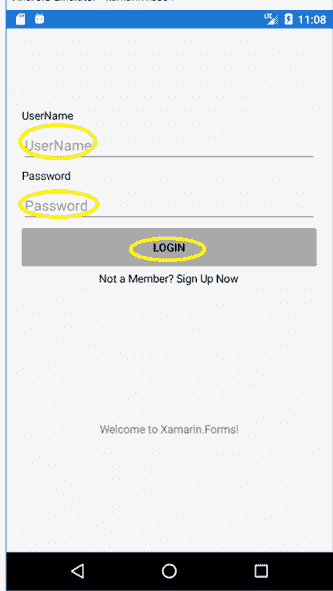

在这里，我们将填写文本空间**用户名**、**密码**中的信息，然后**点击登录**

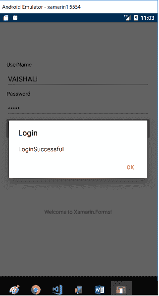

填写完信息后，此页面会将我们切换到导航页面。

### 导航页面

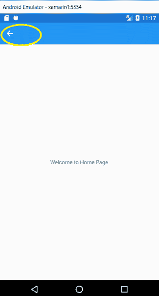

点击这个突出显示的箭头后，我们将切换回**登录页面**。

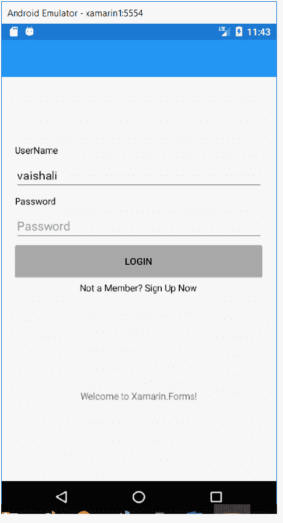

* * *

## <u>采摘者</u>

这里，Xamarin 表单中有三种类型的选择器。

**1。日期选择器**

XamarinForms视图允许用户选择日期。XamarinForms**日期选择器**调用平台的日期选择器控件，使用户能够选择日期。日期选择器定义了八个属性。

*   **MinimumDate:** 这是 **DateTime** 的一种类型，默认为 1900 年的第一天。
*   **最大日期:**这是**日期时间**的类型，默认为 2100 年的最后一天。

**<u>首页.XAML</u>**

```

<?xml version="1.0" encoding="utf-8" ?>
<ContentPage 
             xmlns:x="http://schemas.microsoft.com/winfx/2009/xaml"
             xmlns:local="clr-namespace:App15"
             x:Class="App15.MainPage" BackgroundColor="Aqua">
    <ContentPage.Content>
        <StackLayout>
            <Label Text="DatePicker" FontSize="20" HorizontalOptions="Center"></Label>
            <DatePicker x:Name="dp" MaximumDate="2020/12/31" MinimumDate="2000/12/31"></DatePicker>
        </StackLayout>
    </ContentPage.Content>

```

**输出**

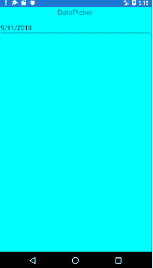 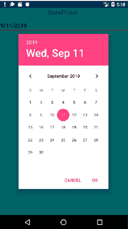

### 2.时间选择器

**3。XamarinForms**视图允许用户选择时间。XamarinForms**时间选择器**调用平台的时间选择器控件，使用户能够选择时间。

**首页.XAML**

```

<?xml version="1.0" encoding="utf-8" ?>
<ContentPage 
             xmlns:x="http://schemas.microsoft.com/winfx/2009/xaml"
             xmlns:local="clr-namespace:App15"
             x:Class="App15.MainPage" BackgroundColor="Aqua">
    <ContentPage.Content>
        <StackLayout Padding="10">
            <Label Text="DatePicker" FontSize="20" HorizontalOptions="Center"></Label>
            <DatePicker x:Name="dp" MaximumDate="2020/12/31" MinimumDate="2000/12/31"></DatePicker>
            <TimePicker x:Name="tp"></TimePicker>
            <Button x:Name="button" Clicked="Button_Clicked" Text="Details"></Button>
            <Label x:Name="details"></Label>
        </StackLayout>
    </ContentPage.Content>

</ContentPage>

```

**首页.XAML.CS**

```

using System;
using System.Collections.Generic;
using System.Linq;
using System.Text;
using System.Threading.Tasks;
using Xamarin.Forms;

namespace App15
{
    public partial class MainPage : ContentPage
    {
        public MainPage()
        {
            InitializeComponent();
        }

        private void Button_Clicked(object sender, EventArgs e)
        {
            var date = dp.Date;
            var time = tp.Time;
            details.Text = string.Format("Date:{0}\n Time:{1}", date, time);
        }
    }
}

```

**输出**

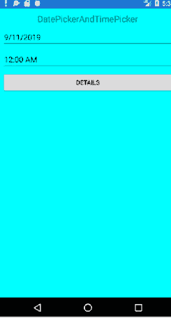

**4。挑选器(称为下拉列表)**

```

<?xml version="1.0" encoding="utf-8" ?>
<ContentPage 
             xmlns:x="http://schemas.microsoft.com/winfx/2009/xaml"
             xmlns:local="clr-namespace:TimePicker"
             x:Class="TimePicker.MainPage">

    <StackLayout>
        <Label Text="Picker"
               FontSize="50"
               FontAttributes="Bold"
               HorizontalOptions="Center" />

        <Picker Title="Color"
                VerticalOptions="CenterAndExpand"
                Margin="10, 0"
                SelectedIndexChanged="OnPickerSelectedIndexChanged">
            <Picker.Items>
                <x:String>Aqua</x:String>
                <x:String>Black</x:String>
                <x:String>Blue</x:String>
                <x:String>Fuchsia</x:String>
                <x:String>Gray</x:String>
                <x:String>Green</x:String>
                <x:String>Lime</x:String>
                <x:String>Maroon</x:String>
                <x:String>Navy</x:String>
                <x:String>Olive</x:String>
                <x:String>Purple</x:String>
                <x:String>Red</x:String>
                <x:String>Silver</x:String>
                <x:String>Teal</x:String>
                <x:String>White</x:String>
                <x:String>Yellow</x:String>
            </Picker.Items>
        </Picker>

        <BoxView x:Name="boxView"
                 WidthRequest="150"
                 HeightRequest="150"
                 HorizontalOptions="Center"
                 VerticalOptions="CenterAndExpand" />
    </StackLayout>

</ContentPage>

```

**首页.XAML.CS**

```

using System;
using System.Collections.Generic;
using System.Linq;
using System.Reflection;
using System.Text;
using System.Threading.Tasks;
using Xamarin.Forms;

namespace TimePicker
{
    public partial class MainPage : ContentPage
    {

        public MainPage()
        {
            InitializeComponent();
        }
        void OnPickerSelectedIndexChanged(object sender, EventArgs e)
        {
            Picker = (Picker)sender;

            if (picker.SelectedIndex == -1)
            {
                boxView.Color = Color.Default;
            }
            else
            {
                string colorName = picker.Items[picker.SelectedIndex];
                FieldInfo colorField = typeof(Color).GetRuntimeField(colorName);
                boxView.Color = (Color)(colorField.GetValue(null));
            }
        }
    }
}

```

**输出**

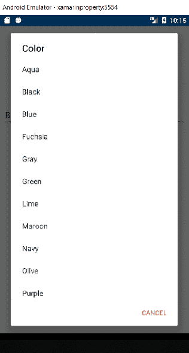

* * *

## 选项卡式页面

选项卡式页面由多个页面或选项卡组成，允许在每个页面或选项卡之间导航。它的行为就像父母一样，其他人都是它的孩子。以下是不同设备上不同类型选项卡页面的示例。我们可以在底部看到 iOS 中的标签页，在 Android 中，Window phone 标签页在顶部。

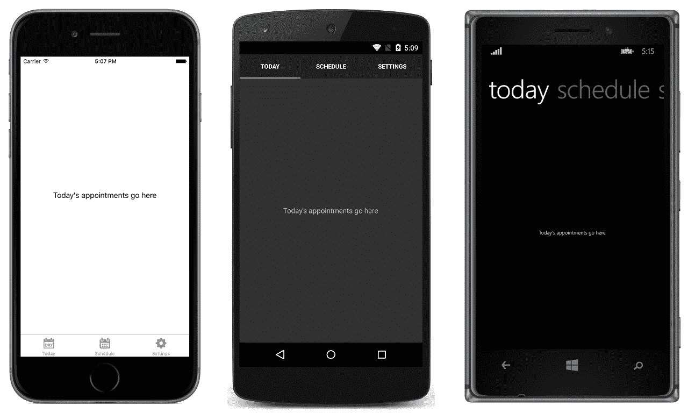

### 流程 1

**首页.XAML**

```

<?xml version="1.0" encoding="utf-8" ?>
<TabbedPage 
             xmlns:x="http://schemas.microsoft.com/winfx/2009/xaml"
             xmlns:local="clr-namespace:XamarinTabbedPage"
             x:Class="XamarinTabbedPage.MainPage">
    <ContentPage Title="Page1">
        <ContentPage.Content>
            <StackLayout VerticalOptions="Center" HorizontalOptions="Center">
                <Label Text="Tabbed Page1"/>
            </StackLayout>
        </ContentPage.Content>
    </ContentPage>
    <ContentPage Title="Page2">
        <ContentPage.Content>
            <StackLayout VerticalOptions="Center" HorizontalOptions="Center">
                <Label Text="Tabbed Page2"/>
            </StackLayout>
        </ContentPage.Content>
    </ContentPage>
    <ContentPage Title="Page3">
        <ContentPage.Content>
            <StackLayout VerticalOptions="Center" HorizontalOptions="Center">
                <Label Text="Tabbed Page3"/>
            </StackLayout>
        </ContentPage.Content>
    </ContentPage>

</TabbedPage>

```

**首页.Xaml.CS**

```

using System;
using System.Collections.Generic;
using System.Linq;
using System.Text;
using System.Threading.Tasks;
using Xamarin.Forms;

namespace XamarinTabbedPage
{
    public partial class MainPage : TabbedPage
    {
        public MainPage()
        {
            InitializeComponent();
        }
    }
}

```

**输出**

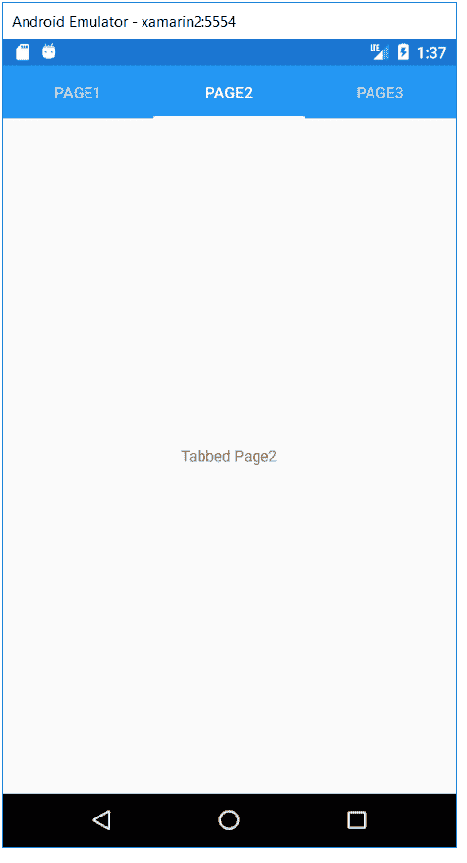

### 流程 2

**图标插入**

**首页.XAML**

```

<?xml version="1.0" encoding="utf-8" ?>
<TabbedPage 
             xmlns:x="http://schemas.microsoft.com/winfx/2009/xaml"
             xmlns:local="clr-namespace:XamarinTabbedPage"
             x:Class="XamarinTabbedPage.MainPage" Title="MainPage">
    <local:Page1>
    </local:Page1>
    <local:Page2>
    </local:Page2>
   </TabbedPage>

```

**首页.Xaml.CS**

```

using System;
using System.Collections.Generic;
using System.Linq;
using System.Text;
using System.Threading.Tasks;
using Xamarin.Forms;

namespace XamarinTabbedPage
{
    public partial class MainPage : TabbedPage
    {
        public MainPage()
        {
            InitializeComponent();
        }
    }
}

```

## <u>第 1 页。xaml〔t1〕</u>

```

<?xml version="1.0" encoding="utf-8" ?>
<ContentPage 
             xmlns:x="http://schemas.microsoft.com/winfx/2009/xaml"
             x:Class="XamarinTabbedPage.Page1" Title="Page1" Icon="home.png">
    <ContentPage.Content>
        <StackLayout>
            <Label Text="Tabed page1"
                VerticalOptions="CenterAndExpand" 
                HorizontalOptions="CenterAndExpand" />
        </StackLayout>
    </ContentPage.Content>
</ContentPage>

```

## 第 2 页。控件

```

<?xml version="1.0" encoding="utf-8" ?>
<ContentPage 
             xmlns:x="http://schemas.microsoft.com/winfx/2009/xaml"
             x:Class="XamarinTabbedPage.Page2" Title="Page2" Icon="Message.png">
    <ContentPage.Content>
        <StackLayout>
            <Label Text="Tabbed Page2"
                VerticalOptions="CenterAndExpand" 
                HorizontalOptions="CenterAndExpand" />
        </StackLayout>
    </ContentPage.Content>
</ContentPage>

```

## APP。控件

### 编码

```

using System;
using Xamarin.Forms;
using Xamarin.Forms.Xaml;

[assembly: XamlCompilation(XamlCompilationOptions.Compile)]
namespace XamarinTabbedPage
{
    public partial class App : Application
    {
        public App()
        {
            InitializeComponent();

            MainPage = new MainPage();

        }

        protected override void OnStart()
        {
            // Handle when your app starts
        }

        protected override void OnSleep()
        {
            // Handle when your app sleeps
        }

        protected override void OnResume()
        {
            // Handle when your app resumes
        }
    }
}

```

## 如何添加图标

从 ICONFINDER 网站下载图标，点击下面的链接:[https://www.iconfinder.com/search/?q=message&from =主页](https://www.iconfinder.com/search/?q=message&from=homepage)，从下载文件夹复制并粘贴到可绘制文件夹的资源中。

### 第 1 页

该过程将对添加图标的所有页面重复。

**输出**

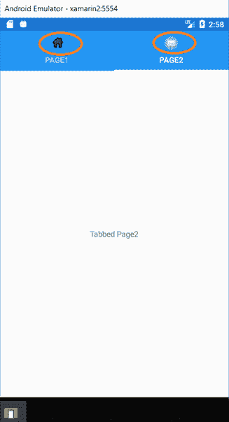

## 旋转木马页面

一种**页面**类型，用户可以像画廊一样左右滑动浏览内容页面。它包含页面列表和显示区域。

*   轮播页面类继承自**多页面<内容页面>T1**

转盘页面通过向左或向右滑动来提供页面导航。它充当其他子页面的基础页面。

转盘页面一次只能看到一个。

### 转盘页面:默认行为

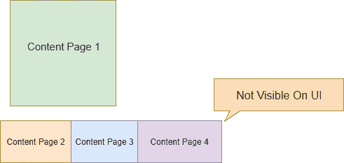
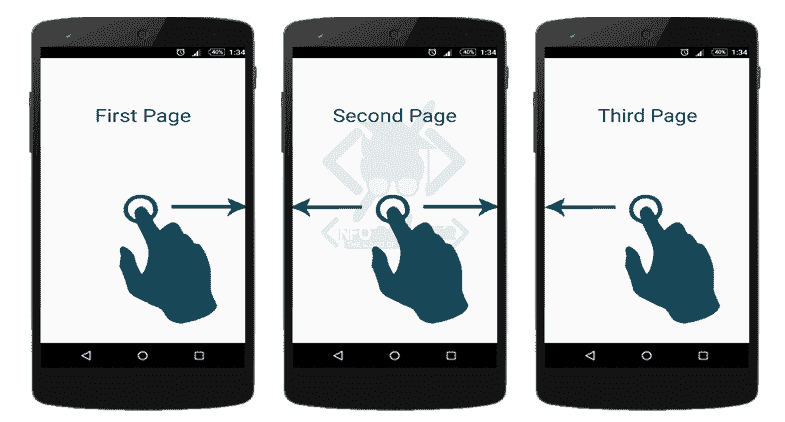

### 旋转木马页面外观

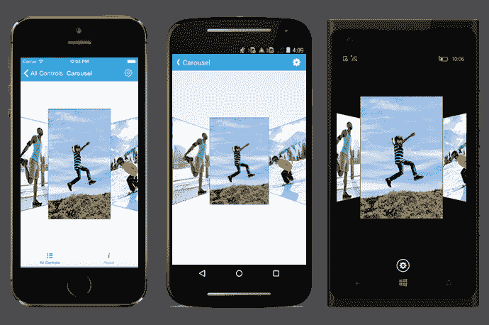

### 页面列表的加载

*   向轮播页面提供作为子页面的页面列表。
*   为项目模板定义数据模板，然后将集合分配给项目源。

**掌握主动权。xaml〔t1〕**

```

<?xml version="1.0" encoding="utf-8" ?>
<CarouselPage 
             xmlns:x="http://schemas.microsoft.com/winfx/2009/xaml"
             x:Class="CarousalPage.MainCarousalPage">
    <ContentPage BackgroundColor="LightPink">
        <ContentPage.Content>
            <StackLayout HorizontalOptions="Center" VerticalOptions="Center">
                <Label Text="I am Page1"></Label>
            </StackLayout>

        </ContentPage.Content>
    </ContentPage>

    <ContentPage BackgroundColor="Yellow">
        <ContentPage.Content>
            <StackLayout HorizontalOptions="Center" VerticalOptions="Center">
                <Label Text="I am Page2"></Label>
            </StackLayout>

        </ContentPage.Content>
    </ContentPage>

    <ContentPage BackgroundColor="Red">
        <ContentPage.Content>
            <StackLayout HorizontalOptions="Center" VerticalOptions="Center">
                <Label Text="I am Page3"></Label>
            </StackLayout>

        </ContentPage.Content>
    </ContentPage>

```

### <u>App。Xaml</u>

```

using System;
using Xamarin.Forms;
using Xamarin.Forms.Xaml;

[assembly: XamlCompilation(XamlCompilationOptions.Compile)]
namespace CarousalPage
{
    public partial class App : Application
    {
        public App()
        {
            InitializeComponent();

            MainPage = new MainCarousalPage();
        }

        protected override void OnStart()
        {
            // Handle when your app starts
        }

        protected override void OnSleep()
        {
            // Handle when your app sleeps
        }

        protected override void OnResume()
        {
            // Handle when your app resumes
        }
    }
}

```

**输出**

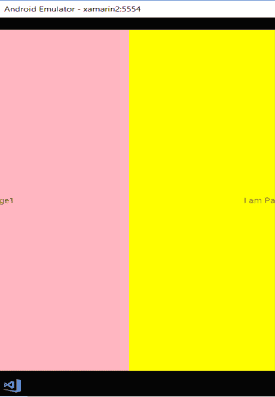

## 模板页面

它是内容页面的基类，使用受控模板显示全屏内容。在这种情况下，我们可以设计整个应用程序的模板，包括字体大小、颜色和许多其他样式技术。

### 第 1 页。控件

### 不使用模板

```

<?xml version="1.0" encoding="utf-8" ?>
<ContentPage 
             xmlns:x="http://schemas.microsoft.com/winfx/2009/xaml"
             x:Class="Templatepage.Page1">
    <ContentPage.Content>
        <StackLayout>
            <Label Text="App Name" BackgroundColor="Blue"></Label>
        <Label Text="Login Registration Page"></Label>
        <Entry Text="Name"></Entry>
        <Entry Text="Age"></Entry>
            <Entry Text="Address"></Entry>
            <Entry Text="Country"></Entry>
            <Button Text="Submit" BackgroundColor="Black"></Button>
            <Label Text="Terms and Conditions"></Label>
            <Label Text="You can not copy more code"></Label>
        </StackLayout>
    </ContentPage.Content>
</ContentPage

```

**输出**

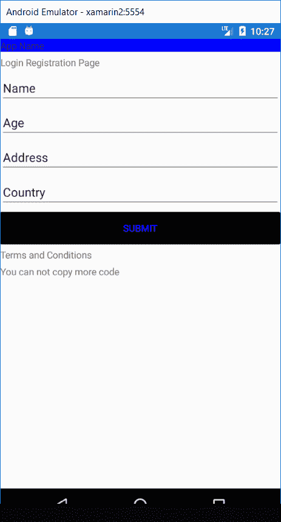

### 使用模板

### 第 2 页。控件

```

<?xml version="1.0" encoding="utf-8" ?>
<ContentPage 
             xmlns:x="http://schemas.microsoft.com/winfx/2009/xaml"
             x:Class="Templatepage.Page2" ControlTemplate="{StaticResource ThemeMaster}">
    <ContentPage.Content>
        <StackLayout>
        <Entry Text="Name"></Entry>
        <Entry Text="Age"></Entry>
       <Button Text="Submit" BackgroundColor="Black" TextColor="Blue"></Button>

        </StackLayout>
    </ContentPage.Content>
</ContentPage>

```

***在 App 中。Xaml 我们可以像这样做一个模板。*T3】**

### App。控件

```

<?xml version="1.0" encoding="utf-8" ?>
<Application 
             xmlns:x="http://schemas.microsoft.com/winfx/2009/xaml"
             x:Class="Templatepage.App">
    <Application.Resources>
        <ResourceDictionary>
            <ControlTemplate x:Key="ThemeMaster">
                <StackLayout>
                <Label Text="App Name" BackgroundColor="Blue"></Label>
                    <ContentPresenter>
                    </ContentPresenter>
                <Label Text="Terms and Conditions"></Label>
                <Label Text="You can not copy more code"></Label>
               </StackLayout>

            </ControlTemplate>
        </ResourceDictionary>

    </Application.Resources>
</Application>

```

### <u>应用程序。xaml . cs〔t1〕</u>

```

using System;
using Xamarin.Forms;
using Xamarin.Forms.Xaml;

[assembly: XamlCompilation(XamlCompilationOptions.Compile)]
namespace Templatepage
{
    public partial class App : Application
    {
        public App()
        {
            InitializeComponent();

            MainPage = new Page2();
        }

        protected override void OnStart()
        {
            // Handle when your app starts
        }

        protected override void OnSleep()
        {
            // Handle when your app sleeps
        }

        protected override void OnResume()
        {
            // Handle when your app resumes
        }
    }
}

```

**输出**

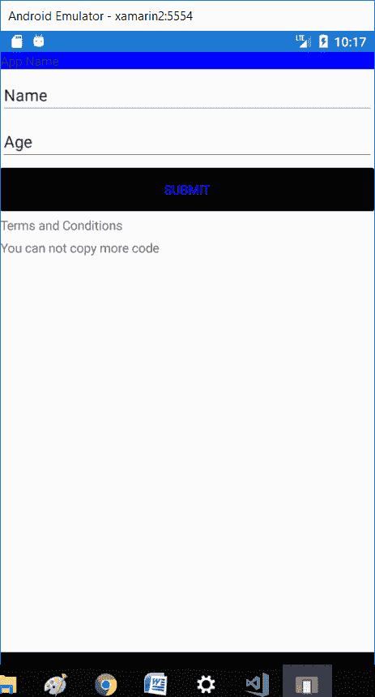

## 包裹

XamarinForms是 Xamarin 最强大的功能之一，对于创建跨平台应用程序非常有用。在它的帮助下，我们可以接触到数十亿智能设备。毫无疑问，我们可以说 Xamarin 由于其无缝的 API 集成能力，已经成为业务的“**选择”**。

* * *