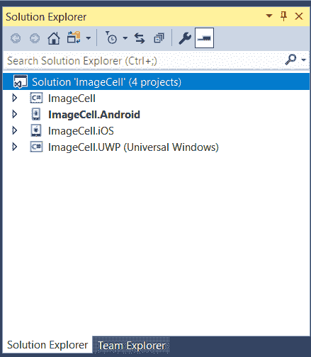
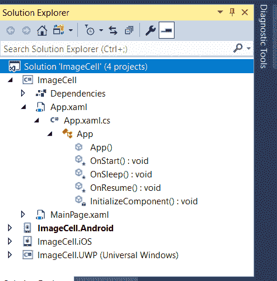
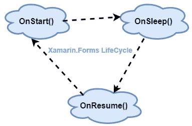

# Xamarin。表单生命周期

> 原文：<https://www.javatpoint.com/xamarin-forms-life-cycle>

Xamarin。表单是一个平台，通过使用前端的 XAML 和后端的 C#来开发跨平台移动应用程序。在 Xamarin。表单应用程序，我们可以共享所有代码。Xamarin。表单还提供了安卓和 iOS 原生 API 的 100% API 覆盖率。因此，我们可以开发原生的安卓、iOS 和视窗应用程序。

Xamarin 的生命周期。表单应用程序:

当我们创建 Xamarin 时。表单应用中，我们将看到四个项目:

*   **可移植项目:**这是我们将对 95%的应用程序代码进行编码的项目，这个代码在所有三个平台上都是共享的。
*   **安卓:**这是我们设置安卓应用图标和闪屏的项目，其他所有代码都将来自可移植项目。
*   **iOS:** 在这个项目中，我们设置了 iOS 应用架构和图标。
*   **通用 Windows:** 通用 Windows 平台是构建两者的应用平台，Windows 手机和 Windows 桌面应用。

**我们可以在这个截图中看到全部四个项目:**



Xamarin。表单应用程序生命周期由三个虚拟方法组成，它们被重写以处理生命周期方法。这些方法出现在 **App 中。Xaml** 。可移植项目中的 Cs 类。

我们在这里找到所有这些文件，如截图所示:



**三种方法为:**

*   OnStart（）
*   OnSleep()
*   OnResume（）



当应用程序处于启动、睡眠或恢复状态时，会调用这三种方法。没有终止申请的方法。应用程序从**OnLeep()**方法终止，没有任何附加通知。

我们可以在 **App 中看到所有这些文件。Xaml.cs** 在我们的 Xamarin 中。表单(可移植项目)。

### OnStart()方法

OnStart()方法在应用程序第一次启动时调用。当应用程序启动时，它会读取所有用 **OnStart()** 方法编写的代码。

**OnStart()方法的语法可以写成如下:**

```

protected override void OnStart()
{
            // Handle when your app starts
 }

```

### OnSleep()方法

OnSleep()方法在应用程序处于睡眠模式时调用，即当应用程序中没有工作时调用。当用户隐藏应用程序时，Sleep 方法调用。在这种形式下，我们的应用程序在睡眠状态下在后台打开。

**OnSleep()方法的语法可以写成如下:**

```

protected override void OnSleep()
 {
            // Handle when your AApp sleeps
 }

```

### OnResume()方法

当我们从睡眠模式返回到应用程序时，会调用 OnResume()方法。

**OnResume()方法的语法可以写成如下:**

```

protected override void OnResume()
 {
            // Handle when your AApp resumes
 }

```

让我们在所有这些方法上设置断点，当应用程序处于其中一种状态时，我们将看到所有这些方法都被调用。

```

protected override void OnStart()
 {
            // Handle when your app starts
            Debug.WriteLine("OnStart");
 }

 protected override void OnSleep()
 {
            // Handle when your app sleeps
            Debug.WriteLine("OnSleep");
  }

  protected override void OnResume()
  {
            // Handle when your app resumes
            Debug.WriteLine("OnResume");
   }

```

* * *