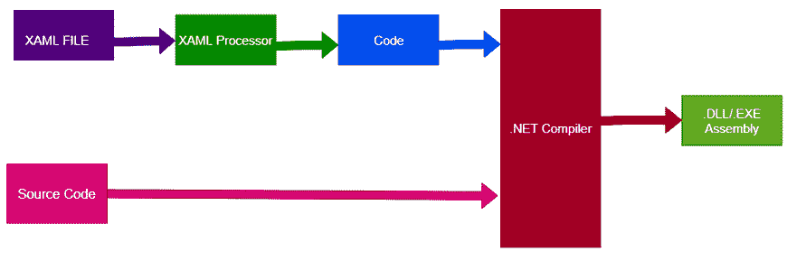
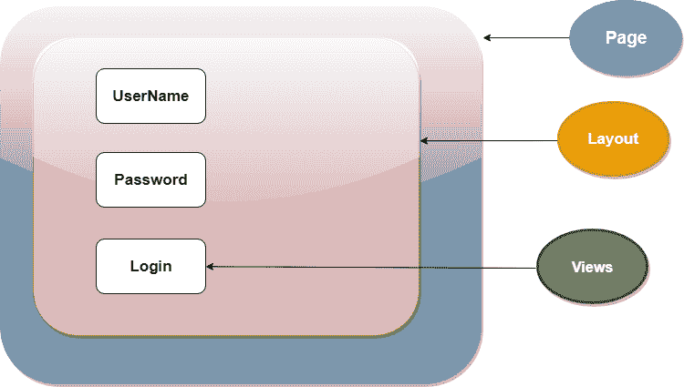

# XAML 代表 Xamarin。形式

> 原文：<https://www.javatpoint.com/xaml-for-xamarin-forms>

Xaml 或可扩展标记语言是一种声明性语言，用于在 Xamarin.Forms 中创建用户界面

Xaml 是基于 XML 的简单的声明性标记语言。Xaml 是区分大小写的强类型标记语言，它将表示与业务逻辑分开。XAML 元素是 CLR 对象的 XML 表示。Xaml 用于创建、初始化和设置层次关系中对象的属性。Xaml 主要用于设计 WPF、Silverlight、Windows Phone 和 Xamarin 表单中的用户界面。

## XAML 工作

Xaml 文件被转换成 BAML(二进制应用程序标记语言)，它将作为资源嵌入到最终的 DLL/exe 中。



## XAML 的优势

*   XAML 是基于 XML 语法的。
*   XAML 代码更小更容易。
*   与代码相比，XAML 代码易于编写和理解。
*   与代码相比，使用 XAML 设计用户界面更容易。
*   XAML 提供了用户界面(XAML)和用户界面逻辑(C#)之间的明确分离。
*   XAML 将设计师和开发者的角色分开。

## Xaml 的优势

首先，在 XAML 布局用户界面的最大好处是简单。当 XAML 被用来布局页面中的视觉树控件时，应用程序就会快速生成，变得非常明显。

XAML 的代码可读性更强。例如:当控件数据绑定到视图模型中的属性时，XAML 语法比 C#语法干净得多。

**Xamarin 数据绑定:**

```

<Label Text="{Binding FirstName}" />

```

**C#数据绑定:**

```

Label firstNameLabel = new Label();
firstNameLabel.SetBinding(Label.Text, "FirstName");

```

XAML 版本变得更易读。

最后，Xamarin 在 Xamarin 工作室和 Visual Studio 中引入了新版本的 XAML 预览器。该工具允许开发人员在集成开发环境中查看用户界面。

**XAML 页面结构**

```

<?xml version="1.0" encoding="utf-8" ?>
<ContentPage 
             xmlns:x="http://schemas.microsoft.com/winfx/2009/xaml"
             xmlns:local="clr-namespace:XamarinLifecycle"
             x:Class="XamarinLifecycle.MainPage">

    <StackLayout>
        <!-- Place new controls here -->
        <Label Text="Welcome to Xamarin.Forms!" 
           HorizontalOptions="Center"
           VerticalOptions="CenterAndExpand" />
    </StackLayout>

</ContentPage>

```

这里，开始的 **<【内容页面】>** 元素，XAML 解析器知道它遇到了一个内容页面，它应该实例化。其他用户界面控件位于<内容页面。内容>标签，其中 XAML 解析器实例化来构建用户界面。

XAML 解析器负责 XAML 文件的工作，查找需要实例化的元素，设置它们的属性，将适当的控件放在整个 Layout 中适当的位置，执行数据绑定等等。这是一项令人印象深刻的技术。

## 性能

在 XAML，房产有两种味道。第一个是**属性**属性。这些是最容易理解和有效的。在用户界面组件的标记中声明的属性。属性名称将始终与控件的属性名称相同，但属性值将始终为字符串。

```

<Label Text="bURGER AND FRIES" TextColor="Red"/>

```

我们总是指定一个字符串，因为 XAML 接受 XML 的规则。

XAML 的第二种属性是**元素属性**。当属性值太复杂而无法用简单字符串表示时，使用元素属性。

元素属性往往隐藏在显眼的地方。创建空白**内容页面**时， **<contentpage.content></contentpage.content>**元素是元素属性。此属性用于保存页面的其余内容，这些内容太复杂，无法用字符串表示。

## XAML 和法典的区别

XAML 比代码更容易维护和修改。Xaml 易于解析，可以通过软件工具而不是代码进行编辑。XAML 有时比等价的 C#代码更简洁。

```

  <StackLayout>
        <!-- Place new controls here -->
        <Label Text="Welcome to Xamarin.Forms!" 
           HorizontalOptions="Center"
           VerticalOptions="CenterAndExpand" />
    </StackLayout>

```

XAML 没有循环，没有流控制，没有代数计算语法，也没有事件处理程序。在这种情况下，C#代码帮助我们定义所有这些东西。

## 文件结构

Xaml 文件由两个文件组成。用户界面和背后的代码。如果我们想要创建登记表，那么我们将有以下内容:

*   登录。Xaml 用户界面
*   登录。用户界面的代码隐藏

## XAML 用户界面结构

XAML 视图由一个**页面**组成，可以使用不同的布局，如果没有布局，则使用多个视图来创建用户界面。



* * *