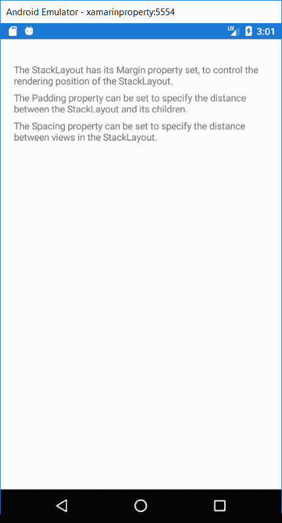
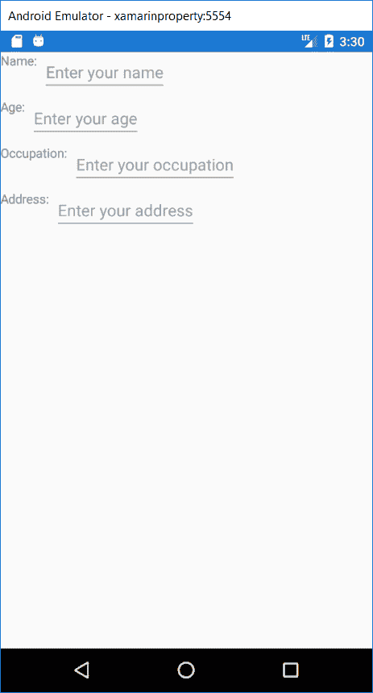
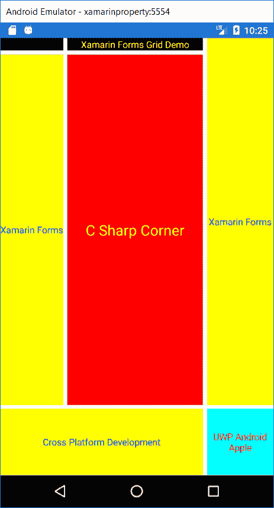
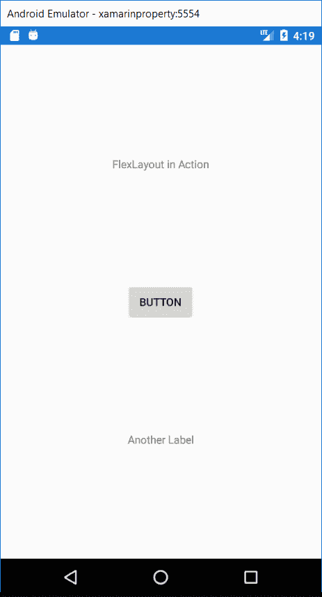
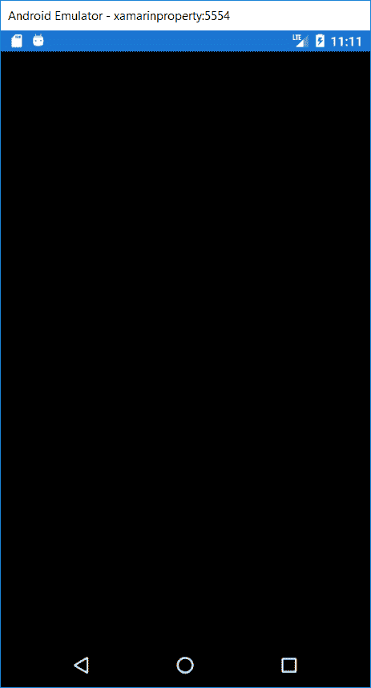
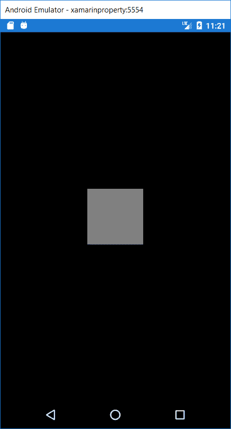
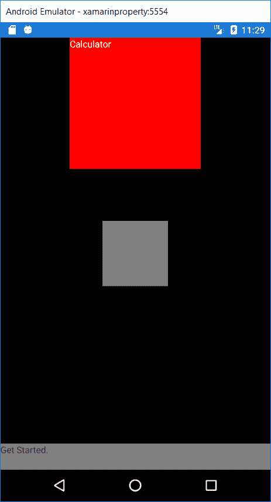
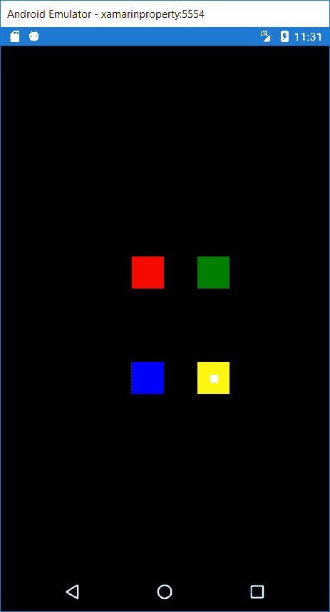
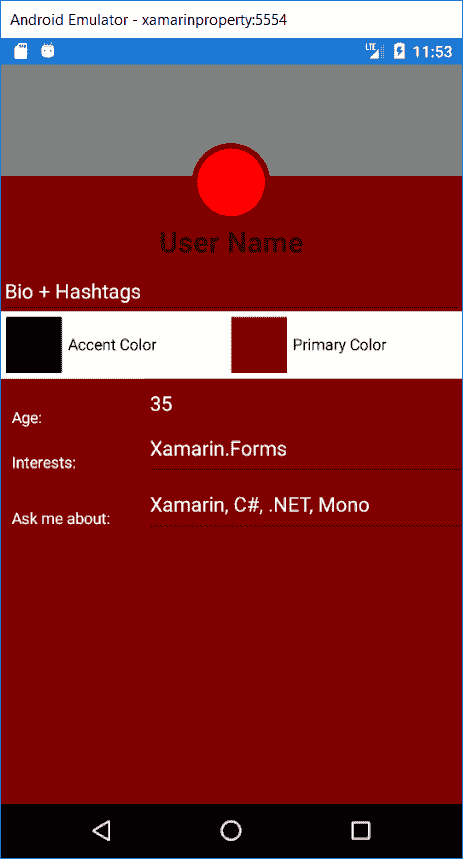
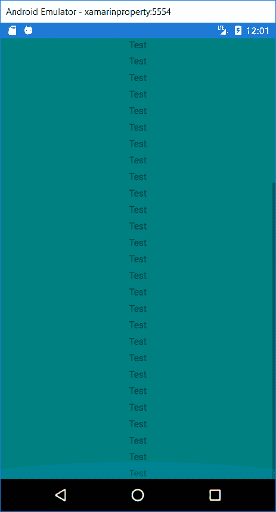

# XamarinForms布局

> 原文：<https://www.javatpoint.com/xamarin-layout>

XamarinForms布局类允许我们排列和分组用户界面控件。要选择布局类，需要知道如何安排子元素的位置和大小。

## 堆栈布局

堆栈布局水平或垂直地组织一维堆栈中的元素。方向属性决定元素的方向，默认方向为垂直。堆栈布局通常用于在页面上排列用户界面的子部分。

下面的 XAML 展示了如何创建一个包含三个标签对象的垂直堆栈。

**首页.XAML**

```

<?xml version="1.0" encoding="utf-8" ?>
<ContentPage 
             xmlns:x="http://schemas.microsoft.com/winfx/2009/xaml"
             xmlns:local="clr-namespace:AK"
             x:Class="AK.MainPage">

    <StackLayout Margin="20,35,20,25">
        <Label Text="The StackLayout has its Margin property set, to control the rendering position of the StackLayout." />
        <Label Text="The Padding property can be set to specify the distance between the StackLayout and its children." />
        <Label Text="The Spacing property can be set to specify the distance between views in the StackLayout." />
    </StackLayout>

</ContentPage>

```

**输出**



## 网格布局

堆栈布局通常用作包含其他子布局的父布局。但是，堆栈布局不应用于通过使用堆栈布局对象的组合来重现**网格**布局。

```

<?xml version="1.0" encoding="utf-8" ?>
<ContentPage 
             xmlns:x="http://schemas.microsoft.com/winfx/2009/xaml"
             xmlns:local="clr-namespace:AK"
             x:Class="AK.MainPage">

        <StackLayout>
            <StackLayout Orientation="Horizontal">
                <Label Text="Name:" />
                <Entry Placeholder="Enter your name" />
            </StackLayout>
            <StackLayout Orientation="Horizontal">
                <Label Text="Age:" />
                <Entry Placeholder="Enter your age" />
            </StackLayout>
            <StackLayout Orientation="Horizontal">
                <Label Text="Occupation:" />
                <Entry Placeholder="Enter your occupation" />
            </StackLayout>
            <StackLayout Orientation="Horizontal">
                <Label Text="Address:" />
                <Entry Placeholder="Enter your address" />
            </StackLayout>
        </StackLayout>

</ContentPage>

```

## 不使用网格

**输出**



*这种类型的布局是浪费的，因为执行了不必要的布局计算。我们可以使用**网格**实现更好的布局。*

## 网格布局

网格用于在行和列中显示元素，这些元素可以具有比例或绝对大小。网格的行和列由行定义和列定义属性指定。对于元素在特定网格单元中的位置，使用**网格。列**，和**网格。行**附属性。要使元素跨多行多列连接，请使用**网格。RowSpan** 和**网格。ColumnSpan** 附加属性。

网格支持视图按行和列排列。行和列可以设置成比例大小或全尺寸。**网格布局**不应与传统表格相混淆，也不是为了呈现表格数据。网格没有行、列或单元格格式的概念。与 HTML 表格不同，网格纯粹是为了布局内容。

在网格布局中，我们可以将屏幕分成行和列，以使我们的布局更具吸引力。网格布局主要用于照片库和其他使用网格的地方。

网格如下所示:


## 目的

网格可用于将视图排列成网格。这在许多情况下很有用:

*   **用于排列计算器应用程序中的按钮。**
*   **在网格中排列按钮/选项，如 iOS 或安卓主屏幕。**
*   **用于排列视图，使其在一个维度上相等(如工具栏)。**

## 使用

与传统表格不同，网格不会影响内容中的行数和列数。相反，网格有行定义和列定义集合。这些包含了将布局多少行和列的定义。视图通过指定的行和列索引添加到网格中，这些索引标识了视图中的列应该放在哪个位置。

## 行和列

行和列信息存储在**网格的行定义**和**列定义**属性中，行定义和列定义对象的每个集合分别存储在这些属性中。行定义只有一个属性

制作网格布局时需要提醒的步骤:

*   定义总行数
*   定义总计列
*   定义我们想要放置在布局中的所有元素，并设置元素所需的行和列。

**首页.XAML**

```

<?xml version="1.0" encoding="utf-8" ?>
<ContentPage 
             xmlns:x="http://schemas.microsoft.com/winfx/2009/xaml"
             xmlns:local="clr-namespace:App13"
             x:Class="App13.MainPage">
    <Grid>
        <Grid.RowDefinitions>
            <RowDefinition Height="Auto" />
            <RowDefinition Height="*" />
            <RowDefinition Height="100" />
        </Grid.RowDefinitions>
        <Grid.ColumnDefinitions>
            <ColumnDefinition Width="Auto" />
            <ColumnDefinition Width="*" />
            <ColumnDefinition Width="100" />
        </Grid.ColumnDefinitions>
        <Label Text="One" Grid.Row="0" Grid.Column="0" TextColor="Green" BackgroundColor="Black" />
        <Label Text="Xamarin Forms Grid Demo" TextColor="Yellow" BackgroundColor="Black" Grid.Row="0" Grid.Column="1" HorizontalTextAlignment="Center" VerticalTextAlignment="Center" />
        <Label Text="Xamarin Forms" TextColor="Blue" BackgroundColor="Yellow" Grid.Row="1" Grid.Column="0" HorizontalTextAlignment="Center" VerticalTextAlignment="Center" />
        <Label Text="C Sharp Corner" FontSize="Large" Grid.Row="1" Grid.Column="1" TextColor="Yellow" BackgroundColor="Red" HorizontalTextAlignment="Center" VerticalTextAlignment="Center" />
        <Label Text="Xamarin Forms" Grid.Row="0" Grid.Column="2" Grid.RowSpan="2" TextColor="Blue" BackgroundColor="Yellow" HorizontalTextAlignment="Center" VerticalTextAlignment="Center" />
        <Label Text="Cross Platform Development" Grid.Row="2" Grid.Column="0" Grid.ColumnSpan="2" TextColor="Blue" BackgroundColor="Yellow" HorizontalTextAlignment="Center" VerticalTextAlignment="Center" />
        <Label Text="UWP Android Apple" Grid.Row="2" Grid.Column="2" TextColor="Red" BackgroundColor="Aqua" HorizontalTextAlignment="Center" VerticalTextAlignment="Center" />
    </Grid>
</ContentPage>

```

**输出**



## 灵活布局

灵活布局类似于堆栈布局，它在堆栈中水平或垂直显示子元素。但是，如果子元素太多而无法容纳在一行或一列中，FlexLayout 也可以包装它的子元素，并且还可以对其子元素的大小、方向和对齐方式进行更精细的控制。

这里是 XAML，展示了如何创建 **FlexLayout** ，它在一列中显示它的单个视图。

**首页.XAML**

```

<?xml version="1.0" encoding="utf-8" ?>
<ContentPage 
             xmlns:x="http://schemas.microsoft.com/winfx/2009/xaml"
             xmlns:local="clr-namespace:AK"
             x:Class="AK.MainPage" Title="grid">

    <FlexLayout Direction="Column"
            AlignItems="Center"
            JustifyContent="SpaceEvenly">
        <Label Text="FlexLayout in Action" />
        <Button Text="Button" />
        <Label Text="Another Label" />
    </FlexLayout>

</ContentPage>

```

**输出**



## 绝对布局

绝对布局用于将子元素定位在绝对请求的位置。当我们想要摆脱所有的布局限制，让布局与众不同时，就会用到绝对布局。我们可以使用比例值和绝对值来设置元素的高度、宽度、X 轴和 Y 轴。

**示例:**

在这里，我们将采取绝对布局的实际实现。在这里，我们将通过设置 x 轴和 y 轴来制作盒子，并将其放置在我们想要的任何地方。

在这里，我们将制作盒子，并将其设置在我们的背景页面上。这里有几件事应该牢记在心。

在绝对边界中，我们总是设置布局边界和布局标志。

**布局边界**

在布局边界中，我们将按照 X 轴、Y 轴、宽度、高度的顺序设置宽度、高度、X 轴和 Y 轴的值。我们在布局边界中设置的第一个值将成为 x 轴的值，以此类推。

**布局标志**

在布局标志中，我们将声明绑定布局中的值是否成比例。最小比例值为 0，最大比例值为 1。

**首页.XAML**

```

<?xml version="1.0" encoding="utf-8" ?>
<ContentPage 
             xmlns:x="http://schemas.microsoft.com/winfx/2009/xaml"
             xmlns:local="clr-namespace:App13"
             x:Class="App13.MainPage">

    <AbsoluteLayout>

        <BoxView  
            AbsoluteLayout.LayoutBounds="0,0,1,1"  
            AbsoluteLayout.LayoutFlags="HeightProportional, WidthProportional"  
            BackgroundColor="Black">
        </BoxView>

    </AbsoluteLayout>
</ContentPage>

```

**代码解释**

在这里，我们得到了布局边界和布局标志的概念。与上面的代码一样，我们将宽度和高度设置为最大值，并声明这些值在布局标志中是成比例的。在这里，盒子覆盖了整体，并作为我们的应用程序的背景。

**输出**



在这里，我们看到它工作得非常好。在这里，我们制作了一个盒子，并将其设置为我们的应用程序的背景。现在我们将制作另一个盒子，并将它放在页面的中心。

```

<?xml version="1.0" encoding="utf-8" ?>
<ContentPage 
             xmlns:x="http://schemas.microsoft.com/winfx/2009/xaml"
             xmlns:local="clr-namespace:App13"
             x:Class="App13.MainPage">
    <AbsoluteLayout>

        <BoxView  
        AbsoluteLayout.LayoutBounds="0,0,1,1"  
        AbsoluteLayout.LayoutFlags="HeightProportional, WidthProportional"  
        BackgroundColor="Black"></BoxView>
        <BoxView   
        AbsoluteLayout.LayoutBounds="0.5,0.5,100,100"   
        AbsoluteLayout.LayoutFlags="XProportional,YProportional"   
        BackgroundColor="Gray"></BoxView>

    </AbsoluteLayout>
</ContentPage>

```

**代码说明:**

我们已经有了一个框，现在我们想添加另一个框，其中 X 轴和 Y 轴的比例值设置为 0.5，这意味着 50%，我们的新框位于页面的中心。我们可以改变 x 轴和 y 轴的值来查看盒子的移动。

**输出**



这里我们看到在页面中心创建了另一个框。

现在我们将创建一个标签，并将它放在页面的底部。

```

<?xml version="1.0" encoding="utf-8" ?>
<ContentPage 
             xmlns:x="http://schemas.microsoft.com/winfx/2009/xaml"
             xmlns:local="clr-namespace:App13"
             x:Class="App13.MainPage">
    <AbsoluteLayout>
        <BoxView  
        AbsoluteLayout.LayoutBounds="0,0,1,1"  
        AbsoluteLayout.LayoutFlags="HeightProportional, WidthProportional"  
        BackgroundColor="Black"></BoxView>

        <BoxView   
        AbsoluteLayout.LayoutBounds="0.5,0.5,100,100"   
        AbsoluteLayout.LayoutFlags="XProportional,YProportional"   
        BackgroundColor="Gray"></BoxView>

        <Label Text="Get Started."   
           AbsoluteLayout.LayoutBounds="0,1,1,40"   
           AbsoluteLayout.LayoutFlags="XProportional,YProportional,WidthProportional"  
           BackgroundColor="Gray"></Label>

    </AbsoluteLayout>
</ContentPage>

```

**代码说明:**

这里，在标签中，我们为其高度设置绝对值，为 x 轴和宽度设置比例值。y 轴设置为 1，以便显示在页面底部。

**输出**



## 相对布局

**目的**

相对布局可用于在屏幕上定位与整体布局或其他视图相对应的视图。

用法

**理解概念**

在 RelativeLayout 中定位和调整视图大小是有约束的。约束信息可能包含以下信息。

**类型**

约束与父视图或其他视图相关。

**属性**

我们应该使用哪个属性作为约束的基础。

**因子**

我们必须在财产价值上应用哪个因素。

**恒定**

我们必须用这个值来抵消成本。

**元素名称**

与约束相关的视图的名称。

```

<?xml version="1.0" encoding="utf-8" ?>
<ContentPage 
             xmlns:x="http://schemas.microsoft.com/winfx/2009/xaml"
             xmlns:local="clr-namespace:App13"
             x:Class="App13.MainPage">
    <RelativeLayout BackgroundColor="Black">
        <BoxView BackgroundColor="Red" RelativeLayout.XConstraint="{ConstraintExpression   
            Type=RelativeToParent, Property=Width, Factor=0.4}"   
                 RelativeLayout.YConstraint="{ConstraintExpression Type=RelativeToParent,  
            Property=Height, Factor=0.4}">
        </BoxView>
        <BoxView   
            BackgroundColor="Green" RelativeLayout.XConstraint="{ConstraintExpression   
            Type=RelativeToParent, Property=Width, Factor=0.6}"   
            RelativeLayout.YConstraint="{ConstraintExpression Type=RelativeToParent,  
            Property=Height,Factor=0.4}">
        </BoxView>
        <BoxView x:Name="BlueBox" BackgroundColor="Blue"   
            RelativeLayout.XConstraint="{ConstraintExpression Type=RelativeToParent,  
            Property=Width, Factor=0.4}"   
            RelativeLayout.YConstraint="{ConstraintExpression Type=RelativeToParent,  
            Property=Height, Factor=0.6}">
        </BoxView>
        <RelativeLayout x:Name="YellowBox" BackgroundColor="Yellow"   
            RelativeLayout.XConstraint="{ConstraintExpression Type=RelativeToParent,  
            Property=Width, Factor=0.6}"   
            RelativeLayout.YConstraint="{ConstraintExpression Type=RelativeToParent,  
            Property=Height, Factor=0.6}"  
            RelativeLayout.WidthConstraint="{ConstraintExpression Type=RelativeToView,  
            ElementName=BlueBox, Property=Width, Factor=1}"   
            RelativeLayout.HeightConstraint="{ConstraintExpression Type=RelativeToView,  
            ElementName=BlueBox, Property=Height, Factor=1}">

            <BoxView BackgroundColor="White"   
            RelativeLayout.XConstraint="{ConstraintExpression   
            Type=RelativeToView, ElementName=YellowBox, Property=Width,  
            Factor=0.4}" RelativeLayout.YConstraint="{ConstraintExpression   
            Type=RelativeToView, ElementName=YellowBox, Property=Height,  
            Factor=0.4}" HeightRequest="10"  
            WidthRequest="10">
            </BoxView>
        </RelativeLayout>
    </RelativeLayout>
</ContentPage>

```

**输出**



## 在这里，我们将探索复杂的布局

每种布局在创建特定布局时都有其优缺点。在这里，我们将使用三种不同的布局创建一个具有相同页面实现的示例应用程序。

**首页.XAML**

```

<?xml version="1.0" encoding="utf-8" ?>
<ContentPage 
             xmlns:x="http://schemas.microsoft.com/winfx/2009/xaml"
             xmlns:local="clr-namespace:App13"
             x:Class="App13.MainPage" BackgroundColor="Maroon" Title="Relative Layout">
    <ContentPage.Content>
        <ScrollView>
            <RelativeLayout>
                <BoxView Color="Gray" HeightRequest="100"
            RelativeLayout.WidthConstraint="{ConstraintExpression Type=RelativeToParent, Property=Width, Factor=1}" />
                <Button BorderRadius="35" x:Name="imageCircleBack"
            BackgroundColor="Maroon" HeightRequest="70" WidthRequest="70" RelativeLayout.XConstraint="{ConstraintExpression Type=RelativeToParent,Property=Width, Factor=.5, Constant = -35}" RelativeLayout.YConstraint="{ConstraintExpression Type=RelativeToParent, Factor=0, Property=Y, Constant=70}" />
                <Button BorderRadius="30" BackgroundColor="Red" HeightRequest="60"
            WidthRequest="60" RelativeLayout.XConstraint="{ConstraintExpression Type=RelativeToView, ElementName=imageCircleBack, Property=X, Factor=1,Constant=5}" RelativeLayout.YConstraint="{ConstraintExpression Type=RelativeToParent, Factor=0, Property=Y, Constant=75}" />
                <Label Text="User Name" FontAttributes="Bold" FontSize="26"
            HorizontalTextAlignment="Center" RelativeLayout.YConstraint="{ConstraintExpression Type=RelativeToParent, Property=Y, Factor=0, Constant=140}" RelativeLayout.WidthConstraint="{ConstraintExpression Type=RelativeToParent, Property=Width, Factor=1}" />
                <Entry Text="Bio + Hashtags" TextColor="White" BackgroundColor="Maroon"
            RelativeLayout.YConstraint="{ConstraintExpression Type=RelativeToParent, Property=Y, Factor=0, Constant=180}" RelativeLayout.WidthConstraint="{ConstraintExpression Type=RelativeToParent, Property=Width, Factor=1}" />
                <RelativeLayout BackgroundColor="White" RelativeLayout.YConstraint="
            {ConstraintExpression Type=RelativeToParent, Property=Y, Factor=0, Constant=220}" HeightRequest="60" RelativeLayout.WidthConstraint="{ConstraintExpression Type=RelativeToParent, Property=Width, Factor=1}" >
                    <BoxView BackgroundColor="Black" WidthRequest="50"
                HeightRequest="50" RelativeLayout.YConstraint="{ConstraintExpression Type=RelativeToParent, Property=Y, Factor=0, Constant=5}" RelativeLayout.XConstraint="{ConstraintExpression Type=RelativeToParent, Property=X, Factor=0, Constant=5}" />
                    <BoxView BackgroundColor="Maroon" WidthRequest="50"
                HeightRequest="50" RelativeLayout.YConstraint="{ConstraintExpression Type=RelativeToParent, Property=Y, Factor=0, Constant=5}" RelativeLayout.XConstraint="{ConstraintExpression Type=RelativeToParent, Property=Width, Factor=0.5}" />
                    <Label FontSize="14" TextColor="Black" Text="Accent Color"
                RelativeLayout.YConstraint="{ConstraintExpression Type=RelativeToParent, Property=Y, Factor=0, Constant=20}" RelativeLayout.XConstraint="{ConstraintExpression Type=RelativeToParent, Property=X, Factor=0, Constant=60}" />
                    <Label FontSize="14" TextColor="Black" Text="Primary Color"
                RelativeLayout.YConstraint="{ConstraintExpression Type=RelativeToParent, Property=Y, Factor=0, Constant=20}" RelativeLayout.XConstraint="{ConstraintExpression Type=RelativeToParent, Property=Width, Factor=0.5, Constant=55}" />
                </RelativeLayout>
                <RelativeLayout Padding="5,0,0,0">
                    <Label FontSize="14" Text="Age:" TextColor="White"
            RelativeLayout.YConstraint="{ConstraintExpression Type=RelativeToParent, Property=Height, Factor=0,Constant=305}"
            RelativeLayout.XConstraint="{ConstraintExpression Type=RelativeToParent, Property=Width, Factor=0, Constant=10}"
            RelativeLayout.WidthConstraint="{ConstraintExpression Type=RelativeToParent, Property=Width,Factor=.25,Constant=0}"
            RelativeLayout.HeightConstraint="{ConstraintExpression Type=RelativeToParent, Property=Height, Factor=0,Constant=50}" />
                    <Entry Text="35" TextColor="White" BackgroundColor="Maroon"
            RelativeLayout.YConstraint="{ConstraintExpression Type=RelativeToParent, Property=Height, Factor=0,Constant=280}"
            RelativeLayout.XConstraint="{ConstraintExpression Type=RelativeToParent, Property=Width, Factor=0.3, Constant=0}"
            RelativeLayout.WidthConstraint="{ConstraintExpression Type=RelativeToParent, Property=Width,Factor=0.75,Constant=0}"
            RelativeLayout.HeightConstraint="{ConstraintExpression Type=RelativeToParent, Property=Height, Factor=0,Constant=50}" />
                </RelativeLayout>
                <RelativeLayout  Padding="5,0,0,0">
                    <Label FontSize="14" Text="Interests:" TextColor="White"
            RelativeLayout.YConstraint="{ConstraintExpression Type=RelativeToParent, Property=Height, Factor=0,Constant=345}"
            RelativeLayout.XConstraint="{ConstraintExpression Type=RelativeToParent, Property=Width, Factor=0, Constant=10}"
            RelativeLayout.WidthConstraint="{ConstraintExpression Type=RelativeToParent, Property=Width,Factor=.25,Constant=0}"
            RelativeLayout.HeightConstraint="{ConstraintExpression Type=RelativeToParent, Property=Height, Factor=0,Constant=50}" />
                    <Entry Text="Xamarin.Forms" TextColor="White" BackgroundColor="Maroon"
            RelativeLayout.YConstraint="{ConstraintExpression Type=RelativeToParent, Property=Height, Factor=0,Constant=320}"
            RelativeLayout.XConstraint="{ConstraintExpression Type=RelativeToParent, Property=Width, Factor=0.3, Constant=0}"
            RelativeLayout.WidthConstraint="{ConstraintExpression Type=RelativeToParent, Property=Width,Factor=0.75,Constant=0}"
            RelativeLayout.HeightConstraint="{ConstraintExpression Type=RelativeToParent, Property=Height, Factor=0,Constant=50}" />
                </RelativeLayout>
                <RelativeLayout  Padding="5,0,0,0">
                    <Label FontSize="14" Text="Ask me about:" TextColor="White"
            LineBreakMode="WordWrap"
            RelativeLayout.YConstraint="{ConstraintExpression Type=RelativeToParent, Property=Height, Factor=0,Constant=395}"
            RelativeLayout.XConstraint="{ConstraintExpression Type=RelativeToParent, Property=Width, Factor=0, Constant=10}"
            RelativeLayout.WidthConstraint="{ConstraintExpression Type=RelativeToParent, Property=Width,Factor=.25,Constant=0}"
            RelativeLayout.HeightConstraint="{ConstraintExpression Type=RelativeToParent, Property=Height, Factor=0,Constant=50}" />
                    <Entry Text="Xamarin, C#, .NET, Mono" TextColor="White"
            BackgroundColor="Maroon"
            RelativeLayout.YConstraint="{ConstraintExpression Type=RelativeToParent, Property=Height, Factor=0,Constant=370}"
            RelativeLayout.XConstraint="{ConstraintExpression Type=RelativeToParent, Property=Width, Factor=0.3, Constant=0}"
            RelativeLayout.WidthConstraint="{ConstraintExpression Type=RelativeToParent, Property=Width,Factor=0.75,Constant=0}"
            RelativeLayout.HeightConstraint="{ConstraintExpression Type=RelativeToParent, Property=Height, Factor=0,Constant=50}" />
                </RelativeLayout>
            </RelativeLayout>
        </ScrollView>
    </ContentPage.Content>
</ContentPage>

```

**输出**



## 滚动视图

滚动视图包含布局，并允许它们滚动到屏幕外。滚动视图还用于在键盘显示时允许视图移动到屏幕的可见部分。

**目的**

Scrollview 确保更广泛的视图可以在小型手机上很好地显示。

**例如:**

适用于 iPhone 6s 的布局可以在 iPhone 4s 上共享。Scrollview 允许在较小的屏幕上显示布局的剪切部分。

**首页.XAML**

```

<?xml version="1.0" encoding="utf-8" ?>
<ContentPage 
             xmlns:x="http://schemas.microsoft.com/winfx/2009/xaml"
             xmlns:local="clr-namespace:App13"
             x:Class="App13.MainPage" BackgroundColor="Maroon" Title="Relative Layout">
    <ContentPage.Content>
        <ScrollView BackgroundColor="Teal">
            <Grid HorizontalOptions="Fill" VerticalOptions="FillAndExpand">
                <Grid.ColumnDefinitions>
                    <ColumnDefinition Width="*" />
                    <ColumnDefinition Width="Auto" />
                    <ColumnDefinition Width="*" />
                </Grid.ColumnDefinitions>
                <Label Grid.Column="1" Grid.Row="0" Text="Test"/>
                <Label Grid.Column="1" Grid.Row="1" Text="Test"/>
                <Label Grid.Column="1" Grid.Row="2" Text="Test"/>
                <Label Grid.Column="1" Grid.Row="3" Text="Test"/>
                <Label Grid.Column="1" Grid.Row="4" Text="Test"/>
                <Label Grid.Column="1" Grid.Row="5" Text="Test"/>
                <Label Grid.Column="1" Grid.Row="6" Text="Test"/>
                <Label Grid.Column="1" Grid.Row="7" Text="Test"/>
                <Label Grid.Column="1" Grid.Row="8" Text="Test"/>
                <Label Grid.Column="1" Grid.Row="9" Text="Test"/>
                <Label Grid.Column="1" Grid.Row="10" Text="Test"/>
                <Label Grid.Column="1" Grid.Row="11" Text="Test"/>
                <Label Grid.Column="1" Grid.Row="12" Text="Test"/>
                <Label Grid.Column="1" Grid.Row="13" Text="Test"/>
                <Label Grid.Column="1" Grid.Row="14" Text="Test"/>
                <Label Grid.Column="1" Grid.Row="15" Text="Test"/>
                <Label Grid.Column="1" Grid.Row="16" Text="Test"/>
                <Label Grid.Column="1" Grid.Row="17" Text="Test"/>
                <Label Grid.Column="1" Grid.Row="18" Text="Test"/>
                <Label Grid.Column="1" Grid.Row="19" Text="Test"/>
                <Label Grid.Column="1" Grid.Row="20" Text="Test"/>
                <Label Grid.Column="1" Grid.Row="21" Text="Test"/>
                <Label Grid.Column="1" Grid.Row="22" Text="Test"/>
                <Label Grid.Column="1" Grid.Row="23" Text="Test"/>
                <Label Grid.Column="1" Grid.Row="24" Text="Test"/>
                <Label Grid.Column="1" Grid.Row="25" Text="Test"/>
                <Label Grid.Column="1" Grid.Row="26" Text="Test"/>
                <Label Grid.Column="1" Grid.Row="27" Text="Test"/>
                <Label Grid.Column="1" Grid.Row="28" Text="Test"/>
                <Label Grid.Column="1" Grid.Row="29" Text="Test"/>
                <Label Grid.Column="1" Grid.Row="30" Text="Test"/>
                <Label Grid.Column="1" Grid.Row="31" Text="Test"/>
                <Label Grid.Column="1" Grid.Row="32" Text="Test"/>
                <Label Grid.Column="1" Grid.Row="33" Text="Test"/>
                <Label Grid.Column="1" Grid.Row="34" Text="Test"/>
                <Label Grid.Column="1" Grid.Row="35" Text="Test"/>
                <Label Grid.Column="1" Grid.Row="36" Text="Test"/>
                <Label Grid.Column="1" Grid.Row="37" Text="Test"/>
                <Label Grid.Column="1" Grid.Row="38" Text="Test"/>
                <Label Grid.Column="1" Grid.Row="39" Text="Test"/>
            </Grid>
        </ScrollView>
    </ContentPage.Content>
</ContentPage>

```

**输出**



## 包裹

总的来说，我们发现 Xamarin 的布局结构与其他 XAML 框架相似。它们旨在跨平台环境下工作。每个布局都解决了特定的问题。一旦我们理解了每一个是如何工作的，我们就可以将它们分层在一起，构建我们梦想的用户界面。

* * *