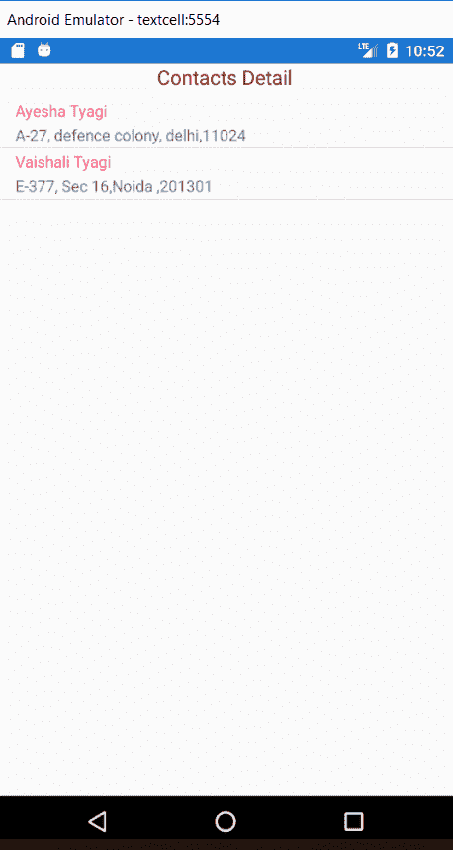
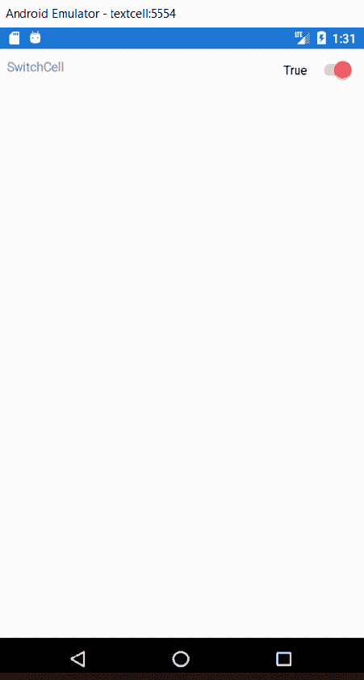
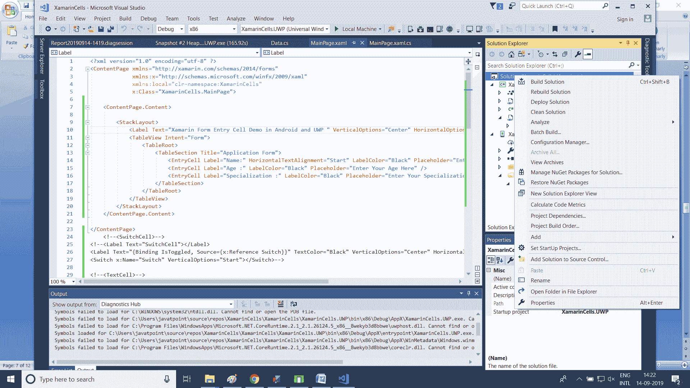
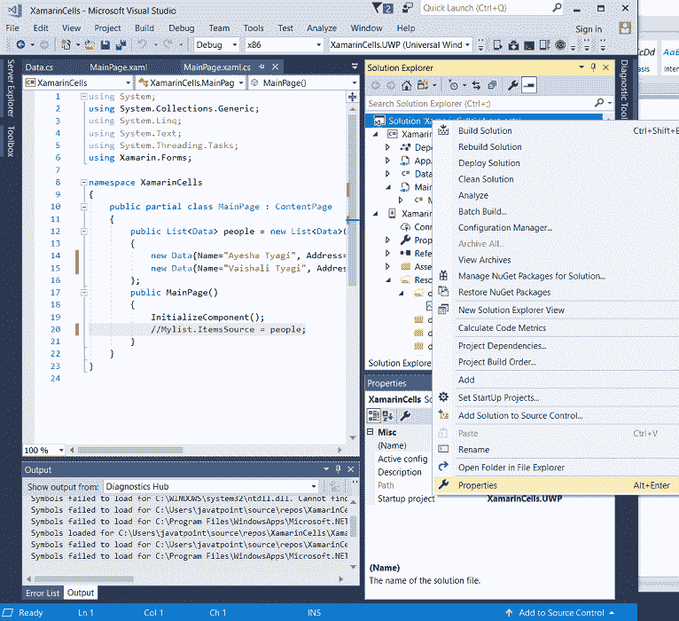
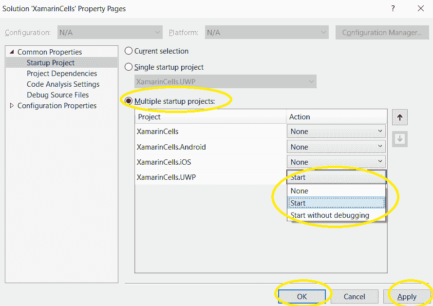
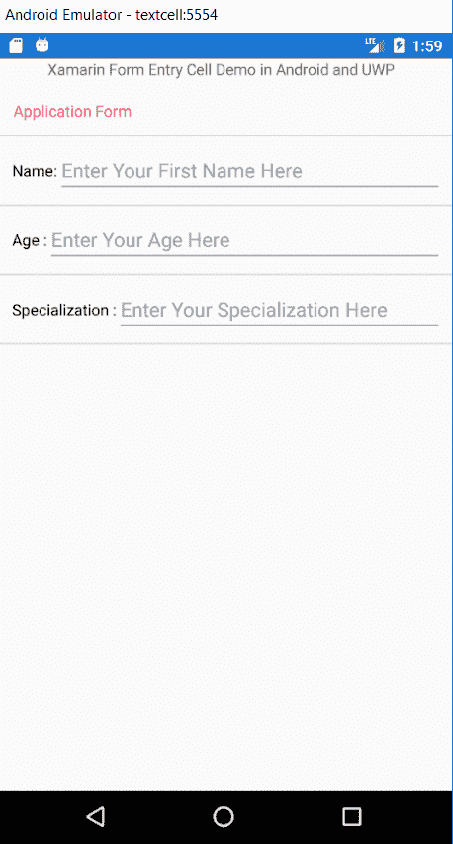
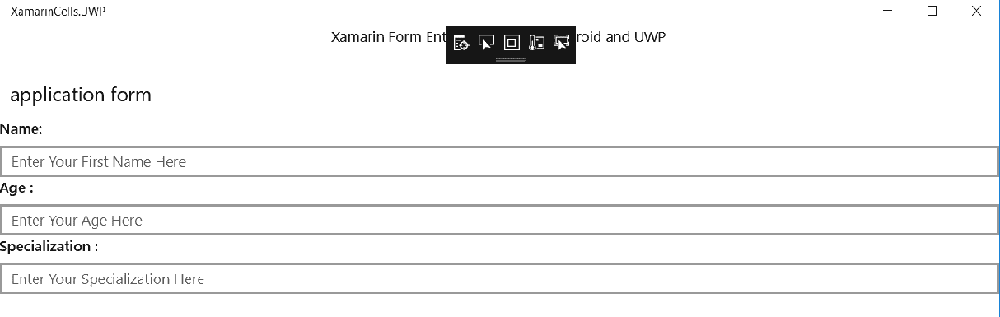
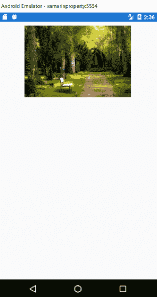
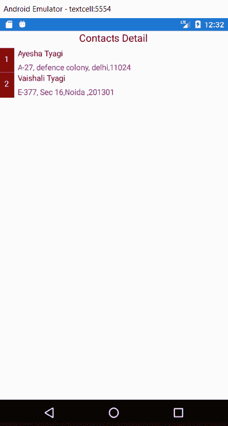

# Xamarin 中的单元格。形式

> 原文：<https://www.javatpoint.com/xamarin-forms-cells>

XamarinForms 单元格可以添加到列表视图和表格视图中。单元格是一种专用元素，用于表格中的项目，并描述列表中的元素应如何呈现。**细胞**类由**元素**驱动，我们可以从其中导出**视觉元素**。单元格本身不是视觉元素。它是创建视觉元素的模板。该单元专用于**列表视图**和**表格视图**控制。

以下是细胞的类型:

*   文本单元格
*   开关电池
*   EntryCell
*   ImageCell
*   ViewCell(检视储存格)

## 文本单元格

文本单元格是一个有两个单独的文本区域来显示数据的单元格。文本单元格通常用于表格视图和列表视图控件中的信息。两个文本区域垂直对齐，以最大化单元格内的空间。

在这里，我们想借助列表视图中的文本单元格显示一个人的联系方式。

以下是我们在文本单元格中显示联系人详细信息的步骤。

### 示例:

在这个例子中，我们在列表视图中创建文本单元格来显示一个人的联系细节。

**//程序**

**首页.XAML**

```

<?xml version="1.0" encoding="utf-8" ?>
<ContentPage 
             xmlns:x="http://schemas.microsoft.com/winfx/2009/xaml"
             xmlns:local="clr-namespace:XamarinCells"
             x:Class="XamarinCells.MainPage">
    <StackLayout>
        <Label Text="Contacts Detail" FontSize="Medium" TextColor="Maroon" HorizontalOptions="Center"></Label>
         <ListView x:Name="Mylist">
            <ListView.ItemTemplate>
                <DataTemplate>
                    <TextCell Text="{Binding Name}" Detail="{Binding Address}"></TextCell>
                    <!--here we bind the Text and Detail of the person in the TextCell-->
                </DataTemplate>
            </ListView.ItemTemplate>
        </ListView>
    </StackLayout>

</ContentPage>

```

在这里，我们创建一个类，它就是数据。CS，我们创建数据的地方。

**数据。CS**

```

using System;
using System.Collections.Generic;
using System.Text;

namespace XamarinCells
{
    public class Data
    {
        public string Name { get; set; }
        public string Address { get; set; }
    }
}

```

在**主页面的编码页面上。Xaml.CS** 中，我们创建了一个数据列表，在这里我们提供了人的信息，然后在 ListView 的帮助下在 TextCell 中显示对象(人)的信息。

**首页.Xaml.CS**

```

using System;
using System.Collections.Generic;
using System.Linq;
using System.Text;
using System.Threading.Tasks;
using Xamarin.Forms;

namespace XamarinCells
{
    public partial class MainPage : ContentPage
    {
        public List<Data> people = new List<Data>()
        {
            new Data{Name="Ayesha Tyagi", Address="A-27, defence colony, delhi,11024"},
            new Data{Name="Vaishali Tyagi", Address="E-377, Sec 16,Noida ,201301"},
        };
        public MainPage()
        {
            InitializeComponent();
            Mylist.ItemsSource = people;
        }
    }
}

```

执行这个程序，点击模拟器。

**输出:**



**打印阿耶沙·泰亚吉和瓦伊沙里·泰亚吉的联系方式**

## 开关电池

开关电池是一种结合了标签和开关功能的电池。开关单元可用于打开和关闭功能、用户偏好或配置选项。

### 示例:

在本例中，我们创建了一个开关单元来显示开关的文本和功能。

**//程序**

**首页.XAML**

```

<?xml version="1.0" encoding="utf-8" ?>
<ContentPage 
             xmlns:x="http://schemas.microsoft.com/winfx/2009/xaml"
             xmlns:local="clr-namespace:XamarinCells"
             x:Class="XamarinCells.MainPage">

    <ContentPage.Content>
        <StackLayout Padding="10">
            <StackLayout Orientation="Horizontal">
                <Label Text="SwitchCell"></Label>
                <Label Text="{Binding IsToggled, Source={x:Reference Switch}}" TextColor="Black" VerticalOptions="Center" HorizontalOptions="EndAndExpand"></Label>
                <Switch x:Name="Switch" VerticalOptions="Start"></Switch>

            </StackLayout>
        </StackLayout>
    </ContentPage.Content>

</ContentPage>

```

**输出:**



## EntryCell

EntryCell 是一个结合了标签和条目功能的单元。当我们在应用程序中构建一些功能来从用户那里收集数据时，EntryCell 在这些场景中非常有用。它们可以很容易地放入一个 TableView 中，并且可以被视为简单的表单。

### 示例:

在这里，我们用 Xamarin 中的 TableView 创建 EntryCell。在跨平台应用开发中，用 Xaml 为安卓和通用窗口平台形成应用。

为此，我们必须为跨平台应用程序设置环境。

在这里，我们将遵循以下步骤:

**第一步:**右键点击项目名称，如截图所示。



**步骤 2:** 点击属性，如截图所示。



**第三步；**勾选多个启动项目单选按钮- >点击应用- >点击确定。



**首页.Xaml**

```

<?xml version="1.0" encoding="utf-8" ?>
<ContentPage 
             xmlns:x="http://schemas.microsoft.com/winfx/2009/xaml"
             xmlns:local="clr-namespace:XamarinCells"
             x:Class="XamarinCells.MainPage">

    <ContentPage.Content>

        <StackLayout>
            <Label Text="Xamarin Form Entry Cell Demo in Android and UWP " VerticalOptions="Center" HorizontalOptions="Center" />
            <TableView Intent="Form">
                <TableRoot>
                    <TableSection Title="Application Form">
                        <EntryCell Label="Name:" HorizontalTextAlignment="Start" LabelColor="Black" Placeholder="Enter Your First Name Here" />
                        <EntryCell Label="Age :" LabelColor="Black" Placeholder="Enter Your Age Here" />
                        <EntryCell Label="Specialization :" LabelColor="Black" Placeholder="Enter Your Specialization Here" />
                    </TableSection>
                </TableRoot>
            </TableView>
        </StackLayout>
    </ContentPage.Content>

</ContentPage>

```

执行这个程序，点击模拟器。

**输出:**

**在安卓**



这里，在输出中，这打印了安卓系统中**表格视图**中 **EntryCell** 中的一个人的信息。

**输出:**

**在窗口**



## ImageCell

ImageCell 对象用于将图像和文本放入表格中。ImageCell 控件的功能类似于普通的页面控件。

**首页.Xaml**

```

xml version="1.0" encoding="utf-8" ?>
<ContentPage 
             xmlns:x="http://schemas.microsoft.com/winfx/2009/xaml"
             xmlns:local="clr-namespace:Label"
             x:Class="Label.MainPage" 
              Title="Editor Page-XAML">
    <ContentPage.Content>
        <StackLayout Padding="5,10">
// In the source we have to give the name of the image file.
            <Image Source="nature.jpg"></Image>
        </StackLayout>
    </ContentPage.Content>
</ContentPage>

```

执行这个程序，点击模拟器。

**输出:**



## ViewCell(检视储存格)

我们可以把视图单元看作一张白纸。这是我们的个人画布，以创建一个细胞，看起来正是我们想要的方式。

在 ViewCell 的帮助下，我们可以定制表单。

### 示例:

这里，我们在列表视图的帮助下，在视图单元中创建一个页面。

**//程序**

**首页.Xaml**

```

<?xml version="1.0" encoding="utf-8" ?>
<ContentPage 
             xmlns:x="http://schemas.microsoft.com/winfx/2009/xaml"
             xmlns:local="clr-namespace:XamarinCells"
             x:Class="XamarinCells.MainPage">
    <StackLayout>
        <Label Text="Contacts Detail" FontSize="Medium" TextColor="Maroon" HorizontalOptions="Center"></Label>
         <ListView x:Name="Mylist">
            <ListView.ItemTemplate>
                <DataTemplate>
                    <!--<ImageCell Text="{Binding Name}" Detail="{Binding Address}" ImageSource="{Binding Image}"></ImageCell>-->
                    <!--here we bind the Text and Detail of the person in the TextCell-->
                    <ViewCell>
                        <!--take ViewCell to customize the page-->
                        <StackLayout Orientation="Horizontal">
                            <Grid BackgroundColor="Maroon" Padding="10">

                                <!--with the help of grid we will show the id(sequences of the items) set the padding property-->
                                <Label Text="{Binding Id}" TextColor="White"></Label>
                                <!--Binding Id bind the id--> 
                            </Grid>
                            <StackLayout Orientation="Vertical">
                                <!--create another stacklayout-->
                                <Label Text="{Binding Name}" TextColor="Maroon"></Label>
                                <!--create label to bind the name and address-->
                                <Label Text="{Binding Address}" TextColor="Purple"></Label>
                            </StackLayout>

                        </StackLayout>
                    </ViewCell>
                </DataTemplate>
            </ListView.ItemTemplate>
        </ListView>
    </StackLayout>

</ContentPage>

```

类是在我们定义要在页面上显示的项目变量名的地方创建的。

**//程序**

**数据。CS**

```

using System;
Using System.Collections.Generic;
Using System.Text;

namespace XamarinCells
{
    public class Data
    {
        public string Name { get; set; }
        public string Address { get; set; }
        //public string Image { get; set; }
        public int Id { get; set; }

    }
}

```

在主页的编码页上。Xaml 中，我们用 id 创建一个项目列表。

**//程序**

```

using System;
using System.Collections.Generic;
using System. Linq;
using System. Text;
using System.Threading.Tasks;
using Xamarin.Forms;

namespace XamarinCells
{
    public partial class MainPage : ContentPage
    {
        public List<Data> people = new List<Data>()
        {
            new Data{Name="Ayesha Tyagi", Address="A-27, defence colony, delhi,11024",Id=1},
            new Data{Name="Vaishali Tyagi", Address="E-377, Sec 16,Noida ,201301",Id=2},
        };
        public MainPage()
        {
            InitializeComponent();
            Mylist.ItemsSource = people;
        }
    }
}

```

执行这个程序，点击模拟器。

**输出:**



上述程序打印了带有身份证号的阿耶沙·泰亚吉和瓦伊沙里·泰亚吉的联系方式。

* * *