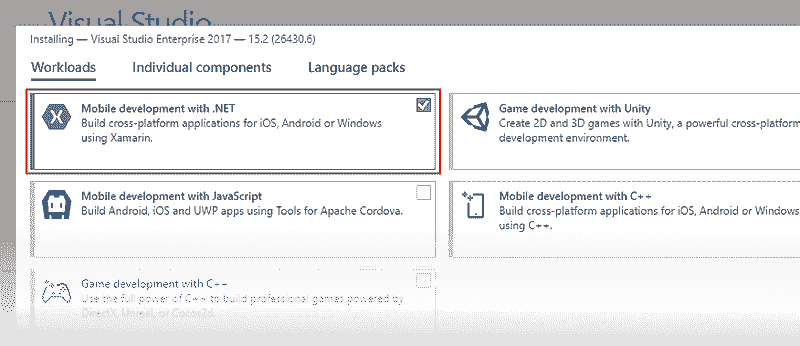
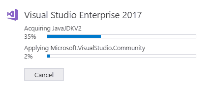

# 巫师安卓系统

> 吴奇珍:t0]https://www . javatpoint . com/xamparin-Android

Xamarin。安卓是 Xamarin 家族的一部分，使用 C#和 Xamarin 构建原生安卓应用。 **Xamarin。安卓**提供了与我们在安卓和 Java 中相同的用户界面控件。在继续下一步之前，我们将关注安卓架构和使用 Java 的开发工具。

## 安卓开发

安卓是一个基于 Linux 内核的开源操作系统。安卓最初由安卓公司开发，由谷歌收购。安卓提供了丰富的应用框架，允许我们在 Java 环境中为移动设备构建创新的应用和游戏。

原生安卓应用可以使用安卓工作室开发，也可以使用 Java 作为编程语言的 Eclipse 开发。


## 安卓平台架构

安卓操作系统是一个基于 Linux 的软件组件堆栈，可以分为五个部分，如下图所示。


### Linux 内核

Linux 内核提供了多任务执行环境，允许多个进程并发执行。安卓运行时依赖于 Linux 内核来实现所有功能，比如低级内存管理和线程。

### 硬件抽象层

硬件抽象层(HAL)通过更高级别的 java API 帮助 Android/Application 框架与硬件特定的设备驱动程序进行通信。安卓哈尔包含特定类型硬件组件的多个库模块，如相机和蓝牙模块。因此，当我们使用 Java API 调用访问硬件设备时，Android 系统会为硬件组件加载库模块。

### 安卓运行时

每个安卓应用程序都基于安卓 5.0 或更高版本，在其进程中运行，并带有安卓运行时实例。ART 是为了在低内存设备上运行多个虚拟机而编写的。

应用程序的代码必须从标准的 Java 类文件转换为 Dalvik 可执行文件(。数据被优化为比 java 字节码占用最少的内存(消耗少 50%的内存)。构建可以在安卓平台上运行的工具链，比如将 Java 的源代码编译成 DEX 字节码。

与达尔维克相比，艺术有两个主要特点。

1.  提前(AOT)编译，这提高了速度并减少了内存占用。
2.  ART 优化了垃圾收集。

### 本机 C/C++库

C/C++库提供了更广泛的功能，包括 2D 和三维图形绘制、安全套接字层(SSL)通信、SQLite 数据库管理、音频和视频回放等媒体管理、显示子系统以及图形层管理和 C 系统库(libs)的实现。

安卓应用可以通过基于 Java 的安卓核心库 API 访问这些库。此外，我们可以在使用 Java 原生接口(JNI)的 Java 代码中使用 Android 原生开发工具包(NDK)访问这些原生 C/C++库。

### Java API 框架

Java 的应用编程接口框架是一组丰富的、可扩展的应用编程接口，用于使用 JAVA 语言访问安卓操作系统的整个功能集。这些应用编程接口有助于与本机 C/C++库交互，并为各种任务管理(如活动管理、通知管理、资源管理等)构建丰富的用户界面。

### 系统应用和第三方应用

安卓操作系统附带了一套系统应用程序，用于电子邮件、电话、消息、日历、互联网浏览、联系人等。除了系统应用，我们还可以安装第三方电子邮件、outlook、聊天、twitter、facebook 等信息。

### Xamarin。安卓架构

Xamarin。安卓应用在 Mono 执行环境中运行。Mono 运行时是用 C 语言编写的，在 Android Runtime (ART)虚拟机中并行运行。运行时环境都运行在 Linux 内核之上，并公开各种 API 来访问 android 系统。


Xamarin。安卓应用程序可以通过调用。Net APIs，或者使用 Android 命名空间中公开的类，这些类提供了一个到 Java APIs 的桥梁。这些是由安卓运行时呈现的。

### 托管可调用包装器(MCW)

安卓操作系统设施，如音频、图形、OpenGL 和电话，不能直接用于本地应用程序。它们只通过安卓中可用的安卓运行时 Java 应用编程接口公开。*命名空间或 Java。*命名空间。

所以要访问 Xamarin 中的这些 API。安卓系统需要一个托管的可调用包装器，作为调用安卓代码的 JNI (Java Native Interface)桥，为覆盖虚拟方法和实现 Java Interface 提供支持。

### 安卓可调用包装器

安卓可调用包装器是一个 JNI 桥，用于在我们需要安卓运行时调用托管代码。当安卓可调用包装器(ACW)是从 Java 创建的时候，ACW 构造器调用了相应的 C#构造器。

### Xamarin。安卓开发

Xamarin。安卓允许我们使用 C#构建原生的安卓应用程序。一个 Xamarin。安卓项目是基于我们用安卓工作室或 Eclipse 创建的安卓项目的标准结构。我们可以做 Xamarin。安卓系统的开发，使用面向苹果电脑的 IDEs - Xamarin 工作室或 Visual Studio，面向视窗系统的 Visual Studio。


### 设置和安装

在这里，我们将定义如何安装和配置 Xamarin。安卓将与 Visual Studio 一起在 Windows 和 macOS 上工作。如何使用 Android SDK 管理器下载并安装 Android SDK 工具和组件，这是构建和测试应用程序所需的，以及如何将物理 Android 设备连接到我们的开发计算机上进行调试和测试我们的应用程序。

### 装置

Xamarin 可以作为新的 Visual Studio 2017 的一部分进行安装。为此，我们必须遵循以下步骤:

1.  从 Visual Studio 页面下载 Visual Studio 2017 社区、Visual Studio 专业版或 Visual Studio 企业版。
2.  要开始安装，请双击下载的软件包。
3.  选择移动的**开发。NET** 工作负载来自安装屏幕。



4.当**移动开发用。NET** 被选中，在这里，我们可以选择我们想要安装的移动开发的选项。


5.当 Visual Studio 2017 安装开始时，单击右下角的按钮进行安装:


这取决于安装的是 Visual Studio 2017 的哪个版本，安装过程可能需要很长时间才能完成。我们可以使用进度条来监控安装。



6.Visual Studio 2017 安装完成后，点击**启动**按钮启动 Visual Studio:


## 为 Xamarin 设置安卓软件开发工具包。机器人

Visual Studio 包括一个安卓软件开发工具包管理器，通过它我们可以下载安卓软件开发工具包工具以及开发 Xamarin 所需的其他组件。安卓应用。

Xamarin。安卓软件开发工具包管理器帮助我们下载最新的安卓组件，我们可以用它们来开发我们的 Xamarin。安卓应用。它取代了谷歌独立的 SDK 管理器，该管理器已被否决。

### 软件开发工具包管理器

在 Visual Studio 中启动 SDK 管理器，点击**工具- >安卓- >安卓 SDK 管理器**。


安卓软件开发工具包管理器显示在工具屏幕的安卓软件开发工具包中。屏幕有两个选项卡- **工具和平台**。


### 安卓软件开发工具包位置

安卓软件开发工具包的位置在安卓软件开发工具包和工具屏幕的顶部，如截图所示。出于以下原因，需要设置安卓软件开发工具包的位置:

1.  安卓软件开发工具包管理器无法找到安卓软件开发工具包。
2.  我们必须在备用(非默认)位置安装安卓软件开发工具包。

要设置 Android SDK 位置，请单击省略号(...)按钮在 Android SDK 位置的右侧。这将打开浏览文件夹对话框，用于导航到安卓软件开发工具包的位置。截图显示正在选择程序文件(x86)\Android 下的 Android SDK:


当我们点击**确定**时，软件开发工具包管理器管理安装在该位置的安卓软件开发工具包。

### 工具选项卡

“工具”选项卡显示工具和附加工具的列表。我们使用此选项卡安装安卓软件开发工具包工具、平台工具和构建工具。此外，我们可以安装安卓仿真器、HAXM 加速、低级调试器(LLDB)、NDK 和谷歌游戏库。

**例如:**要下载谷歌安卓模拟器包，点击安卓模拟器旁边的勾号，然后点击应用(更改)按钮:


一个对话框将显示消息**以下软件包要求我们在安装**之前接受其许可条款:


如果我们同意条款和条件，请单击接受。在窗口的底部，进度条指示下载和安装的进度。安装完成后，“工具”选项卡显示所选工具和附加工具已安装。

### 平台选项卡

“平台”选项卡显示了 SDK 版本列表以及每个平台的其他资源(如系统映像):


此屏幕显示安卓版本(如**安卓 8.0** )、代码名(**奥利奥**)、API 级别(如 26)以及该平台组件的大小(如 1 GB)。我们使用“平台”选项卡来安装安卓应用编程接口级别的组件，这是我们想要的目标。

安装平台的所有组件后，平台名称旁边会出现一个复选标记。如果某个平台的所有组件都没有安装，则该平台的框将被填充。我们可以通过单击平台左侧的+框来展开平台以查看其组件(以及安装了哪些组件)。单击-关闭平台的组件列表。

要向 SDK 添加另一个平台，请单击该平台旁边的框，直到复选标记出现以安装其所有组件，然后单击**应用更改**:


要仅安装特定组件，请单击平台旁边的框。然后，我们可以选择我们需要的任何单个组件:


**注意:**要安装的组件数量出现在“应用更改”按钮旁边。单击应用更改按钮后，我们将看到许可接受屏幕，如前所示。如果我们接受条款和条件，请单击接受。当有多个组件要安装时，我们会多次看到此对话框。在底部，进度条将指示下载和安装的进度。当下载和安装过程完成时(这可能需要很多分钟，取决于需要下载多少组件)。添加的组件用复选标记标记，并显示为已安装。

### 存储库选择

默认情况下，安卓软件开发工具包管理器从微软管理的存储库中下载平台组件和工具。如果需要访问微软知识库中没有的 alpha/beta 平台和工具。我们可以将软件开发工具包管理器切换到使用谷歌的存储库。要进行此切换，请单击右下角的齿轮图标，然后选择**存储库>谷歌(不支持)**:


当我们选择谷歌存储库时，额外的包可能会出现在平台选项卡中，这在以前是不可用的。在这里，我们必须意识到谷歌存储库的使用是不受支持的，不建议用于日常开发。

要返回到支持的平台和工具库，我们将单击**微软(推荐)**。这将程序包和工具列表恢复为默认选择。

## 安卓模拟器设置

在这里，我们将解释如何准备安卓模拟器来测试应用程序。

安卓仿真器可以在多种配置下运行，以模拟不同的设备。每种配置都称为虚拟设备。当我们在模拟器中部署和测试我们的应用程序时，我们将选择一个预配置或定制的虚拟设备来模拟物理安卓设备，如 Nexus 或 Pixel 手机。

**仿真器性能的硬件加速(Hyper V & HAXM)**

在这里，我们将学习如何使用我们计算机的硬件加速功能来最大限度地提高安卓仿真器的性能。

Visual Studio 很容易让开发人员测试和调试 Xamarin。在安卓设备不可用的情况下，使用安卓仿真器的安卓应用程序。但是，如果硬件加速在计算机上不可用，安卓仿真器运行缓慢。我们可以通过使用特定的 x86 虚拟设备映像和我们计算机的虚拟化功能来提高安卓仿真器的性能。

**在 windows 上加速安卓模拟器**

这里，是可用于加速安卓模拟器的虚拟化技术。

1.  **Windows Hypervisor 平台(WHPX)和微软的 Hyper-V:** Hyper-V 是 window 的虚拟化功能，可以在物理主机上运行虚拟化的计算机系统。
2.  **英特尔的硬件加速执行管理器(HAXM):** HAXM 是一个运行计算机英特尔中央处理器的虚拟化引擎。

在 windows 上，我们使用 HAXM 来加速安卓仿真器。如果 HAXM 在我们的计算机上不可用，那么可以使用 Windows Hypervisor 平台(WHPX)。

如果满足以下标准，安卓仿真器将自动使用硬件加速:

*   硬件加速是可用的，并且在我们的计算机系统上启用。
*   模拟器正在运行为基于虚拟设备的 x-86 创建的系统映像。

**超 V 加速**

Hyper-V 是加速安卓模拟器的选择。在启用 Hyper-V 之前，首先我们要验证系统是否符合支持 Windows Hypervisor 平台的标准。

**验证对 Hyper-V 的支持**

Hyper-V 运行在 Windows 虚拟机管理程序平台上。要在 Hyper-V 上使用安卓模拟器，计算机必须满足以下标准才能支持 Windows 虚拟机管理程序平台:

*   计算机必须满足以下要求:
    *   64 位英特尔或 AMD 锐龙处理器，带二级地址转换。
    *   对虚拟机监控模式扩展的中央处理器支持。
    *   最少 4gb 内存。
*   在计算机的 BIOS 中，必须启用以下项目:
    *   虚拟化技术(这被称为标签取决于主板制造商)。
    *   硬件强制数据执行预防。
*   我们的计算机必须更新到 Windows 10 2018 年 4 月更新(版本 1803)或更高版本。我们可以通过以下步骤来验证我们的 Windows 版本是否是最新的:
    1.  在窗口搜索框中输入**关于**。
    2.  在搜索结果中选择**关于我们的电脑**。
    3.  在窗口的**规格**部分的**关于**对话框中向下滚动。
    4.  验证**版本**至少为 1803:


**要验证我们的计算机硬件和软件是否与 Hyper-V 兼容，请打开命令提示符，并键入以下命令:**

```

CMD
SYSTEMINFO

```

如果列出的所有 Hyper-V 要求的值都为**是**，则计算机可以支持 Hyper-V。例如:


**启用超 V 加速**

如果电脑符合上述条件，我们将使用以下步骤激活带有 Hyper-V 的安卓模拟器:

1.在搜索框中输入 Windows 功能，在搜索结果中选择 **Windows 功能开启或关闭**。在“窗口功能”对话框中，启用 Hyper-V 和 Windows 虚拟机管理程序平台:


1.  进行这些更改后，请重新启动计算机。
2.  **安装 Visual Studio 15.8 或更高版本**(此版本的 Visual Studio 支持使用 Hyper-V 运行 Android 模拟器)。
3.  **安装安卓仿真器包 27.2.7 或更高版本。**要安装这个包，我们将导航到 Visual Studio 中的**工具>安卓>安卓 SDK 管理器**。选择工具选项卡，并确保安卓模拟器版本至少为 27.2.7。此外，请确保安卓软件开发工具包工具版本为 26.1.1 或更高版本:


当我们创建虚拟设备时(**请参见使用安卓设备管理器**管理虚拟设备)，请务必选择基于 **x86 的**系统映像。如果我们使用基于 ARM 的系统映像，虚拟设备将不会加速，并且运行缓慢。

**用 HAXM 加速**

要确定我们的硬件是否支持 HAXM，我们必须遵循以下步骤:我的处理器是否支持英特尔虚拟化技术？。如果设备支持 HAXM，我们可以使用以下命令检查是否已经安装了 HAXM:

1.打开命令提示符窗口，输入以下命令:

```

cmd
sc query intelhaxm

```

2.我们将检查输出，看看 HAXM 进程是否正在运行。如果是，我们应该看到输出将 intelhaxm 状态列为 RUNNING。例如:


1.如果状态未设置为运行，则不安装 HAXM。

如果计算机支持 HAXM，但没有安装 HAXM，我们将在下一节中使用这些步骤来安装 HAXM。

**安装 HAXM**

HAXM 安装可从英特尔硬件加速执行管理器页面获得的 Windows 软件包。要下载和安装 HAXM，我们使用以下步骤:

1.  从英特尔的网站上，对于 Windows，我们下载了最新的 HAXM 虚拟化引擎安装程序。直接从英特尔网站下载 HAXM 安装程序的优势在于，我们可以保证使用的是最新版本。
2.  运行**intelhaxm-android.exe**启动 HAXM 安装程序。接受安装程序对话框中的默认值:


当我们创建虚拟时，一定要选择一个基于 **x86 的**系统映像。如果我们使用基于 ARM 的系统映像，虚拟设备将不会加速，并且运行缓慢。

## 使用安卓设备管理器管理虚拟设备

在这里，我们将描述如何使用安卓设备管理器来创建和配置安卓虚拟设备。我们可以使用这些虚拟设备来运行和测试我们的应用程序，而不依赖于物理设备。

启用硬件加速后，下一步是使用安卓设备管理器创建虚拟设备，我们可以使用这些设备来测试和调试应用程序。

### 视窗操作系统上的安卓设备管理器

在这里，我们将解释如何使用安卓设备管理器来创建、定制和启动安卓虚拟设备。


我们使用安卓设备管理器来创建和配置运行在安卓模拟器中的安卓虚拟设备。每个 AVD 都是模拟器的配置，模拟器模拟了物理安卓设备。

### 要求

要使用安卓设备管理器，我们需要以下项目:

*   Visual Studio 2019 社区、专业和企业版。
*   或者我们可以使用 Visual Studio 2017 版或更高版本。支持 Visual Studio 社区、企业和专业版。
*   Visual Studio 工具用于 Xamarin 版本。
*   必须安装安卓软件开发工具包(使用这个为 Xamarin 设置安卓软件开发工具包。安卓)。如果还没有安装，我们必须确保在它的位置安装安卓软件开发工具包:**C:\ Program Files(x86)\ Android \ Android-SDK**。

必须安装以下软件包(通过 ndroid 软件开发工具包管理器)

*   **安卓 SDK 工具 26.1.1 版**或更高版本
*   **安卓 SDK 平台-工具 27.0.1** 或更高版本
*   **安卓 SDK 构建工具 27.0.3** 或更高版本
*   **安卓仿真器 27.2.7** 或更高版本。

这些包应该显示为**已安装的**状态，如下图所示:


### 启动设备管理器

我们将通过点击**工具- >安卓- >安卓设备管理器**，从**工具**启动安卓设备管理器。


### 主屏幕

当我们启动安卓设备管理器时，它会显示显示所有配置虚拟设备的屏幕。对于每个虚拟设备，**操作系统(安卓版本)，显示名称、内存大小、处理器和屏幕分辨率**。


当我们在列表中选择一个设备时，右侧会出现**开始**按钮。我们可以单击“开始”按钮，使用此虚拟设备启动模拟器:


当模拟器用选定的虚拟设备启动时，**开始**按钮变为**停止**，我们可以用它来停止模拟器。

### 新的鸿沟

要创建新设备，点击**新建**按钮


点击**新建**启动**新设备**画面。


要在**新设备屏幕**中排列新设备，请使用以下步骤:

1.在这里，我们必须给设备命名。在本例中，创建了一个名为**和**新设备。


2.通过单击**基本设备**选择要模拟的物理设备，然后单击菜单。


3.现在，我们将通过单击处理器的菜单来选择虚拟设备的处理器类型。现在我们选择性能最好的 **x86** ，因为它支持**硬件加速**。 **x86_64** 选项也利用了硬件加速，但运行速度比 **x86** 稍慢。


4.点击菜单中的**操作系统**，选择安卓版本。例如，选择**奥利奥 8.1 - API 27** 为 API 级别 27 创建虚拟设备:


如果我们选择尚未安装的安卓应用编程接口级别，设备管理器将在屏幕底部显示消息。**将下载一个新设备** -它将在创建新的虚拟设备时下载并安装必要的文件:


如果我们想在我们的虚拟设备中包含谷歌播放服务应用程序接口，请启用**谷歌应用程序接口**选项。要包括谷歌 Play 商店应用，我们将启用**谷歌 Play 商店**选项:


请注意，谷歌 Play 商店的图像仅适用于一些基本设备类型，如 Pixel、Pixel 2、Nexus 5 和 Nexus 5X。

6.编辑我们需要修改的任何属性。

7.添加我们需要显式设置的任何附加属性。**新设备**屏幕仅显示最常修改的属性，但是我们可以点击**添加属性**下拉菜单(在底部)来添加其他属性:


我们还可以通过选择属性列表顶部的自定义选项来定义自定义属性。

8.单击创建按钮创建新设备。


9.我们可能会看到许可接受屏幕。单击接受。


10.安卓设备管理器将新设备添加到已安装的虚拟设备列表中，同时在设备创建过程中显示**创建**进度指示器:


11.创建过程完成后，新设备会显示在已安装虚拟设备列表中，并带有**开始**按钮。


* * *