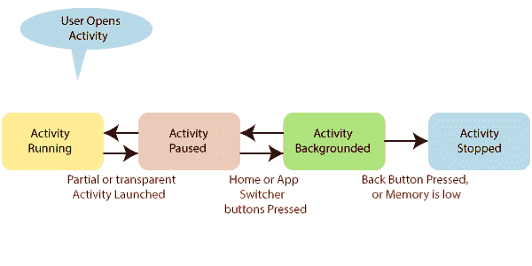
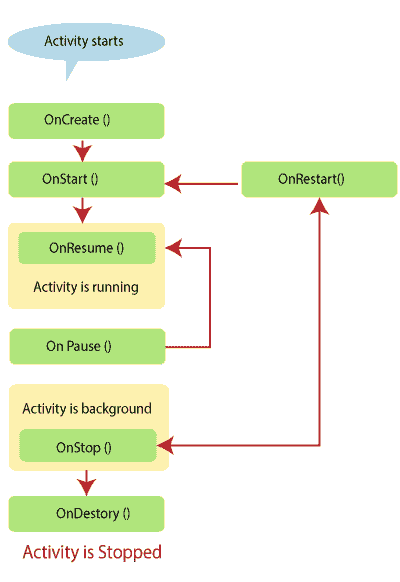

# Xamarin。安卓活动生命周期

> 原文：<https://www.javatpoint.com/xamarin-android-activity-lifecycle>

活动是 Android 应用程序的构建模块，它们可以以不同的状态存在。活动生命周期从初始化开始，到终止结束。活动生命周期包括应用程序初始化和终止之间的许多状态。活动是安卓应用程序中的单个页面，用户可以在其中进行交互。

## 活动状态

**AndroidOS** 活动是基于它们的状态。安卓状态帮助安卓识别不再使用的活动。安卓国家允许**操作系统**回收内存和资源。

**该图显示了活动在其生命周期内可以经历的状态。**



**状态分为四组:**

1.  **活动或运行:**当活动在前台时，它们可以被视为活动或运行。活动或运行状态也称为活动堆栈的顶部。运行状态被称为安卓系统中优先级最高的活动。在极端情况下，当活动试图使用比操作系统中可用内存更多的内存时，可以终止此活动。在这种情况下，UI 变得无响应。
2.  **暂停:**当设备进入睡眠状态，但活动仍然可见，但被新的、非全尺寸或透明的活动部分隐藏时，在这种情况下，活动被视为暂停。暂停的活动仍然有效，即它们维护所有状态和成员信息，并将保持与窗口管理器的关联。暂停是安卓系统中优先级第二高的活动。此活动仅由操作系统终止。此活动满足资源要求，这是保持活动稳定和响应所必需的。
3.  **停止/后台:**完全被另一个活动覆盖的活动可以被认为是在后台停止或继续。停止的活动试图尽可能长时间地保持它们的状态，但是停止的活动总是被认为是所有三种状态中优先级最低的活动。操作系统可以在这种状态下终止活动，以满足最高优先级活动的资源需求。
4.  **重启:**在安卓系统中，这可能是活动在生命周期中从暂停到停止从内存中移除的可能性。如果我们想回到活动，它必须重新启动。重启后会恢复到之前保存的状态，然后显示给用户。

## 活动生命周期方法

当用户浏览安卓应用程序时，会发生一系列事件。例如，当我们启动一个应用，比如**脸书应用**，它启动并出现在用户的前台，**onCreate()→onStart()→onResume()**。

如果任何其他活动开始，例如:当电话到达时，脸书应用程序将转到后台，电话到达前台。现在我们有两个过程正在进行。

```

onPause()  --- > onStop()

```

当电话结束时，**脸书**应用返回前台。调用了三种方法。

```

onRestart() --- > onStart() --- > onResume()

```

Xamarin。安卓框架为管理应用程序中的**活动状态**提供了一个强大的模型。当活动的状态改变时，操作系统会通知活动，操作系统会调用该活动的特定方法。

以下是指定与**活动生命周期**的关系的几种方法:

作为开发人员，我们可以通过重写活动中的方法来处理状态的变化。在这里，我们必须注意到所有的生命周期方法都是在 UI 线程上调用的，并且阻止操作系统执行下一个 UI 工作。它将隐藏当前活动并显示新活动。任何长时间运行的任务都应该在后台线程上执行。

**以下是生命周期方法及其用途:**



**OnCreate:** OnCreate 是创建任何活动时调用的第一个方法。OnCreate 总是被覆盖，以执行任何活动所需的任何初始化，例如:

*   **创建视图**
*   **初始化变量**
*   **将静态数据绑定到列表**

OnCreate 取 **Bundle** 参数，该参数是一个字典，用于在活动之间存储和传递状态和对象的信息。如果包不为空，这表明活动正在重新启动，它应该从上一个包恢复其状态。

```

protectedoverridevoidOnCreate(Bundle bundle)
{
base.OnCreate(bundle);

string intentString;
bool intentBool;

if (bundle != null)
   {
      intentString = bundle.GetString("myString");
      intentBool = bundle.GetBoolean("myBool");
   }

// Set our view from the "main" layout resource
   SetContentView(Resource.Layout.Main);
}

```

一旦 OnCreate 完成，安卓将启动 OnStart。

**OnStart:**OnCreate 完成后，系统会调用 OnStart。如果需要在任何活动可见之前执行任何任务，活动可能会覆盖此方法。OnStart 包括诸如刷新活动中视图的当前值。安卓会在 OnStart 后调用 OnResume 方法。

**OnResume:** 当任何活动准备好开始与用户交互时，系统将调用 OnResume。活动应该重写此方法来执行任务。这些任务是:

*   **提高帧速率。**
*   **开始动画**
*   **收听 GPS 更新**
*   **显示相关的提醒，如对话框或提醒。**
*   **连接外部事件处理程序。**

这里我们将编写代码来演示如何初始化相机。

```

publicvoidOnResume()
{
base.OnResume(); // Always call the superclass first.

if (_camera==null)
    {
// Do camera initializations here
    }
}

```

OnResume 很重要，因为在 OnPause 中完成的任何操作都应该在 OnResume 中撤消。当我们开始任何活动时，它是在 OnPause 之后执行的唯一方法。

**OnPause:** OnPause 在系统将要将活动放入后台时或活动不可见时调用。如果需要，活动应该重写 OnPause 方法:

*   将未保存的更改提交给持久性数据。
*   消耗它应该清理或销毁的资源。
*   降低帧速率并暂停动画。
*   注销外部事件处理程序或通知处理程序。必须这样做，以防止活动中的内存泄漏。
*   如果活动显示任何对话框或警报，必须使用。消除方法。

例子:在这个例子中，我们释放相机。暂停期间，活动不能使用它。

```

publicvoidOnPause()
{
base.OnPause(); // Always call the superclass first

// Release the camera as other activities might need it
if (_camera != null)
    {
        _camera.Release();
        _camera = null;
    }
}

```

以下是 OnPause 之后将调用的两个生命周期方法。

1.  如果活动返回前台，将调用 OnResume。
2.  当活动放在后台时，将调用 OnStop。

**OnStop:** 当活动不可见时，在这种情况下，我们将使用 OnStop。此活动发生在以下场景中:

1.  当新的活动开始时。
2.  当现有活动回到前台时。
3.  当一项活动被破坏时。

当安卓需要内存资源，无法在后台做活动时，在内存不足的情况下无法调用 OnStop。这就是当我们计划终止任何活动时，不能依赖 OnStop 的原因。

在此之后可以调用的下一个生命周期方法将是 on story(如果活动正在运行)，如果活动正在返回交互，将使用 OnRestart。

**OnDestroy:** OnDestroy 是在活动实例被销毁并从内存中完全移除之前，对其调用的最终方法。在极端情况下，安卓可能会扼杀活动的托管过程，导致 OnDestroy 无法实现。大多数活动不会执行此方法，因为主要的清理和关闭是在 OnPause 或 OnStop 方法中完成的。

OnDestroy 方法通常被重写，以清理可能会泄漏资源的长期运行的资源。

这方面的例子是在 OnCreate 中启动的后台线程。活动被销毁后将没有生命周期方法。

**OnRestart:** OnRestart 是在停止活动之后，恢复活动之前调用的。

**例如**当用户在应用程序中进行活动时按下主页按钮。出现这种情况时，调用 **OnPause** ，然后调用**ontop**，活动被移到后台但不被破坏。如果我们想重新安装应用程序，那么使用任务管理器或类似的应用程序，安卓会调用活动的 OnRestart 方法。

OnStart 将是 OnRestart 之后调用的下一个生命周期方法。

## 包裹

安卓活动生命周期为应用程序中的状态管理活动提供了一个强大的框架，但是它可能很难理解和实现。

* * *