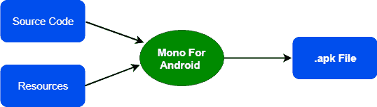
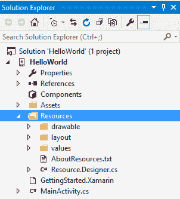
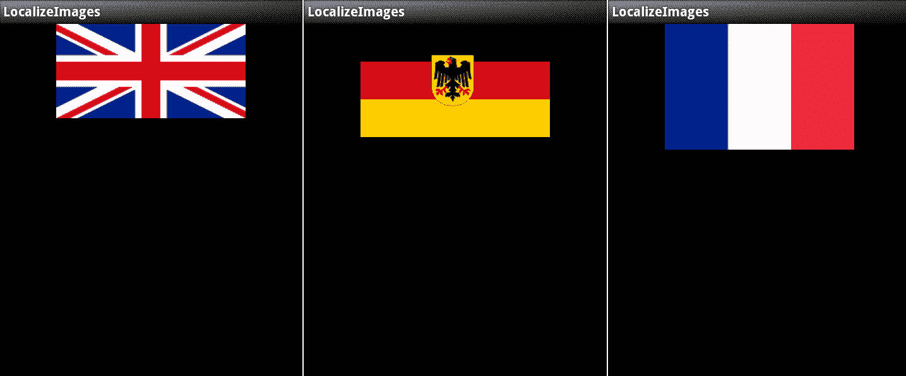
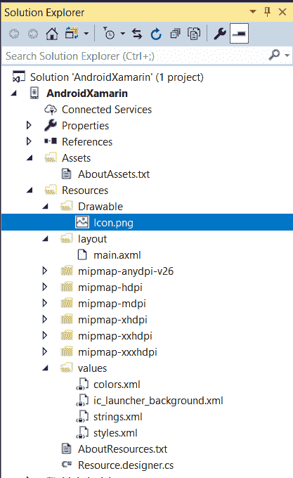
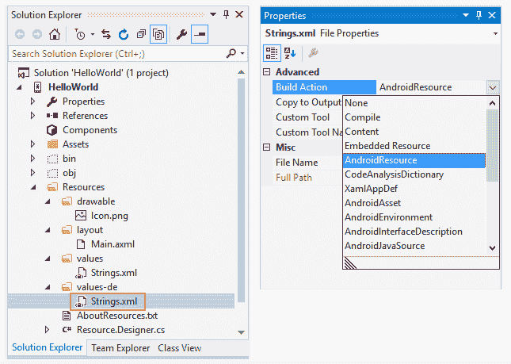
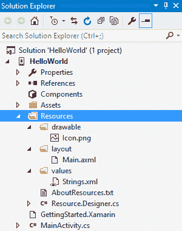
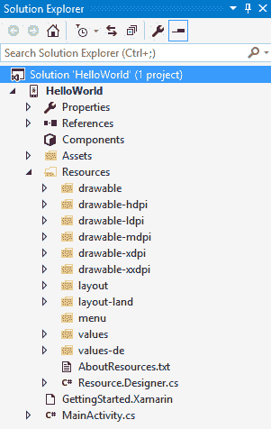

# Xamarin。安卓应用基础

> 原文：<https://www.javatpoint.com/xamarin-android-application-fundamentals>

在这里，我们将解释开发人员在开发安卓应用程序时需要注意的一些任务或概念。

## 易接近

在这里，我们将讨论如何使用安卓可访问性应用程序接口来构建应用程序。

**用户界面元素**

安卓提供了一个 **ContentDescription** 属性，供屏幕读取 API 用来描述控件可访问性的目的。

内容的描述在 AXML 布局文件中。

**AXML 布局**

在 XML 布局中，我们使用**Android:content description**属性:

```

<ImageButton
android:id=@+id/saveButton"
android:src="@drawable/save_image"
android:contentDescription="Save data" />

```

**文本视图的提示**

对于数据输入，**编辑文本**和**文本视图**控件使用提示属性来提供预期输入的描述。当输入文本时，文本本身将“阅读”而不是提示。

**AXML 布局**

XML 布局文件使用 android:提示属性:

```

<EditText
android:id="@+id/someText"
android:hint="Enter some text" />

```

**标签用于将输入字段与标签链接起来**

要将标签与数据输入控件相关联，我们使用 labelFor 属性。

**AXML 布局**

在 XML 布局中，我们使用 android:labelFor 属性来引用另一个控件的标识符:

```

<TextView
android:id="@+id/labelFirstName"
android:hint="Enter some text"
android:labelFor="@+id/editFirstName" />
<EditText
android:id="@+id/edit first name"
android:hint="Enter some text" />

```

**宣布无障碍**

我们在任何视图控件上使用 AnnounceForAccessibility 方法，以便在启用可访问性时向用户传达事件或状态更改。对于内置旁白提供足够反馈的所有操作，不需要 AnnounceForAccessibility。我们可以使用 AnnounceForAccessibility，其中附加信息将对用户有所帮助。

下面的代码显示了一个调用 AnnounceForAccessibility 的简单示例:

```

button.Click += delegate {
  button.Text = string.Format ("{0} clicks!", count++);
button.AnnounceForAccessibility (button.Text);
};

```

**改变焦点设置**

导航依赖于关注用户对操作可用性的理解的控件。安卓提供了一个可聚焦的属性，可以让标签控件在导航过程中专门接收焦点。

**AXML 布局**

在布局 XML 文件中，设置安卓:可聚焦属性:

```

<android:focusable="false" />

```

我们可以使用下一个焦点向下、下一个焦点向左、下一个焦点向上的属性来关注控件的顺序，这些属性是在 XAML 布局中设置的。我们使用这些属性来确保用户可以轻松地浏览屏幕上的控件。

## 安卓资源

在这里，我们将展示 Xamarin 中 Android 资源的概念。

安卓应用只是一个源代码。许多文件可以制作应用程序，如视频、图像、字体和音频文件。称为资源的非源代码文件，在构建过程中编译，并打包为 APK，用于分发和安装到设备中:



资源为安卓应用程序提供了不同的优势:

*   **代码分离:** Resources 将源代码与图像、字符串、菜单、动画、颜色等分离。资源也有助于本地化。
*   **目标多个设备:**资源在不改变代码的情况下为不同设备提供支持。
*   **编译时检查:**在应用程序中，资源是静态的，并被编译到应用程序中。在编译时，这允许验证资源。这时候，很容易抓到并改正错误。在运行时，更难找出错误，并且错误的纠正成本很高。

当一个新的 Xamarin。安卓项目启动后，会创建一个独占目录 Resources，以及一些子目录:



此屏幕截图显示应用程序资源根据其类型排列到子目录中。**可绘制**目录有图像；视图进入**布局**子目录等。

以下是访问 Xamarin 中**资源**的两种方式。安卓应用:用代码编程，用 XML 语法声明。

这些资源被称为**默认资源**，由所有设备使用，除非找到更具体的匹配。每种类型的资源都可能有备用资源，安卓可以使用这些资源来定位特定的工具。

**例如，**针对用户的地区和屏幕大小提供的资源。如果设备从纵向旋转 90 度到横向，那么在所有情况下，安卓将为应用程序加载资源，而无需任何额外的编码工作。

在保存其他资源的目录末尾添加一个短字符串，称为限定符。

**例如，****resources/drawing-de**将指定设置为德语区域的设备的图像，而**resources/drawing-fr**保存设置为法语区域的设备的图像。在下图中可以看到提供其他资源的示例，在该示例中，通过更改设备的区域设置来运行相同的应用程序:



**在这里，我们将讨论一些与资源相关的更基础的术语。这些是:**

## 安卓资源基础

几乎所有的安卓应用程序都有一些资源。应用程序通常具有 XML 文件形式的用户界面布局。当我们创建 Xamarin 时。安卓应用首先，默认资源是由 Xamarin 设置的。安卓项目模板。



如截图所示，以下是在资源文件夹中创建默认资源的五个文件:

*   **Icon.png-**这是应用程序的默认图标
*   **Main.axml -** Main.axml 是应用程序的默认用户界面布局文件。安卓系统使用。xml 文件扩展名，而 Xamarin。安卓系统使用。axml 文件扩展名。
*   **Strings.xml -** 字符串表有助于应用程序本地化。
*   **AboutResources.txt -** 这个文件对于应用程序来说不是必需的，可以安全删除。它只是提供了一个资源文件夹概述和其中的文件。
*   **Resource.designer. Cs -** 该文件由 Xamarin 自动生成并维护。安卓系统拥有唯一的标识，该标识被分配给每个资源。资源设计器 Cs 与 R.java 文件非常相似和相同。Xamarin 会自动创建它。安卓工具会不时再生。

### 创建和访问资源

创建资源就像将文件添加到资源目录一样简单。当 Strings.xml 添加到文件中时，生成操作被 Xamarin 自动设置为 AndroidResources。安卓工具:



这使得 Xamarin。安卓工具可以正确编译并将资源嵌入到 APK 文件中。如果因为任何原因**构建动作**没有设置为**安卓资源**，那么数据将被排除在 APK 之外。在加载或访问时，**资源**给出运行时错误，应用程序崩溃。

安卓只支持资源项目的小写文件名，而**Xarin**。**安卓**支持大写和小写。图像名称的惯例是使用带下划线的小写字母作为分隔符，例如， **my_image_name.png** 。如果使用破折号或空格作为分隔符，则无法处理**资源**的名称。

### 以编程方式引用资源

要以编程方式访问所有资源文件，必须为数据分配唯一的资源标识。资源标识是在名为资源的特定类中定义的整数，它可以在文件 **Resource 中找到。设计师. CS** 。

**代码看起来是这样的:**

```

public partial class Resource
{
public partial class Attribute
    {
    }
public partial class Drawable {
public constint Icon=0x7f020000;
    }
public partial class Id
    {
public const int Textview=0x7f050000;
    }
public partial class Layout
    {
public const int Main=0x7f030000;
    }
}

public partial class String
    {
public const int App_Name=0x7f040001;
public const int Hello=0x7f040000;
    }

```

每个资源标识都在嵌套类中找到，对应于资源的类型。

当 icon.png 文件被添加到项目中时。安卓更新了资源类，并创建了一个名为 Drawable 的嵌套类，带有一个常量名称图标。可绘制允许文件**icon.png**在代码中被称为**资源。可绘制图标**。

不应手动编辑资源类； **Xamarin** 将覆盖**安卓**中的所有更改。

当我们以编程方式引用资源时，它们可以被**资源类层次结构**访问。这里我们使用以下语法:

```

[<PackageName>.]Resource.<ResourceType>.<ResourceName>

```

**PackageName:** 包，它提供了需要使用它的另一个包中的资源的资源。

**资源类型:**这是资源类中嵌套资源的类型。

**资源名称:**这是资源的文件名(没有文件类型扩展名)或位于 XML 元素中的资源的**安卓:名称**属性的值。

**例如**布局文件的内容，**主。axml** 有:

```

<?xml version="1.0" encoding="utf-8"?>
<LinearLayout xmlns:android="http://schemas.android.com/apk/res/android"
android:orientation="vertical"
android:layout_width="fill_parent"
android:layout_height="fill_parent">
<ImageView android:id="@+id/myImage"
android:layout_width="wrap_content"
android:layout_height="wrap_content"
android:src="@drawable/flag" />
</LinearLayout>

```

在这个例子中，我们使用了 ImageView，它需要一个可绘制的资源名称标志。ImageViewhas 有一个 src 属性，该属性设置为@drawable/flag。当一个活动开始时，安卓会在目录**Resource/drawing**中查找一个文件**flag.png**(文件扩展名可以是另一种图像格式，如**flag.jpg**)并加载该文件并在 ImageView 中显示。当这个应用程序运行时，它看起来像下图:


## 默认资源

默认资源是不特定于任何特定设备的项目。如果没有找到特定的资源，那么它是安卓操作系统的默认选择。默认资源是最常见的资源。它们根据资源的类型排列到**资源**目录的子目录中。



从上图中，它显示了可绘制资源、布局和值(包含简单值的 XML 文件)的默认值。

**资源类型列表为:**

*   **可绘制:**可绘制资源是图形的一般概念。可绘制资源可以被编译到应用程序中，并由应用编程接口调用访问或由其他 XML 资源引用。可绘制图像的示例有:位图文件(。巴布亚新几内亚。gif，。jpg)，特殊的可调整大小的位图被称为 Nine-patch，XML 中定义的通用形状等。
*   **布局:**在布局中，XML 文件描述用户界面布局，例如列表中的一个活动或行。
*   **Animator:** 描述动画属性的 XML 文件，它引入了 API 11 (Android 3.0)并为动画提供了对象的属性。属性动画是描述任何对象的动画的更加灵活和强大的方式。
*   **动画:** XML 文件描述补间动画。补间动画是对视图对象内容的一系列动画说明，例如，旋转图像和增加文本大小。补间动画仅限于查看对象。
*   **颜色:** XML 文件描述颜色列表。为了理解颜色列表，我们考虑一个 UI 小部件，比如 Button。颜色可能有不同的状态，如按下或禁用，按钮可能会随着状态的每次变化而改变颜色。该列表显示在状态列表中。
*   **菜单:**描述应用程序菜单的 XML 文件，如**选项菜单、上下文菜单和子菜单**。菜单的例子是弹出菜单，标准控制菜单。
*   **原始:**以原始和二进制形式保存的任意文件。这些文件以二进制格式编译在**安卓应用程序**中。
*   **值:**包含简单金额的 XML 文件。在 XML 文件值中，目录不定义单个资源，而是可以标识多个资源。例如，一个 XML 文件包含一个字符串值列表，并且该 XML 文件可能包含颜色值。
*   **XML:**XML 文件的功能类似于。Net 配置文件。这些是应用程序可以在运行时读取的任意 XML。

## 替代资源

备用资源是那些以特定设备为目标的资源。替代资源也被定义为运行时配置，例如当前语言、屏幕大小和像素密度。如果安卓可以匹配特定设备或配置的资源，而不是默认资源，在这种情况下，我们将使用备用资源。如果安卓没有找到与当前配置匹配的其他资源，那么我们将加载默认资源。备用资源子目录的名称为**资源类型限定符**。

限定符是标识特定设备配置的名称。一个名称可以包含多个限定符；破折号将它们分开。



从上面的截图中可以看出，它包含了各种配置的其他资源，如区域设置、屏幕大小、屏幕密度和方向。

将**限定符**添加到**资源**时适用的规则是:

1.  可能有多个限定符和分隔限定符的破折号。
2.  限定符只能指定一次。
3.  限定符在表中显示时必须是有序的。

**限定词列表为:**

*   **MCC 和跨国公司:**完整形式 **MCC 移动国家代码**和**跨国公司是移动网络代码**。Sim 卡提供 MCC，网络设备提供 MNC。可以使用移动国家/地区代码来定位地区，推荐的方法是使用语言限定符。比如:集中德国资源；限定词是 mcc262。在 T-mobile 的美国目标资源中，可用的限定符是 **mcc310-mnc206** 。
*   **语言:**两个字母的 ISO 639-1 语言代码，后面是两个字母的 ISO-3166-alpha-2 区域代码。如果两个限定词都出现了，那么它们就用-r 隔开。例如，为了针对讲法语的地区，就使用限定词 fr。针对法裔加拿大人地区，将使用 fr-rCA。
*   **最小宽度:**要执行应用程序，我们应该必须指定屏幕的最小宽度。API 等级 13 或以上可用(Android 3.2)。
    **例如，**限定符 sw320 dp 用于瞄准高度和宽度至少为 320 dp 的器件。
*   **屏幕纵横比-** 屏幕纵横比是基于纵横比，而不是屏幕方向。大屏幕更全面。我已经加入了 API 等级 4 (Android 1.6)。可能的值很长。
*   **屏幕方向-** 这包括纵向或横向屏幕方向。在应用程序的生命周期中，屏幕方向可能会发生变化。可能的值是港口和陆地。
*   **坞站模式-** 车内设备为坞站或台式坞站。在 API 等级 8 (Android 2.2.x)中增加了 Dock 模式。停靠模式中的可能值是汽车和桌子。
*   **夜间模式-** 应用程序是在夜间运行还是在白天运行。夜间模式可能会在应用程序的生命周期内发生变化，旨在允许开发人员在夜间使用更暗版本的界面，并在 8 级应用编程接口(安卓 2.2.x)中添加。夜间模式的可能值是**夜间**和**非夜间**。
*   **屏幕像素密度(dpi)—**屏幕像素密度显示物理屏幕上给定区域的像素数量。通常表示为每英寸点数(dpi)。可能的值有:
    *   低密度屏幕。
    *   中密度屏幕
    *   高密度屏幕
    *   超高密度显示器
    *   nodpi -未缩放的资源
    *   tvdpi -这包括在 13 级的应用编程接口(安卓 3.2)中，用于 mdpi 和 hdpi 之间的屏幕。
*   **触摸屏-** 定义设备可能具有的触摸屏类型。可能的值有手写笔(适合手写笔的电阻式触摸屏)、手指(触摸屏)和 notouch(无触摸屏)。
*   **键盘可用性-** 定义可用的键盘类型。键盘可用性可能会在应用程序的生命周期内发生变化，例如，当用户打开键盘时。值为:
    *   **按键暴露-** 按键暴露限定符定义为当设备有硬件键盘时。如果没有启用任何软件键盘，则在打开硬件键盘时使用按键暴露。
    *   **key hidden-**当设备有键盘硬件，但不可见，且没有启用键盘软件时，使用 key hidden 限定符。
    *   **键软-** 当设备启用了键盘软件时，使用键软限定符。
*   **主要文本输入法-** 该限定符用于指定可用于输入的硬件按键类型。可能的值有:
    *   **无按键-** 无硬件按键输入。
    *   **qwerty -** 有 qwerty 键盘可用。
    *   **12 键-** 有一个 12 键的硬件键盘
*   **导航键可用性-** 对于 5 向或 d 向键盘(方向键盘)，导航可用。在应用程序的生命周期中，导航键的可用性可能会发生变化。可能的值有:
    *   用户可以使用导航键
    *   **navhidden -** 不包括导航键。
*   **主要非接触导航方法-** 这种类型的导航在设备上可用。可能的值有:
    *   **nonav -** 唯一可用的导航设施是触摸屏
    *   **d-pad -** d-pad(方向板)可用于导航
    *   **轨迹球-** 该设备具有用于导航的轨迹球
    *   **车轮-** 有一个或多个定向车轮可用的不常见情况
*   **平台版本(API 级别)—**平台版本由设备以 vN 格式支持，其中 N 是作为目标的 API。例如，v11 目标是 API 级别 11 的设备。

## 安卓决定使用什么资源

android 应用程序包含许多资源。在这里，我们将研究安卓如何在设备上运行时为应用程序选择资源。

安卓通过迭代测试规则来展示资源的基础:

*   **消除矛盾限定词-** 例如，如果定向设备是人像，那么风景资源目录将被消除。
*   **忽略不支持的限定符-** 并非所有限定符对所有 API 级别都可用。如果资源目录包含设备不支持的限定符，则资源目录将被避免。
*   **确定次高优先级限定符-** 根据上表，选择次高优先级限定符(从上到下)。
*   **保留限定符的任何资源目录-** 如果任何资源目录与上面的限定符匹配，请选择下一个最高优先级的限定符(从上到下)。

当系统在寻找资源却找不到的时候，它会寻找其他资源并进行扩展。安卓找不到默认资源。例如，当安卓正在寻找低密度资源，而它不可用时，安卓可能会选择高密度资源的版本，而不是默认的或中等密度的资源。之所以这样做，是因为高密度资源可以用 0.5 的因子进行测量，这将导致比测量中密度资源(需要 0.75 的因子)更少的可见性问题。

**例如:**考虑一个具有以下可绘制资源目录的应用程序:

```

drawable
drawable-en
drawable-fr-rCA
drawable-en-port
drawable-en-notouch-12key
drawable-en-port-ldpi
drawable-port-ldpi
drawable-port-notouch-12key

```

然后应用程序在具有以下配置的设备上运行:

```

•   Locale - en-GB
•   Orientation - port
•   Screen density - hdpi
•   Touchscreen type - notouch
•   Primary input method - 12key

```

消除了法语资源与 en-GB 语言环境的冲突:

```

drawable
drawable-en
drawable-en-port
drawable-en-notouch-12key
drawable-en-port-ldpi
drawable-port-ldpi
drawable-port-notouch-12key

```

第一个限定词选自限定词表 MCC 和 MNC。没有包含此限定符的资源目录，因此 MCC/MNC 代码被忽略。

下一个限定符选择语言。一些资源与语言代码相匹配。所有与语言代码不匹配的资源目录都将被拒绝，资源列表现在为:

```

drawable-en-port
drawable-en-notouch-12key
drawable-en-port-ldpi

```

屏幕方向的下一个限定符是消除与屏幕方向端口不匹配的资源目录:

```

drawable-en-port
drawable-en-port-ldpi

```

屏幕密度的限定符是 ldpi，这会导致排除一个以上的资源目录:

```

drawable-en-port-ldpi

```

因此，安卓将使用资源目录中的可绘制资源来为设备绘制端口。

* * *