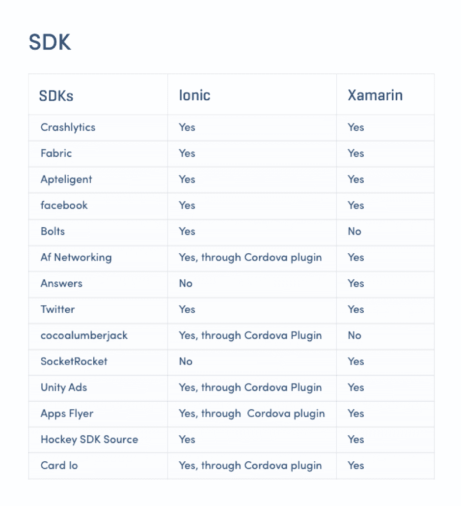

# Xamarin vs Ionic

> 原文：<https://www.javatpoint.com/xamarin-vs-ionic>

跨平台应用程序开发可能是完全原生工程的替代方案。在经典的原生方法中，我们生成了两个不同的应用程序:一个是用 Java 为安卓编写的，另一个是用 Swift 或 Objective-C 为 iOS 编写的。这种方式的开发非常耗时且昂贵，因为在这种情况下，我们必须编写两次相同的代码。另一方面，它确保了最高的代码一致性，其外观和感觉与原始应用程序相似。

相比之下，交叉开发允许工程师一次性编写代码，并在整个平台上应用部分代码。这主要是以性能和行为为代价的。跨平台社区通过不断引入新的方法和工具来减少这些优势。

在这里，我们将着眼于跨平台框架 Xamarin 和 ion 来构建移动应用程序。

## Swift 摘要:-

ion 和 Xamarin 是构建混合应用程序的两个流行框架。从过去几年来看，这两个框架都是争论的焦点。Xamarin 和 ion 之间的区别不仅限于性能，它还适用于应用程序的大小、UX/UI 体验、代码可重用性、第三方 SDK 等。

在开始比较 Xamarin 和 ion 之前，我们应该知道跨平台框架的好处。

## 跨平台移动开发的优势

根据市场和市场调研，跨平台 app 在市场上的人气快速增长，预估从 2015 年的**251.9 亿美元增长到 2020 年的 804.5 亿美元**。

跨平台开发是一种允许为软件环境的多个平台开发单一代码库的方法。

## 跨平台开发的优势是:

**成本效益**

它只允许在一个团队中进行一次调查。

**一个技术栈**

开发人员可以将单一技术堆栈用于各种工程任务。

**可重用代码**

高达 90%的代码库可以从一个平台重用到另一个平台，而不是用另一种语言设计相同的功能。

**易维护性**

维护和部署更改更容易，因为不需要在每个平台上分别维护应用程序。

如果我们想开发跨平台应用程序，下一个挑战是决定我们想要使用的工具。每个框架都有它的优点和缺点。这里我们将考虑 Xamarin 和 ion 框架的基本选择标准，这将有助于我们做出正确的决定。

*   **Xamarin** 是微软支持的跨平台移动应用开发框架，它使用了包装在. NET 层中的 C#和 Native 库。
*   **ional**是一个框架，其目标是使用 HTML5 和 Angular 开发混合应用。

*下面是我们将要比较 Xamarin 和 Ionical 框架的几个内容。*

## Xamarin 和 ion 的区别

以下是基于特定标准的 Xamarin 和 ion 之间的区别:

### 一般信息:定义、类型等。

**什么是 Ionic 键？:是“跨平台”框架还是“混合”？**

ion 是一个在 HTML5 中开发混合移动应用的前端框架。ion 不是一个跨平台框架，因为它是用来创建混合 HTML5 应用程序的。混合是指 web 和本地应用程序开发的结合。ion 使用网络技术(JavaScript、HTM 和 CSS)来创建应用程序，这些应用程序在网络视图中显示给移动设备。Ionic 框架不被称为跨平台框架，因为它不使用本机小部件。

由于混合应用程序开发框架，Ionic 给予移动应用程序开发人员以下自由:

*   用一个命令为所有设备生成图标和闪屏:节省至少一天的各种尺寸的图像准备的 Ionic 资源。
*   即时反映代码更改，即使我们直接在模拟器或设备上运行。
*   同时构建和测试 iOS 和安卓应用，并立即看到变化。
*   与世界各地的客户、顾客和测试人员分享我们的 Ionic 应用程序，甚至无需通过应用程序/游戏商店
*   使用 ng-Cordova 快速访问设备的全部本机功能。

**什么是 Xamarin？**

Xamarin 是一个跨平台框架，允许我们使用 C#开发 iOS、安卓和 Mac 应用。Xamarin 使用 C#语言和。Net 框架。

对于非本机应用程序，性能可能是一个重要问题。但 Xamarin 可以利用硬件加速来提升性能，这与包括 Ionic 在内的另一个混合平台不同。

去年，我们做了一个实验来衡量原生 VS 跨平台应用的计算性能。我们发现跨平台框架的性能与原生应用程序开发框架相当。

如果我们关心应用程序的性能，那么我们应该转向 Xamarin 应用程序开发。Xamarin 应用程序拥有大量的 API 访问权限，可以向应用程序添加不同的功能。Xamarin 应用程序是用本机界面控件构建的，因此 Xamarin 应用程序的外观和感觉看起来像本机。

**Xamarin 开发平台类型:**

Xamarin 支持所有主要平台，包括安卓、iOS 和 Windows。Xamarin 提供了本机开发环境来构建应用程序。这些开发平台是:

1.  **Xamarin。安卓:**与原生开发不同，这里我们用 C#而不是 Java 工作。我们可以在活动中定义我们的用户界面，类似于原生开发。
2.  **Xamarin.iOS:** 它用 C#而不是 Objective-C 或者 Swift 来开发这个应用。运行时环境类似于 Native iOS 开发，因此开发人员需要用 C#编写代码，而 Xamarin 通过使用 Objective-C 包装器来负责构建，以使代码与 iOS 平台兼容。
3.  **XamarinForms:**与 **XamarinForms**，我们可以构建一个跨平台的应用程序，它将与所有平台一起工作，即安卓、iOS 和窗口。代码和业务用户界面可以在所有平台上共享。否则，我们必须为每个平台创建单独的 UI 层和代码库。

### Xamarin VS Ionic 中的响应用户界面/UX 设计

**图像滑块**

在 Ionic 中，如果我们设置一个简单的图像滑块，滑块最初是不响应的，直到包含应用程序的窗格被手动轻推。但在 Xamarin (Xamarin 原生和 XamarinForms)，很容易创建响应性设计。

**动画**

在 Ionic 中实现动画和过渡并不像它应该的那样顺利。另一方面，Xamarin 提供了流畅的、效果更好的动画和过渡。Xamarin 还支持自定义动画。

说到动画，对于构建游戏或图形复杂的应用程序来说，ion 不是一个理想的选择。在 Ionic 中，要设计高密集的图形或高度交互的过渡，我们没有很多工具。但是通过使用材质设计组件，我们可以在 Xamarin 应用程序中构建自定义或奇怪的动画。

### 面向企业的移动设备管理

Xamarin 对企业的移动设备管理比 ion 好。Xamarin 应用程序可以很容易地与微软为处理自带设备的组织提供的 Intune 服务集成。

对于 Ionic，微软推出了一个 Cordova 插件，可以与 Ionic 应用程序一起使用，远程管理企业设备。

### 移动数据库支持

【Xamarin VS Ionic 的境界

对于重视应用程序性能的开发人员来说，我们使用单一和定制的 API 来编写高级查询和对复杂数据建模。为此，我们使用 REALM 工具。

REALM 不支持 Ionic 键。但是 Ionic 在应用编程接口的支持下建立了 REALM 数据库，Xamarin 应用程序可以使用它。

### Firebase(火力基地)

Firebase 支持 Ionic 应用程序，但是对于 Xamarin，Objective-C 中有几个包装器，但是没有真正的支持。尽管有 Firebase，但也有一些像 IBM bluemix、微软 Azure 和 Kinvey 这样的 MBaas 供应商为 Xamarin 平台提供支持，以在云中构建高度可用和可扩展的应用程序。

### 与现有企业架构的集成

Xamarin 的优点可以是，使用现有的。NET 库与 web 和其他数据服务交互，同时在客户端和服务器端共享 C#代码和业务逻辑。

但 ion 只能与 Node 等现有后端技术集成。如果整体架构有任何不同，那么事情可能会变得混乱，因为如果我们熟悉 Angular，就没有任何共享的代码库。Js，它极大地影响了快速开发和集成。

Angular 将支持所有可能的架构，即 MVC、MVVM、MVW 等。在这里，我们可以期待更顺畅的集成，但我们必须准备好花费相当多的时间。

### 第三方软件开发工具包和库支持

### 表演

Xamarin 的性能接近 Native，因为它的跨平台开发能力是基于重用业务逻辑，而不是在两种应用程序之间共享相同的代码库。开发人员可以使用 **Xamarin 快速开发高性能的 Xamarin 应用程序。安卓**，和 **Xamarin.iOS** 。

另一方面，ion 的性能并不接近 Native 应用程序的性能，因为它利用 webview 来包装应用程序。

### 质量比较

ion 平台使用网络技术来产生混合应用程序。与 Xamarin 应用程序相比，ion 应用程序将提供一般的用户体验，并且不那么重要。Xamarin 将提供与原生应用程序最接近的体验，如果我们希望与市场上的其他用户竞争，xamarin 将成为选择的工具。以下是突出混合 HTML 移动应用和跨平台移动应用性能的分析:

*   跨平台原生应用的加载速度比混合应用快 25%。
*   跨平台原生应用程序加载大型数据集的速度比混合 HTML 应用程序快 62%。
*   跨平台原生应用使用的内存平均比混合 HTML 应用少 50%。
*   跨平台原生应用程序使用的 CPU 平均比混合 HTML 应用程序少 76%。

### 对比图

| 比较因子 | 沙马林 | Ionic 的 |
| **目的** | Xamarin 的需求是跨平台应用。 | Ionic 框架用于混合应用。 |
| **语言栈** | 使用 C#语言。 | 使用网络技术——CSS、HTML、JavaScript。 |
| **由**支持 | 微软 | Drift.co |
| **代码可重用性** | 它没有任何特定的平台代码可重用性。 | 代码可重用性的最佳范围。 |
| **性能** | 在 Xamarin 中，有最佳性能(接近原生)。 | 在 ion 中，性能比使用 WebView 的 Xamarin 慢。 |
| **测试** | 在 Xamarin 中，高级工具选项使测试过程变得顺畅。 | 在 ion 中，代码可以使用任何浏览器进行测试。 |
| **学习曲线** | Xamarin 的学习曲线适中。 | Ionic 涉及平滑的学习曲线。 |
| **社区和支持** | 强大而稳定 | 强大而稳定 |
| github stars | 34k | 66k |
| **使用**的公司 | Xamarin 用于 Justwatched 和 under taped。 | Ionic 用于《认知》、《诅咒》、《道琼斯》。 |

### 使用哪个框架

如果我们针对一个特定的移动应用开发项目比较 Xamarin 和 ion，我们的选择将取决于每个框架的特性。

**例如:**如果我们正在计划一个复杂的业务应用，该应用将与现有的企业应用和架构相集成。在这种情况下，Ionic 不会是最好的选择。Xamarin 在这种情况下会好得多，因为它使用 C#。它使代码和业务逻辑能够在客户机和服务器之间共享。

Xamarin 也是构建应用程序的最佳合适框架，它提供了本机设备功能的优势。ion 仅支持有限的本机 API。ion 的问题在于，当我们创建一个包含多行代码的复杂应用程序时，它会让开发人员的生活变得困难。

另一方面，如果需要开发一个小应用，不需要大量的定制和一点原生外观，在这种情况下，ion 是一个很好的选择。尤其是在开发团队熟练掌握 web 技术的情况下。

* * *