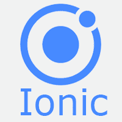

# Ionic 教程

> 原文：<https://www.javatpoint.com/ionic>

《Ionic 教程》提供了 Ionic 框架的基本和高级概念。Ionic framework 是一个开源 UI 工具包，用于使用 HTML、CSS 和 JavaScript 等网络技术构建高性能、高质量的**移动应用程序**、**桌面应用程序**和**渐进式网络应用程序**。它允许开发者**构建一次**和**到处跑**。它是由 2013 年漂移公司的马克斯·林奇、本·斯佩里和亚当·布拉德利创作的。第一个测试版的 Ionic 框架于 2014 年 3 月**发布。**

 **ion 框架主要关注前端用户体验或 UI 交互，处理应用的所有外观和感觉。简单易学，可与其他库或框架如 **Angular** 、 **Cordova** 等集成。

## 为什么要用 Ionic 框架？

对于在可在多种设备和操作系统上运行的应用程序中创建基本的**原生功能**，ion 是一个极好的选择。ion 框架的主要优势是我们可以一次构建应用，而不是针对不同的设备多次构建，并且可以部署到任何地方。它使应用开发**快速**和**经济高效**。这也减少了维护的需要。

## 先决条件

在深入学习 Ionic framework 之前，必须具备 HTML、JavaScript、CSS 等网页脚本语言的基础知识。

## 观众

我们为初学者和专业人士开发了这个 Ionic 教程，他们都想围绕 Ionic 建立职业生涯，或者以无缝的方式学习 Ionic 的戒律。这里有很多题目可以帮助你轻松学习 Ionic 技术。

## 问题

我们向您保证，您不会发现我们的 Ionic 教程有任何问题。但是，如果你发现任何错误，你可以在我们的评论区发布。

* * ***