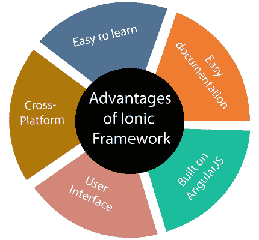

# 什么是离子框架？

> 原文：<https://www.javatpoint.com/what-is-ionic-framework>

Ionic framework 是一个开源 UI 工具包，用于使用 HTML、CSS 和 JavaScript 等网络技术构建高性能、高质量的**移动应用程序**、桌面应用程序和进步的**网络应用程序**。它允许开发人员一次构建并在任何地方运行。它是由 2013 年浮地公司的**马克斯·林奇****本·斯佩里****亚当·布拉德利**创造的。第一个测试版的 Ionic 框架于 2014 年 3 月**发布。**

 **ion 框架主要关注前端用户体验或 UI 交互，处理你的应用的所有观感。简单易学，可与其他库或框架如 **Angular** 、 **Cordova** 等集成。它也可以作为一个独立的没有前端框架使用一个简单的脚本包括。

官方来说，Ionic 框架已经和 **Angular** 进行了集成，但是也为正在开发中的 **Vue.js** 和 **React.js** 提供了支持。

## 什么是渐进式网络应用？

一个进步的网络应用程序是一个普通的网络应用程序，看起来和感觉都像本地移动应用程序。它使用现代网络功能向用户提供类似应用的体验。这些应用程序可以很容易地部署到服务器上，通过网址访问，并由搜索引擎进行索引。普华永道应用优化为:

**可靠:**加载快，提供离线功能。
**快:**要快，对用户动作反应要快。
**可重新接合:**它通过推送通知与用户进行重新接合，感觉像是移动设备上的原生 app。

## 为什么要用离子框架？

在一个可以在多种设备和操作系统上运行的应用程序中，创建基本的**原生功能**是一个很好的选择。ion 框架的主要优势是我们可以一次构建应用，而不是针对不同的设备多次构建，并且可以部署到任何地方。它使应用开发**快速**和**经济高效**。这也减少了维护的需要。

## 离子骨架的优势

ion 应用开发框架的优势如下:

**1。易学**

如果开发人员具有 CSS、HTML 或 JavaScript 框架的基本知识，那么使用 ion 框架学习和开发应用程序是非常容易的。如果开发公司的需求和需求需要混合应用程序开发，它还允许开发公司转向离子。

**2。简单的文档**

ion 提供了非常好的结构化文档。官方文档涵盖了开发人员所需的大部分内容。

**3。跨平台**

ion 应用程序可以部署在多个平台上，如原生 iOS、安卓、桌面和网络，所有这些都有一个代码库。这些应用程序可以只写一次，到处运行。

**4。用户界面**

离子的用户界面，如主题和组件是高度可定制的。ion 平台允许其组件适应运行应用程序的平台。

**5。基于 AngularJS** 打造

离子框架使用了 AngularJS，它为开发人员提供了许多功能。如今，AngularJS 是设计人员使用最广泛的框架。AngularJS 允许 Ionic 提供一个健壮的结构，这使得代码更易于管理。

## 离子骨架的缺点

ion 应用开发框架的缺点如下:

**1。性能**

与本机移动应用程序相比，ion 应用程序的性能并不出色。然而，对于大多数普通用户来说，性能差距并不明显。

**2。安全**

使用 Ionic 框架开发的应用程序可能无法像本机应用程序那样提供足够的安全性。例如，如果您正在开发一个金融应用程序，例如银行应用程序，则不建议使用 Ionic 框架。

**3。有限的原生功能**

离子框架中可能没有一些本机函数。在这种情况下，你需要自己开发插件来实现这个功能。然而，有许多插件可以覆盖大部分原生功能。

**4。对电子游戏不好**

Ionic framework 对于依赖图形的高端应用程序或视频游戏来说并不完美。

**5。需要专家**

JavaScript 可能很难学。所以，需要一个不仅能“做”JS，而且对包括 Angular、Cordova、Ionic 等在内的先进库和技术有深入了解的人。

**6。早期采用者风险**

离子技术仍在发展中。它定期不断地改变它的支持和标准，它的库可以随时完全重写。

* * ***