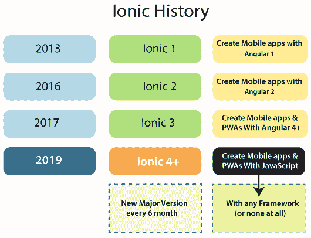

# Ionic 历史

> 原文：<https://www.javatpoint.com/ionic-history>

如今，ion 框架成为全球最受欢迎的**跨平台**移动应用开发技术。全球数百万开发者已经用 Ion 框架构建了数百万个移动应用。ion 框架允许开发者使用 HTML、CSS 和 JavaScript 等网络技术为**移动**和**桌面**创建高质量的应用。它提供了开发者从**前端**设计到持续交付所需要的一切。

**漂洋过海公司**在年内引进了 Ionic **2013** 。它在 2013 年 11 月发布了第一个 alpha 版本的 ion 框架。Ionic 最新发布的是 2019 年的**Ionic v4+** 。我们可以从下图了解 Ionic 框架的历史。

历史上，**ional 1**的引入是为了创建带有 **angular 1** 的移动应用。Ionic 1 于 2013 年底发布。最初，它不使用 web 组件。它使用 angular one 指令，本质上是给你一个**定制的**角度组件，它只在 angular app 内部运行。

**ion 2**于**2016**年推出。它通过给 angular 2 一个相同的值来延续之前的版本。Angular 2 是 Angular 的新版本，与 angular 1 完全不同。因此，Ionic 2 再次只给出角度分量，而不是网分量。所以我们只能在 angular 2 应用中使用 ion 2。

**ion 3**于**2017**年推出。它通过增加一些新的特性来延续上一个版本。这个版本增强了 Ionic 框架，但是还是侧重于 angular，当时是 **angular 4** 。Ionic 团队决定 Ionic 3 不是未来用途的最佳**，因为不是所有的人都在使用 angular。它不允许构建原生的手机 app，也不允许使用 **vue.js** ，或者 **react.js** 框架，你只限于 angular。**

 **因此，**ion 4**在**2019**年推出。Ionic 4 和所有未来版本的 Ionic 都基于**网络组件**。它用 JavaScript、HTML 和 CSS 网络技术构建了原生移动应用程序和渐进式网络应用程序。它支持所有允许使用 HTML 元素的浏览器，这些元素可以与您可能使用的任何 web 框架一起运行。因此，web 组件和 ion 4 可以与任何框架一起工作。

每隔**个月**发布一个新版本的 Ionic framework，并做一些增强。这些新版本不会改变你之前在《Ionic》中学到的整个概念。

* * ***