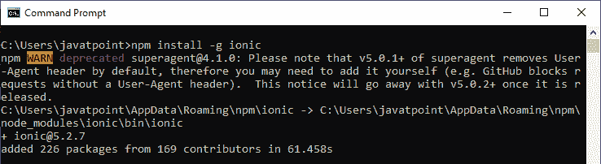

# Ionic装置

> 原文：<https://www.javatpoint.com/ionic-installation>

在本节中，我们将学习如何为Ionic应用程序的成功开发建立环境。

## Ionic的先决条件

1.  Node.js 和 NPM
2.  代码编辑器
3.  Ionic命令行界面

## 安装 Node.js 和 NPM

Node.js 和 NPM 是需要开发 ion 应用的*基础平台。您可以通过下面的链接安装 Node.js 和 NPM 包管理器。*

 *在**窗口**安装 node . js:[点击这里](install-nodejs)

在 **Linux** 上安装 node . js:[点击这里](install-nodejs-on-linux-ubuntu-centos)

要验证 Node.js 和 NPM，请使用如下图所示的命令。


## 代码编辑器

VS 代码编辑器是创建Ionic应用程序的最佳代码编辑器。这是一个由微软制作的流行的免费文本编辑器。

可以下载安装 VS 代码[点击这里](https://code.visualstudio.com/)

还有许多其他代码编辑器可用于创建 ion 应用程序，例如

*   **ion Studio:**这是创建 ion 应用最快最简单的方法。
*   **Atom:** 是 GitHub 开发的一款可黑客攻击的文本编辑器。
*   **WebStorm:** 是由 JetBrains 开发的一款功能强大的非免费编辑器。

## Ionic命令行界面

我们可以通过**Ionic命令行工具**创建和开发一个Ionic应用程序。Ionic键命令行界面是安装Ionic键的首选方法。它是运行应用程序并将其连接到其他服务的主要工具，例如 Ionic AppFlow。

要使用 NPM 全局安装Ionic命令行界面，请在终端窗口中输入以下命令。

```

$ npm install -g ionic

```

当Ionic系统成功安装在您的系统上时，您将看到以下屏幕。



## 创建应用程序

成功安装后，您可以构建Ionic应用程序。要创建一个Ionic应用程序，您需要导航到您想要存储该应用程序的位置。因此，首先，转到终端窗口并执行以下命令。

```

C:\Users\javatpoint> cd Desktop
C:\Users\javatpoint\Desktop> ionic start

```

每当你运行上述命令，它都会要求你写**项目名称**。现在，输入您的项目名称并按**进入**。您将看到以下屏幕。


在此屏幕中，您将看到不同类型的模板。在这里，您可以根据需要选择任何模板。我们可以了解不同类型的模板，如下所示:

**标签应用**

如果选择**标签模板**，Ionic应用程序包含标签菜单、标题和几个有用的屏幕和功能。它是默认的Ionic模板。以下命令创建选项卡应用程序。

```

C:\Users\Username\Desktop> ionic start myIonicApp tabs

```

**侧菜单应用**

如果您选择侧面菜单模板，它只是在应用程序的内容区域添加带有导航的侧面菜单。以下命令创建 sidemenu 应用程序。

```

C:\Users\Username\Desktop> ionic start myIonicApp sidemenu

```

**空白 App**

这是一个空白的启动项目或一个**空项目**。以下命令创建空白应用程序。

```

C:\Users\Username\Desktop> ionic start myIonicApp blank

```

## 第一款Ionic应用

在这里，我们将使用空白模板开始项目。要启动空白的Ionic应用程序，请在终端窗口中执行以下命令。它会安装所有你需要的依赖项，比如**角**或者**Ionic**依赖项。

```

C:\Users\Username\Desktop> ionic start myIonicApp blank

```

现在，您需要导航到新创建的项目，并使用以下命令运行它。

```

C:\Users\Username\Desktop> cd myIonicApp
C:\Users\Username\Desktop> ionic serve

```

当您运行上述命令时，您的终端窗口如下图所示。


完成所有步骤后，您将在浏览器中获得输出，如下图所示。


现在，打开**铬显工具**或按 **ctrl+shift+I** 。在该工具中，当您点击**切换设备工具栏**时，您将获得以下屏幕。


接下来，如果您想在应用程序中更改或修改任何内容，您需要有一个代码编辑器或 IDE 来编写代码。在这里，我们将使用 Visual Studio 代码编辑器，这是一个用于 web 开发的免费 IDE。

## 在 VS 代码中打开项目

打开 Visual Studio 代码编辑器，进入菜单栏点击**文件- >打开文件夹**，然后选择你的**项目**。在 Visual Studio 代码中，将出现以下屏幕。


**安装角度基本延伸**

要安装角度基本延伸，进入**视图- >延伸**或按 **ctrl+shift+x** 。现在在搜索框中键入 Angular Essential，您将在 visual studio 编辑器中看到以下屏幕。点击**安装**。


安装完成后，转到出现在 visual studio 代码编辑器左侧的**项目浏览器**。现在，打开**home.page.html**文件并编写以下代码。

```

<ion-header>
  <ion-toolbar>
    <ion-title>
      Ionic First App
    </ion-title>
  </ion-toolbar>
</ion-header>

<ion-content class="ion-padding">
    <p>{{ text }}</p>
    <ion-button (click)="onChangeText()">Change Text</ion-button>
</ion-content>

```

接下来，打开 **home.page.ts** 文件，写下下面的代码。

```

import { Component } from '@angular/core';

@Component({
  selector: 'app-home',
  templateUrl: 'home.page.html',
  styleUrls: ['home.page.scss'],
})
export class HomePage {
  text = 'Our first Ionic app';

  onChangeText() {
    this.text = 'changed!';
  }
}

```

现在，**保存**文件，**在终端运行**项目。您将在浏览器窗口中获得以下输出。


点击**更改文本**按钮，如下图。


* * **