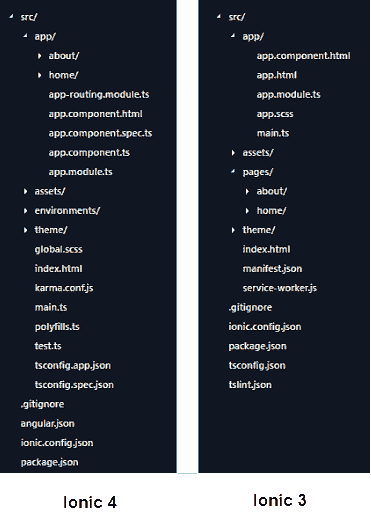

# Ionic 4 和 Ionic 3 的区别

> 原文：<https://www.javatpoint.com/ionic-4-vs-ionic-3>

在这一节中，我们将解释 Ionic 4 和 Ionic 3 之间的主要区别。在 Ionic 3 发布之后，Ionic 框架团队已经发布了 Ionic 4 版本。新版本的 Ionic 在项目结构、性能、与多个框架(如 Angular、React.js 和 Vue.js)的兼容性、新文档以及许多其他改进方面都有显著的变化。现在，让我们一个接一个地看比较。

### 程序包名称的更改

在 ion 4 中，包名以@ **符号**开头，如@**ion/angular**。然而，Ionic 3 包的名称没有使用@符号。我们可以从下面的语法来理解 ion 3 和 ion 4 的语法对比。

```

In Ionic 3: npm install ionic-angular
In Ionic 4: npm install @ionic/angular

```

如果你要将一个应用从 ion 3 迁移到 ion 4，你需要将**导入**从 ion-angular 更新为@ ion/angular。

### 项目结构

ion 4 和 Ionic 3 app 的主要变化是整体项目布局和结构。在《Ionic 3》中，它有一个定制的惯例，即如何设置应用程序以及文件夹结构应该是什么样子。而在 ion 4 中，应用程序结构遵循每个受支持框架的建议设置。

**例如**如果我们用 Angular 构建了 app，那么项目结构将完全是 Angular CLI app 结构。我们可以在下图中看到项目结构的对比。



### RxJS 更改

ion 4 使用最新版本的 RxJS 6。它改变了运算符和核心 RxJS 函数的许多导入路径。

### 网络组件

Ionic 4 被完全重建为使用网络应用编程接口，每个组件都被打包为网络组件。网络组件是一组网络平台应用编程接口，允许 Ionic 框架创建自定义的、可重用的、封装的 HTML 标签，用于网页和网络应用程序。

由于 ion 4 的每个组件都是一个 web 组件，他们创建并开源了一个名为**模板**的工具。模板是一个网络组件编译器，用于构建快速、可重用的用户界面组件和渐进式网络应用程序。

### 生命周期事件

我们在 Ionic 3 中使用的生命周期事件(如 ionViewDidLoad、ionViewCanLeave 和 ionViewCanEnter)已被删除，它们的适当替代选项在 Ionic 4 中使用。使用 Ionic 4，我们能够利用 Angular 提供的典型事件。

更多信息，请点击[路由器接口文档](https://ionicframework.com/docs/api/router-outlet)。

### 覆盖组件

在《Ionic 3》中，加载、吐司和警报等覆盖组件是同步创建的。但是，在 Ionic 4 中，它们是异步创建的。现在，这个应用编程接口变成了基于承诺的。例如，

在 Ionic 3 中，我们创建了如下所示的警报消息。

```

showAlert() {
  const alert = this.alertCtrl.create({
    message: "Hello",
    subHeader: "I'm an alert message"
  });

  alert.present();
}

```

在《Ionic 4》中，承诺被使用。我们可以创建如下所示的警报消息。

```

showAlert() {
  this.alertCtrl.create({
    message: "Hello",
    subHeader: "I'm an alert message"
  }).then(alert => alert.present());
}

// Or using async/await

async showAlert() {
  const alert = await this.alertCtrl.create({
    message: "Hello",
    subHeader: "I'm an alert message."
  });

  await alert.present();
}

```

### 航行

在 ion 4 中，导航已经收到了许多变化。**例如，**v4 能够与官方的**角路由器**集成，而不是使用 Ionic 自己的**导航控制器**。它为整个应用程序提供了更一致的路由体验。角度路由器是角度应用程序中最重要的库。如果不可用，应用程序将无法在浏览器重新加载时保持导航状态。因此，有了 Ionic 框架和 Angular Router，您可以创建丰富的应用程序，这些应用程序是可链接的，并且具有丰富的动画。

ion 版本 3 导航基于简单的堆栈，新页面被推到堆栈的顶部。当我们想要向后导航时，只需弹出最后一页。

传统的网站使用线性历史，用户导航到所需的页面，并可以按下后退按钮进行导航。但是，在 Ionic Framework 中，应用程序可以通过允许并行导航来实现这一点。意味着它有多个导航栈，可以随时交换。

### 惰性加载

正如我们之前了解到的，在 Ionic 4 中导航发生了变化，惰性加载的机制也发生了变化。从下面的代码片段中，我们可以了解延迟加载设置是如何工作的。

### 在 Ionic 3 中

```

// home.page.ts
@IonicPage({
  segment: 'home'
})
@Component({ ... })
export class HomePage {}

// home.module.ts
@NgModule({
  declarations: [HomePage],
  imports: [IonicPageModule.forChild(HomePage)]
})
export class HomePageModule {}

```

### 在 Ionic 4 中

```

	// home.module.ts
@NgModule({
  imports: [
    IonicModule,
    RouterModule.forChild([{ path: '', component: HomePage }])
  ],
  declarations: [HomePage]
})
export class HomePageModule {}

// app.module.ts
@NgModule({
  declarations: [AppComponent],
  imports: [
    BrowserModule,
    IonicModule.forRoot(),
    RouterModule.forRoot([
      { path: 'home', loadChildren: './pages/home/home.module#HomePageModule' },
      { path: '', redirectTo: 'home', pathMatch: 'full' }
    ])
  ],
  bootstrap: [AppComponent]
})
export class AppModule {}

```

* * *