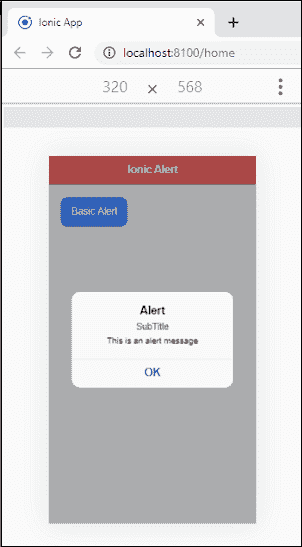

# 离子警报

> 原文：<https://www.javatpoint.com/ionic-alert>

警报是一个对话框，通知用户做出决策的重要信息，或者提供选择特定操作或操作列表的能力。它出现在应用程序内容的顶部。在恢复与应用程序的交互之前，用户可以手动取消它。它还可以包括**头、子头、**和**消息**选项。

警报可以被认为是**浮动模式**，应该用于快速响应，例如密码验证、小应用通知等等。警报非常灵活，可以非常容易地定制。

## 警报控制器

警报控制器负责在离子应用程序中创建警报。它使用 **create()** 方法创建警报，并且可以通过在 create()方法中传递警报选项进行自定义。

警报可以分为多种类型，如下所示。

### 1.基本警报

这些类型的警报用于通知用户新信息。这些信息有不同的类型，例如应用程序的变化、新功能、需要确认的紧急情况，或者作为对用户的确认通知，告知用户某项操作是否成功。以下示例解释了基本警报的使用。

**例**

在这个类型脚本文件中，我们首先需要导入**报警控制器**。然后，创建一个 **showAlert()** 功能，包含标题、子标题、消息、按钮等提醒选项。之后，我们创建了一个**ondidismiss()**方法来恢复与应用程序的交互。

**主页**

```

import { Component } from '@angular/core';
import { AlertController } from '@ionic/angular';

@Component({
  selector: 'app-home',
  templateUrl: 'home.page.html',
  styleUrls: ['home.page.scss'],
})
export class HomePage {
  constructor(public alertCtrl: AlertController) { }

  async showAlert() {
    const alert = await this.alertCtrl.create({
      header: 'Alert',
      subHeader: 'SubTitle',
      message: 'This is an alert message',
      buttons: ['OK']
    });
    await alert.present();
    const result = await alert.onDidDismiss();
    console.log(result);
  }
}

```

**Home.page.html**

在这个文件中，我们将创建一个**按钮**。当我们按下按钮时，它会调用 showAlert()函数。showAlert()函数的实现在 **home.page.ts** 文件中定义。

```

<ion-header translucent>
  <ion-toolbar color="danger">
    <ion-title>Ionic Alert</ion-title>
  </ion-toolbar>
</ion-header>

<ion-content class="ion-padding" color="light">
  <div>
    <ion-button (click)="showAlert()">Basic Alert</ion-button>
  </div>
</ion-content>

```

**输出:**

当您运行该应用程序时，它将显示以下屏幕。当你点击按钮时，立刻，你会得到**提醒信息**。现在，点击**确定**按钮，提醒信息将消失。




### 2.多按钮警报

这种类型的警报用于给出多个警报按钮。除了包含多个[按钮](ionic-buttons)而不是单个按钮之外，它与基本警报类型相似。这里，最右边的按钮作为**主按钮**工作。

**例**

**主页**

```

import { Component } from '@angular/core';
import { AlertController } from '@ionic/angular';

@Component({
  selector: 'app-home',
  templateUrl: 'home.page.html',
  styleUrls: ['home.page.scss'],
})
export class HomePage {
  constructor(public alertCtrl: AlertController) { }
  async showMultipleAlertButtons() {
    const alert = await this.alertCtrl.create({
      header: 'MultipleButtonAlert',
      subHeader: 'SubTitle',
      message: 'This is an multiple button alert message',
      buttons: ['Cancel', 'Save', 'Open']
    });
    await alert.present();
  }
}

```

**Home.page.html**

```

<ion-header translucent>
  <ion-toolbar color="danger">
    <ion-title>Ionic Alert</ion-title>
  </ion-toolbar>
</ion-header>

<ion-content class="ion-padding" color="light">
  <div>
    <ion-button (click)="showMultipleAlertButtons()" expand="block">Multiple Button Alert</ion-button>
  </div>
</ion-content>

```

**输出:**

当您运行应用程序时，您将获得以下输出。


### 3.提示警报

提示告警用于**输入数据或信息**。有时，我们可以使用它在应用程序中前进之前向用户询问密码。下面的例子解释得更清楚。

**例**

**主页**

```

import { Component } from '@angular/core';
import { AlertController } from '@ionic/angular';

@Component({
  selector: 'app-home',
  templateUrl: 'home.page.html',
  styleUrls: ['home.page.scss'],
})
export class HomePage {
  constructor(public alertCtrl: AlertController) { }

  async showPrompt() {
    const prompt = await this.alertCtrl.create({
      header: 'Album',
      message: 'Enter a name for this new album',
      inputs: [
        {
          name: 'name1',
          type: 'text',
          placeholder: 'Placeholder 1'
        },
        {
          name: 'name2',
          type: 'text',
          placeholder: 'Placeholder 2'
        },
      ],
      buttons: [
        {
          text: 'Cancel',
          handler: data => {
            console.log('Cancel clicked');
          }
        },
        {
          text: 'Save',
          handler: data => {
            console.log('Saved clicked');
          }
        }
      ]
    });
    await prompt.present();
  }
}

```

**Home.page.html**

```

<ion-header translucent>
  <ion-toolbar color="danger">
    <ion-title>Ionic Alert</ion-title>
  </ion-toolbar>
</ion-header>

<ion-content class="ion-padding" color="light">
  <div>
    <ion-button (click)="showPrompt()" expand="block">Prompt Alert</ion-button>
  </div>
</ion-content>

```

**输出:**


### 4.确认警报

这些类型的警报用于**确认**在应用程序中前进之前的特定选择。例如，当用户想要从地址簿中删除联系人时，这是必需的。

**例**

**主页**

```

import { Component } from '@angular/core';
import { AlertController } from '@ionic/angular';

@Component({
  selector: 'app-home',
  templateUrl: 'home.page.html',
  styleUrls: ['home.page.scss'],
})
export class HomePage {
  constructor(public alertCtrl: AlertController) { }
  async showConfirm() {
    const confirm = await this.alertCtrl.create({
      header: 'Confirm!',
      message: 'Do you agree to use this Alert option',
      buttons: [
        {
          text: 'Cancel',
          role: 'cancel',
          handler: () => {
            console.log('Confirm Cancel');
          }
        },
        {
          text: 'Okay',
          handler: () => {
            console.log('Confirm Okay.');
          }
        }
      ]
    });
    await confirm.present();
  }
}

```

**Home.page.html**

```

<ion-header translucent>
  <ion-toolbar color="danger">
    <ion-title>Ionic Alert</ion-title>
  </ion-toolbar>
</ion-header>

<ion-content class="ion-padding" color="light">
  <div>
    <ion-button (click)="showConfirm()" expand="block">Confirmation Alert</ion-button>
  </div>
</ion-content>

```

**输出:**


### 5.无线电警报

无线电警报类似于确认警报，但建议使用[无线电](ionic-radio-button)组件来代替此组件。这种类型的警报为用户提供了一组选项，其中只能选择一个选项。

**例**

**主页**

```

import { Component } from '@angular/core';
import { AlertController } from '@ionic/angular';

@Component({
  selector: 'app-home',
  templateUrl: 'home.page.html',
  styleUrls: ['home.page.scss'],
})
export class HomePage {
  constructor(public alertCtrl: AlertController) { }
  async showRadio() {
    const alert = await this.alertCtrl.create({
      inputs: [
        {
          name: 'radio 1',
          type: 'radio',
          label: 'Green',
          value: 'green',
          checked: true,
        },
        {
          name: 'radio 2',
          type: 'radio',
          label: 'Black',
          value: 'black',
        },
        {
          name: 'radio 3',
          type: 'radio',
          label: 'Red',
          value: 'red',
        },
      ],
      buttons: [
        {
          text: 'Cancel',
          handler: data => {
            console.log('Cancel clicked');
          }
        },
        {
          text: 'Save',
          handler: data => {
            console.log('Saved clicked');
          }
        }
      ]
    });
    await alert.present();
  }
}

```

**Home.page.html**

```

<ion-header translucent>
  <ion-toolbar color="danger">
    <ion-title>Ionic Alert</ion-title>
  </ion-toolbar>
</ion-header>

<ion-content class="ion-padding" color="light">
  <div>
    <ion-button (click)="showRadio()" expand="block">Radio Alert</ion-button>
  </div>
</ion-content>

```

**输出:**


### 6.复选框警报

复选框提醒类似于确认提醒，但建议使用[复选框](ionic-checkbox)组件来代替。这种类型的警报为用户提供了一组多个选项，用户可以在其中选择他们的选项。

**例**

**主页**

```

import { Component } from '@angular/core';
import { AlertController } from '@ionic/angular';

@Component({
  selector: 'app-home',
  templateUrl: 'home.page.html',
  styleUrls: ['home.page.scss'],
})
export class HomePage {
  constructor(public alertCtrl: AlertController) { }
  async showCheckBoxAlert() {
    const alert = await this.alertCtrl.create({
      header: 'What is your favorite Programming Language?',
      inputs: [
        {
          name: 'checkbox 1',
          type: 'checkbox',
          label: 'Java',
          value: 'Java',
          checked: true,
        },
        {
          name: 'checkbox 2',
          type: 'checkbox',
          label: 'Android',
          value: 'Android',
        },
        {
          name: 'checkbox 3',
          type: 'checkbox',
          label: 'Python',
          value: 'Python',
        },
      ],
      buttons: [
        {
          text: 'Cancel',
          handler: data => {
            console.log('Cancel clicked');
          }
        },
        {
          text: 'Save',
          handler: data => {
            console.log('Saved clicked');
          }
        }
      ]
    });
    await alert.present();
  }
}

```

**Home.page.html**

```

<ion-header translucent>
  <ion-toolbar color="danger">
    <ion-title>Ionic Alert</ion-title>
  </ion-toolbar>
</ion-header>

<ion-content class="ion-padding" color="light">
  <div>
    <ion-button (click)="showCheckBoxAlert()" expand="block">CheckBox Alert</ion-button>
  </div>
</ion-content>

```

**输出:**


* * *