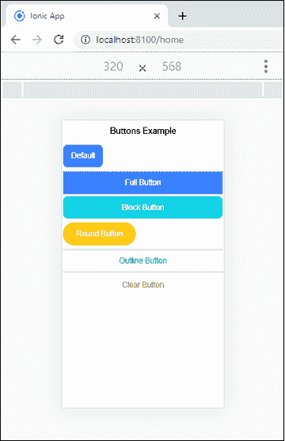
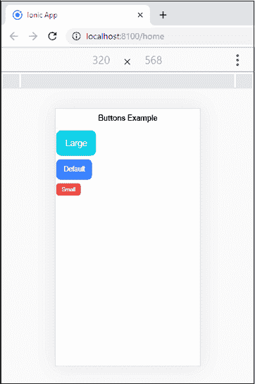
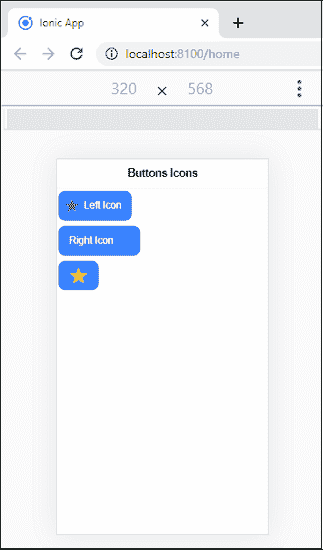

# 离子按钮

> 原文：<https://www.javatpoint.com/ionic-buttons>

离子框架包含几种类型的按钮。这些按钮是与应用程序交互和导航的基本方式。它还应该用来清楚地传达当用户点击它们时会发生什么动作。它可以用在窗体或任何需要简单、标准按钮功能的地方。按钮可以包含**两个东西**，分别是**文字**、**图标**，或者**两个**。它还可以通过各种属性进行增强，以特定的方式显示。我们可以使用标准的 **<离子按钮></离子按钮>** 元素来访问按钮。

按钮属性的不同样式如下所示。

*   默认
*   发展
*   充满
*   形状
*   大小
*   图标

### 默认

这是按钮的基本用法。默认样式的语法是:

```

<ion-button>Default Button</ion-button>

```

可以使用**颜色**属性设置按钮的颜色。ion 包括几个默认的颜色，可以很容易地被覆盖。例如，

```

<ion-button color="light">Light Button</ion-button>

```

### 发展

该属性用于指定按钮的宽度。默认情况下，按钮是内嵌块。但是，通过设置这些属性，我们可以将按钮更改为全幅块元素。我们可以将其分为两种类型:

**1。阻挡按钮**

“阻止”按钮将始终使按钮采用其父容器的 100%宽度，并带有圆角。

```

<ion-button expand="block">Block Button</ion-button>

```

**2。全按钮**

“完整”按钮还会使按钮占据其父容器的 100%宽度。它还删除了按钮的左右边框。当按钮需要在显示屏的整个宽度上伸展时，“完整”按钮样式非常有用。

```

<ion-button expand="full" >Full Button</ion-button>

```

### 充满

它决定了按钮的**背景**和**边框颜色**。默认情况下，按钮是纯色背景。我们可以将这些属性分为以下类型。

**清除**

它用于使按钮具有透明背景，类似于平面按钮。您可以通过在按钮中添加**清除属性**来实现，如下所示:

```

<ion-button expand="full"  fill="clear">Full Button</ion-button>

```

**轮廓**

它用于使按钮具有透明的背景和可见的边框。您可以通过在按钮中添加**轮廓属性**来实现，如下所示:

```

<ion-button expand="full"  fill="outline">Full Button</ion-button>

```

**实心**

它用于制作背景填充的按钮。它对工具栏中的按钮很有用。您可以通过在按钮中添加**实体属性**来实现，如下所示:

```

<ion-button expand="full" fill="solid" >Full Button</ion-button>

```

### 圆形按钮

它用于创建带有圆角的按钮。您可以通过在按钮中添加**倒圆角属性**来实现，如下所示:

```

<ion-button shape="round" >Round Button</ion-button>

```

**例**

在下面的例子中，我们可以清楚地理解所有类型的按钮属性的用法。

**Button.html**

```

<ion-header>
    <ion-toolbar>
      <ion-title>Buttons Example</ion-title>
    </ion-toolbar>
  </ion-header>
  <ion-content>

    <!-- Default -->
    <ion-button>Default</ion-button>

    <!-- Expand -->
    <ion-button expand="full" color="primary">Full Button</ion-button>
    <ion-button expand="block" color="secondary">Block Button</ion-button>

    <!-- Round -->
    <ion-button shape="round" color="warning">Round Button</ion-button>

    <!-- Fill -->
    <ion-button expand="full" fill="outline" color="success">Outline Button</ion-button>
    <ion-button expand="block" fill="clear" color="danger">Clear Button</ion-button>
  </ion-content>

```

**按钮**

```

import { Component } from '@angular/core';

@Component({
  selector: 'app-home',
  templateUrl: button.html',
  styleUrls: [button.scss'],
})
export class HomePage {}

```

**输出**

当我们在终端窗口中执行这个 Ionic 应用程序时，它会给出以下输出。



### 按钮尺寸

size 属性用于指定按钮的大小。它允许我们改变按钮的高度和填充。这些属性主要有三种类型，我们可以在下表中看到。

| 塞内加尔 | 大小 | 描述 |
| 1. | 默认 | 它指定按钮的默认高度和填充。它对项目中的按钮很有用。 |
| 2. | 小的 | 它创建了高度和填充更少的按钮。 |
| 3. | 大型 | 它创建了具有更多高度和填充的按钮。 |

**例**

在下面的例子中，我们可以清楚地了解所有按钮大小之间的差异。

```

<ion-header>
    <ion-toolbar>
      <ion-title>Buttons Example</ion-title>
    </ion-toolbar>
  </ion-header>

  <ion-content>
    <!-- Sizes -->
    <div></div>
    <div><ion-button size="large" color="secondary">Large</ion-button></div>
    <div><ion-button>Default</ion-button></div>
    <div><ion-button size="small" color="danger">Small</ion-button></div>
  </ion-content>

```

**输出**

当我们在终端窗口中执行这个 Ionic 应用程序时，它会给出以下输出。



### 按钮图标

如果要给按钮添加图标，需要在按钮内部添加一个**图标组件**。您也可以使用插槽属性设置按钮内图标的位置。下表给出了插槽属性。

| 塞内加尔 | 插槽属性 | 描述 |
| 1. | 目标 | 它将内容放在按钮文本的右侧。 |
| 2. | 开始 | 它将内容放在按钮文本的左侧。 |
| 3. | 仅图标 | 当按钮没有文本时使用。 |

**例**

```

<ion-header>
    <ion-toolbar>
      <ion-title>Buttons Icons </ion-title>
    </ion-toolbar>
  </ion-header>

  <ion-content>
    <!-- Icons -->
    <div><ion-button>
        <ion-icon slot="start" name="star" color="success"></ion-icon>
         Left Icon
    </ion-button></div>

    <div><ion-button>
        Right Icon
        <ion-icon slot="end" name="star" color="secondary"></ion-icon>
    </ion-button></div>

    <div><ion-button>
        <ion-icon slot="icon-only" name="star" color="warning"></ion-icon>
    </ion-button></div>
  </ion-content>

```

**输出**



* * *