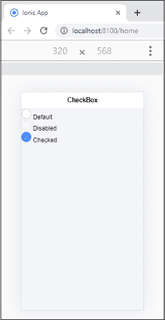
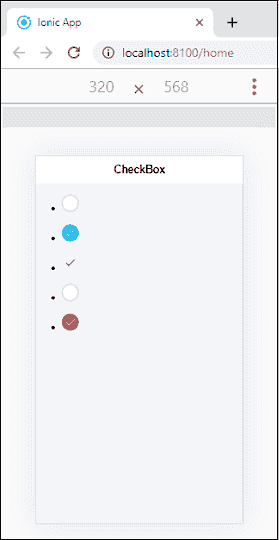
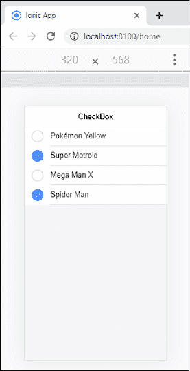

# Ionic复选框

> 原文：<https://www.javatpoint.com/ionic-checkbox>

复选框是一种类型的**输入**组件，它保存**布尔值**。它类似于 HTML 复选框输入。Ionic复选框在每个平台上都有不同的样式，就像其他Ionic组件一样。您可以使用**选中的**属性和 **<Ionic复选框>** 元素来设置默认值，使用**禁用的**属性来禁止用户更改该值。

### 例子

以下示例显示了在Ionic应用程序中使用的不同类型的复选框。

```

<ion-header>
  <ion-toolbar>
    <ion-title>
      CheckBox
    </ion-title>
  </ion-toolbar>
</ion-header>

<ion-content class="padding" color="light">
  <!-- Default Checkbox -->
  <div>
    <ion-checkbox></ion-checkbox>
    <ion-label> Default</ion-label>
  </div>
  <!-- Disabled Checkbox -->
  <div>
    <ion-checkbox disabled="true"></ion-checkbox>
    <ion-label> Disabled</ion-label>
  </div>
  <!-- Checked Checkbox -->
  <div>
    <ion-checkbox checked="true"></ion-checkbox>
    <ion-label> Checked</ion-label>
  </div>
</ion-content>

```

**输出**

当你在你的终端执行这个应用时，它会给出如下输出。



## 样式复选框

如果您想要为您的复选框设置样式，请使用带有复选框前缀的Ionic颜色属性。以下示例说明了复选框组件使用“Ionic”颜色属性。

**例**

```

<ion-header>
  <ion-toolbar>
    <ion-title>
      CheckBox
    </ion-title>
  </ion-toolbar>
</ion-header>

<ion-content class="padding" color="light">
  <!-- Checkbox Colors -->
  <ul><li>
    <ion-checkbox color="primary" checked="false"></ion-checkbox>
  </li></ul>
  <ul><li>
    <ion-checkbox color="secondary" checked="true"></ion-checkbox>
  </li></ul>
  <ul><li>
    <ion-checkbox color="light" checked="true"></ion-checkbox>
  </li></ul>
  <ul><li>
    <ion-checkbox color="dark" checked="false"></ion-checkbox>
  </li></ul>
  <ul><li>
    <ion-checkbox color="danger" checked="true"></ion-checkbox>
  </li></ul>
</ion-content>

```

**输出**



## 列表中的复选框

您也可以在列表中使用复选框。以下示例解释了复选框如何与列表一起使用。

**例**

**Home.page.html**

```

<ion-header>
  <ion-toolbar>
    <ion-title>
      CheckBox
    </ion-title>
  </ion-toolbar>
</ion-header>

<ion-content class="padding" color="light">
 <!-- Checkboxes in a List -->
 <ion-list>
    <ion-item *ngFor="let entry of form">
      <ion-label>{{entry.val}}</ion-label>
      <ion-checkbox slot="start" [(ngModel)]="entry.isChecked"></ion-checkbox>
    </ion-item>
  </ion-list>
</ion-content>

```

**主页**

```

import { Component } from '@angular/core';

@Component({
  selector: 'app-home',
  templateUrl: 'home.page.html',
  styleUrls: ['home.page.scss'],
})
export class HomePage {
  public form = [ 
    { val: 'Pok?mon Yellow' , isChecked: false},
    { val: 'Super Metroid' , isChecked: true},
    { val: 'Mega Man X' , isChecked: false},
    { val: 'Spider Man' , isChecked: true}
  ];
}

```

**输出**



* * *