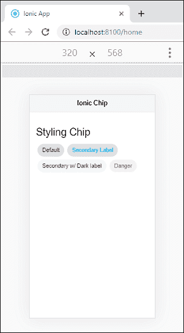

# Ionic 芯片

> 原文：<https://www.javatpoint.com/ionic-chip>

Ionic 芯片在一个小盒子里代表复杂的实体，比如一个触点。它只是一个元素或组件，您可以使用它在应用程序内部的一些文本系统中显示信息。这是一个漂亮的**气泡状**容器，用于保存文本和图标。它可以包含许多不同的 Ionic 元素，如文本、头像和图标。我们可以从下面的例子来理解。

### 例子

```

<ion-header>
  <ion-toolbar color="light">
    <ion-title>Ionic Chip</ion-title>
  </ion-toolbar>
</ion-header>

<ion-content class="ion-padding">
  <h1>Chips Example</h1>
  <ion-chip>
    <ion-label>Default</ion-label>
  </ion-chip>
</ion-content>

```

**输出:**


## 轮廓芯片

我们还可以配置一个 Ionic 芯片的边界。默认情况下，Ionic 键的形状为**实心**。但是，可以使用**轮廓**属性进行更改。下面的例子解释得更清楚。

### 例子

```

<ion-header>
  <ion-toolbar color="light">
    <ion-title>Ionic Chip</ion-title>
  </ion-toolbar>
</ion-header>

<ion-content class="ion-padding">
  <h1>Chips Example</h1>
  <ion-chip>
    <ion-label>Default</ion-label>
  </ion-chip>
  <ion-chip outline>Outline Chip</ion-chip>
</ion-content>

```

**输出:**

当您执行该应用程序时，它将显示以下输出。在这里，你可以看到默认芯片和轮廓芯片的区别。


## 添加图标和头像

Ionic 允许在芯片组件中添加图标和头像媒体。要在<ion-chip>中添加图标和头像，需要在<Ionic 芯片>内放置 **<Ionic 图标>** 和 **<Ionic 头像>** 组件。以下示例解释了如何将图标和头像添加到芯片组件中。</ion-chip>

### 例子

```

<ion-header>
  <ion-toolbar color="light">
    <ion-title>Ionic Chip</ion-title>
  </ion-toolbar>
</ion-header>

<ion-content class="ion-padding">
  <h1>Adding icons and Avatar</h1>
  <ion-chip>
    <ion-icon name="pin"></ion-icon>
    <ion-label>Default</ion-label>
  </ion-chip>

  <ion-chip>
    <ion-label>Button Chip</ion-label>
    <ion-icon name="close-circle"></ion-icon>
  </ion-chip>

  <ion-chip>
    <ion-icon name="pin" color="primary"></ion-icon>
    <ion-label>Icon Chip</ion-label>
    <ion-icon name="close"></ion-icon>
  </ion-chip>

  <ion-chip>
    <ion-avatar>
      
    </ion-avatar>
    <ion-label>Avatar Chip</ion-label>
    <ion-icon name="close-circle"></ion-icon>
  </ion-chip>
</ion-content>

```

**输出:**


## 芯片造型

芯片组件也可以以不同的风格着色。要更改<ion-chip>的样式，请使用颜色属性。下面的例子解释了在芯片组件中使用**颜色**属性。</ion-chip>

### 例子

```

<ion-header>
  <ion-toolbar color="light">
    <ion-title>Ionic Chip</ion-title>
  </ion-toolbar>
</ion-header>

<ion-content class="ion-padding">
  <h1>Styling Chip</h1>
  <ion-chip>
    <ion-label>Default</ion-label>
  </ion-chip>

  <ion-chip>
    <ion-label color="secondary">Secondary Label</ion-label>
  </ion-chip>

  <ion-chip color="secondary">
    <ion-label color="dark">Secondary w/ Dark label</ion-label>
  </ion-chip>

  <ion-chip color="danger">
    <ion-label>Danger</ion-label>
  </ion-chip>
</ion-content>

```

**输出:**



* * *