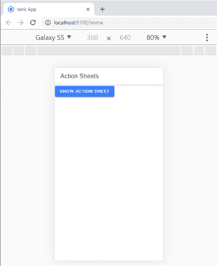

# 离子颜色

> 原文：<https://www.javatpoint.com/ionic-colors>

在这一节中，我们将学习爱奥尼亚如何为不同的元素使用颜色。

## 离子颜色类别

ion 框架包含一组**九个预定义的**颜色类，用来改变很多组件的颜色。你可以用这些颜色搭配自己的造型。在爱奥尼亚，每种颜色都是多种属性的集合，包括**色调**和**色调**。我们可以使用颜色属性将颜色应用于离子组件。如果您没有为所需元素设置任何颜色，则默认设置**原色**。

我们可以在下表中看到由 Ionic framework 提供的默认颜色集。

| 彩色 | 描述 |
| 光线 | 它用于白色。 |
| 积极的 | 它用于蓝色。 |
| 平衡的 | 它用于绿色。 |
| 稳定的 | 它用于浅灰色。 |
| 平静 | 它用于浅蓝色。 |
| 激励的 | 它用于黄色。 |
| 断定的 | 它用于红色。 |
| 皇室的 | 它用于紫色。 |
| 黑暗 | 它用于黑色。 |

## 添加颜色

我们可以通过在一个离子组件上设置**颜色属性**，或者通过 CSS 样式化，在整个应用程序中添加颜色。

如果我们想添加一种新的颜色，首先在根处为颜色的所有变化定义 CSS 变量。例如，要添加名为**收藏夹**的新颜色，我们可以定义以下变量:

**CSS 文件**

```

:root {
  --ion-color-favorite: #69bb7b;
  --ion-color-favorite-rgb: 105,187,123;
  --ion-color-favorite-contrast: #ffffff;
  --ion-color-favorite-contrast-rgb: 255,255,255;
  --ion-color-favorite-shade: #5ca56c;
  --ion-color-favorite-tint: #78c288;
}

```

现在，创建一个使用这些 CSS 变量的新类。该类的格式必须为。ion-color-{COLOR}其中{COLOR}是要添加的颜色的名称:

```

.ion-color-favorite {
  --ion-color-base: var(--ion-color-favorite);
  --ion-color-base-rgb: var(--ion-color-favorite-rgb);
  --ion-color-contrast: var(--ion-color-favorite-contrast);
  --ion-color-contrast-rgb: var(--ion-color-favorite-contrast-rgb);
  --ion-color-shade: var(--ion-color-favorite-shade);
  --ion-color-tint: var(--ion-color-favorite-tint);
}

```

添加该类后，它可以用于支持颜色属性的任何离子组件。例如，我们可以在一个离子按钮上使用**喜欢的颜色**，如下所示。

**HTML 文件**

```

<ion-button color="favorite">Favorite</ion-button>

```

## 离子颜色用法

离子键对每种元素使用不同的类别。比如按钮元素有**按钮类**，表头元素有**条类**。现在，如果我们想创建一个蓝色按钮，我们将使用**按钮-初级**类如下。

```

<div class = "button button-primary">
   ...
</div>

```

我们也可以像其他 CSS 类一样使用离子颜色类。下面的代码帮助我们理解颜色属性的用法。

```

<ion-button ion-button block (click)="openMenu()" color="primary">
    Show Action Sheet
 </ion-button>

```

当上述代码执行时，它改变**蓝色**的**显示动作单**按钮。我们将获得以下输出。



* * *