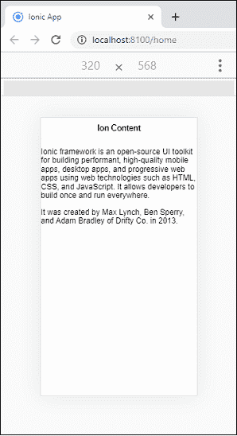
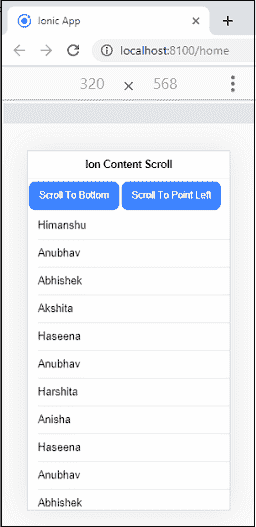
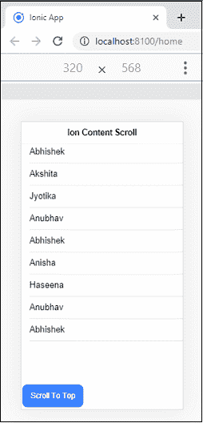

# Ionic含量

> 原文：<https://www.javatpoint.com/ionic-content>

Ionic框架提供了一个<**Ionic内容** >元素，作为一个容器，包装了我们想要在应用程序中创建的所有其他元素。内容组件允许一个易于使用的内容区域，该区域包含一些有用的方法来控制**可滚动**区域。在Ionic应用程序中，单个视图中应该只有一个内容组件。包含许多其他Ionic成分的内容可以定制，以修改其填充、边距等。通过使用 **CSS 工具**中提供的全局样式。您也可以使用 **CSS** 和可用的 **CSS 自定义属性**通过单独的样式进行自定义。

### 例子

```

<ion-header>
    <ion-toolbar>
      <ion-title>
        Ion Content
      </ion-title>
    </ion-toolbar>
  </ion-header>

  <ion-content>
    <div>
      <p>Ionic framework is an open-source UI toolkit for building performant, high-quality mobile apps, desktop apps, and progressive web apps using web technologies such as HTML, CSS, and JavaScript. It allows developers to build once and run everywhere.</p>
    </div>
    <div>
        <p>It was created by Max Lynch, Ben Sperry, and Adam Bradley of Drifty Co. in 2013.</p>
      </div>
  </ion-content>

```

**输出**



### Ionic内容滚动示例

如果您想使用Ionic内容滚动事件，您需要通过设置[滚动事件] =“真”来**启用滚动事件**

Ionic内容主要有三个**滚动事件，如下所示:**

1.  **Ionic滚动开始:**滚动开始时发出..
2.  **Ionic膨胀:**滚动结束时发出..
3.  **Ionic滚动:**滚动时发出。默认情况下，它是禁用的。

我们可以从下面的例子中理解Ionic内容滚动。

**Home.page.html**

```

<ion-header>
    <ion-toolbar>
      <ion-title>
        Ion Content Scroll
      </ion-title>
    </ion-toolbar>
  </ion-header>

  <ion-content
    [scrollEvents]="true"
    (ionScrollStart)="logScrollStart()"
    (ionScroll)="logScrolling($event)"
    (ionScrollEnd)="logScrollEnd()"
  >
    <ion-button (click)="ScrollToBottom()">
      Scroll To Bottom
    </ion-button>

    <ion-button (click)="ScrollToPoint(300, 120)">
      Scroll To Point Left
    </ion-button>

    <ion-list>
      <ion-item *ngFor="let item of dummyList">
        <ion-label>{{ item.value }}</ion-label>
      </ion-item>
    </ion-list>

    <div style="height: 50px;width:600px;" text-right>
      <ion-button (click)="ScrollToPoint(-300, -120)">
        Scroll To Point Right
      </ion-button>
    </div>

    <ion-button (click)="ScrollToTop()">
      Scroll To Top
    </ion-button>
  </ion-content>

```

**主页**

```

import { Component, ViewChild } from '@angular/core';
import { IonContent, } from '@ionic/angular';

@Component({
  selector: 'app-home',
  templateUrl: 'home.page.html',
  styleUrls: ['home.page.scss'],
})
export class HomePage {
  @ViewChild(IonContent, {static: false}) content: IonContent;
  dummyList: any;

  constructor(
  ) {
    this.dummyList = [
      {
        value: 'Himanshu',
      }, {
        value: 'Anubhav',
      }, {
        value: 'Abhishek',
      }, {
        value: 'Akshita',
      }, {
        value: 'Haseena',
      }, {
        value: 'Anubhav',
      }, {
        value: 'Harshita',
      }, {
        value: 'Anisha',
      }, {
        value: 'Haseena',
      }, {
        value: 'Anubhav',
      }, {
        value: 'Abhishek',
      }, {
        value: 'Anisha',
      }, {
        value: 'Haseena',
      }, {
        value: 'Akshita',
      }, {
        value: 'Abhishek',
      }, {
        value: 'Akshita',
      }, {
        value: 'Jyotika',
      }, {
        value: 'Anubhav',
      }, {
        value: 'Abhishek',
      }, {
        value: 'Anisha',
      }, {
        value: 'Haseena',
      }, {
        value: 'Anubhav',
      }, {
        value: 'Abhishek',
      }
    ];
  }
  logScrollStart() {
    console.log('logScrollStart : When Scroll Starts');
  }

  logScrolling() {
    console.log('logScrolling : When Scrolling');
  }

  logScrollEnd() {
    console.log('logScrollEnd : When Scroll Ends');
  }

  ScrollToBottom() {
    this.content.scrollToBottom(1500);
  }

  ScrollToTop() {
    this.content.scrollToTop(1500);
  }

  ScrollToPoint(X, Y) {
    this.content.scrollToPoint(X, Y, 1500);
  }
}

```

**输出**

当你执行上面的Ionic应用程序时，它会在你的浏览器中给出下面的屏幕。



现在，如果你点击**滚动到底部**按钮，你会立即进入屏幕底部，你可以在下面的屏幕中看到。接下来，当你点击**滚动到顶部**按钮时，你将再次到达屏幕顶部，我们可以在下图中看到。



* * *