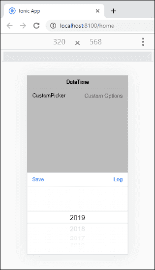

# Ionic日期时间

> 原文：<https://www.javatpoint.com/ionic-datetime>

日期时间组件用于呈现**选择器界面**，便于用户选择**日期和时间**。选择器界面显示可滚动列，可用于选择年、月、日、小时、分钟和秒值。Ionic日期时间类似于本机日期时间元素。但是，Ionic日期时间组件非常容易以首选格式显示日期和时间，并有助于管理日期时间值。

### 例子

在这里，我们将看到一个没有任何值或属性的 **<Ionic-日期时间>** 组件的示例。

```

<ion-header>
  <ion-toolbar color="light">
    <ion-title>DateTime</ion-title>
  </ion-toolbar>
</ion-header>

<ion-content>
  <ion-list>
    <ion-item>
      <ion-label>Plain</ion-label>
      <ion-datetime></ion-datetime>
    </ion-item>
  </ion-list>
</ion-content>

```

**输出:**

当您执行上述代码片段时，它将显示以下输出。


接下来，当您点击**普通部分**时，您将获得以下屏幕。该屏幕显示当前系统日期信息。一旦点击**完成**按钮，它将被放入如下格式的普通部分。

```

Plain    Sep 29, 2019

```


Ionic日期时间使用以下术语。

### 显示和选取器格式

datetime 组件在两个位置显示日期时间值。第一个在<ion-datetime>组件中，第二个是拾取器界面，从页面底部呈现。</ion-datetime>

### 显示形式

此属性指定如何在日期时间组件中向用户打印日期时间的值。<ion-datetime>元素总是显示相对于用户时区的值。</ion-datetime>

### 选取器格式

该属性指定在**选择器格式**中显示哪一列，列的顺序，以及每一列中应使用的格式。如果您没有提供选取器格式，它将使用**显示格式**的值。

### 例子

在本例中，我们在<Ionic-日期时间>组件中添加了**显示格式**和 **pickerFormat** 属性。该属性以**特定格式**显示日期时间。

```

<ion-header>
  <ion-toolbar color="light">
    <ion-title>DateTime</ion-title>
  </ion-toolbar>
</ion-header>

<ion-content>
  <ion-list>
    <ion-item>
      <ion-label>Specific Format</ion-label>
      <ion-datetime displayFormat="YYYY" placeholder="Select Year"></ion-datetime>
    </ion-item>    
    <ion-item>
      <ion-label>Start Time</ion-label>
      <ion-datetime displayFormat="h:mm A" pickerFormat="h:mm A" value="1990-02-19T07:43Z"></ion-datetime>
    </ion-item>
    <ion-item>
      <ion-label>Ends</ion-label>
      <ion-datetime value="1990-02-20" placeholder="Select Date"></ion-datetime>
    </ion-item>
  </ion-list>
</ion-content>

```

**输出:**

当您执行上述代码片段时，它将给出以下输出。


现在，点击**特定格式**部分，您将看到以下屏幕。在这里，你可以选择你想要的年份。一旦点击**完成**按钮，它将被放入特定格式部分。


### 日期时间数据

在 JavaScript 和 HTML 中处理日期时间值一直是一个挑战。但是，在Ionic中处理日期时间允许开发人员在输入中轻松格式化日期时间值。它提供了简单的日期时间选择器格式，以获得出色的用户体验。

### 最大和最小日期时间

两个方向的日期都是无限的，默认情况下**最大**日期是当年的**结束**，而**最小**日期是 100 年前一年的**开始**。您可以使用 **max** 和 **min** 属性自定义最大和最小日期时间值。例如，如果我们将 min 属性设置为 2015，max 属性设置为 2020-12-31，那么 datetime 组件将在 2015 年初到 2020 年 12 月 31 日之间限制选择。

### 例子

本示例解释了使用<Ionic日期时间>组件禁用、**最小值**和**最大值**属性。

```

<ion-header>
  <ion-toolbar color="light">
    <ion-title>DateTime</ion-title>
  </ion-toolbar>
</ion-header>

<ion-content>
  <ion-list>
    <ion-item>
      <ion-label>Disable</ion-label>
      <ion-datetime id="dynamicDisabled" displayFormat="MM DD YY" disabled value="2010-01-26"></ion-datetime>
    </ion-item> 
    <ion-item>
      <ion-label>Max and Min</ion-label>
      <ion-datetime min="1990" max="2020" placeholder="Select Year"></ion-datetime>
    </ion-item>
  </ion-list>
</ion-content>

```

**输出:**


### custompickerproptions

自定义选取器选项属性允许您创建一些**自定义按钮**。以下示例解释了自定义选取器选项如何与<Ionic-日期时间>组件配合使用。

**Home.page.html**

```

<ion-header>
  <ion-toolbar color="light">
    <ion-title>DateTime</ion-title>
  </ion-toolbar>
</ion-header>

<ion-content>
  <ion-list> 
    <ion-item>
      <ion-label>CustomPicker</ion-label>
      <ion-datetime [pickerOptions]="customPickerOptions" placeholder="Custom Options" displayFormat="YYYY"></ion-datetime>
    </ion-item>
  </ion-list>
</ion-content>

```

**主页**

在此页面中，我们使用自定义选取器选项创建了自定义按钮**保存**和**日志**。

```

import { Component } from '@angular/core';

@Component({
  selector: 'app-home',
  templateUrl: 'home.page.html',
  styleUrls: ['home.page.scss'],
})
export class HomePage {
  customPickerOptions: any;
  constructor() {
    this.customPickerOptions = {
      buttons: [{
        text: 'Save',
        handler: () => console.log ('Clicked Save')
    }, {
      text: 'Log',
      handler: () => {
        console.log ('Clicked Log. Do not Dismiss.');
        return false;
      }
    }]
  };
}
}

```

**输出:**

当您执行上述代码片段时，它将显示以下屏幕。


接下来，点击自定义选择器部分，它将给出如下屏幕。这里，当你点击**保存按钮**时，数据将被保存，屏幕看起来如上图。而当你点击**日志按钮**时，页面并没有消失，你会得到消息:**点击日志。不要忽视**。



### 本地自定义

自定义区域属性为您的月份指定了**自定义简称**。您可以看到下面的示例来理解自定义区域设置如何与< ion-datetime >组件一起工作。

**Home.page.html**

```

<ion-header>
  <ion-toolbar color="light">
    <ion-title>DateTime</ion-title>
  </ion-toolbar>
</ion-header>

<ion-content>
  <ion-list> 
    <ion-item>
      <ion-label>Custom Locale</ion-label>
      <ion-datetime value="1995-04-15" min="1990-02" max="2000"
      [dayShortNames]="customDayShortNames" displayFormat="DDD. MMM DD, YY"
      monthShortNames="jan, feb, mar, apr, mai, jun, jul, aug, sep, okt, nov, des"></ion-datetime>
    </ion-item>
  </ion-list>
</ion-content>

```

**主页**

```

import { Component } from '@angular/core';

@Component({
  selector: 'app-home',
  templateUrl: 'home.page.html',
  styleUrls: ['home.page.scss'],
})
export class HomePage {
  customDayShortNames = [ 's\u00f8n', 'man', 'tir', 'ons', 'tos', 'fre', 'l\u00f84'];
}

```

**输出:**


### 特定日/月/年

<ion-datetime>组件还允许您通过设置属性“月值”、“日值”和“年值”来选择特定的日、月和年。你可以看下面的例子来理解它如何与<ion-datetime>组件一起工作。</ion-datetime></ion-datetime>

```

<ion-header>
  <ion-toolbar color="light">
    <ion-title>DateTime</ion-title>
  </ion-toolbar>
</ion-header>

<ion-content>
  <ion-list> 
    <ion-item>
      <ion-label>Specific day/month/year</ion-label>
      <ion-datetime monthValues= "6,7,8" yearValues="2017,2018"
      dayValues= "01,02,03,04,05,06,07,08,09,10,11,12,13,14,15" 
      displayFormat= "DD/MM/YYYY" > </ion-datetime>
    </ion-item>
  </ion-list>
</ion-content>

```

**输出:**

在下面的输出中，您可以上下滚动特定的列来选择特定的日、月和年。


* * *