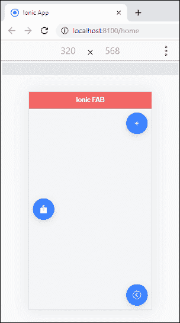
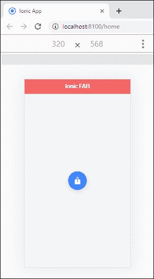
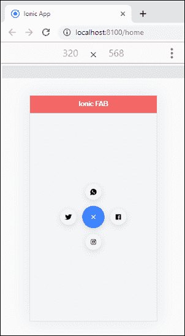

# 离子晶圆厂按钮

> 原文：<https://www.javatpoint.com/ionic-fab-button>

离子 FAB 是 ***浮动动作按钮*** 作为容器元素。它们是材料设计组件，可以包含一个或多个 fab 按钮。应该放在**固定位置**上，这样才不会随内容滚动。晶圆厂必须包含一个主**晶圆厂按钮**。它还包括一个 fab 列表，其中包含相关按钮，当主 fab 按钮被按下/点击时显示。它还允许包含几个具有不同边值的 fab 列表元素。FAB 按钮的形状像一个**圆**。我们可以使用标准的 **<离子晶圆>** 组件来访问浮动动作按钮。

有一个 FAB 按钮背后的想法是用来调用页面上的提升动作。例如，如果您有一个项目列表，并且想要再添加一个项目，则添加按钮可以用作浮动操作按钮。

默认情况下，浮动操作按钮固定在右下角。但是，我们也可以配置 FAB 按钮来提供视图中的默认操作。例如，它可以固定在特定的位置，也可以是带有视图的卷轴等。

### 例子

以下示例解释了在离子应用程序中 FAB 按钮的工作方式。在这里，我们将在<离子制造>组件中获取三个**<离子制造按钮>，并为所有这些按钮添加**图标**。**

 **```

<ion-header translucent>
  <ion-toolbar color="danger">
    <ion-title>Ionic FAB</ion-title>
  </ion-toolbar>
</ion-header>

<ion-content class="ion-padding" color="light">
   <!-- fab placed to the top end -->
   <ion-fab vertical="top" horizontal="end" slot="fixed">
    <ion-fab-button>
      <ion-icon name="add"></ion-icon>
    </ion-fab-button>
  </ion-fab>

  <!-- fab placed to the bottom end -->
  <ion-fab vertical="bottom" horizontal="end" slot="fixed">
    <ion-fab-button>
      <ion-icon name="arrow-dropleft"></ion-icon>
    </ion-fab-button>
  </ion-fab>

   <!-- fab placed to the (vertical) center and start -->
   <ion-fab vertical="center" horizontal="start" slot="fixed">
    <ion-fab-button>
      <ion-icon name="share"></ion-icon>
    </ion-fab-button>
  </ion-fab>

</ion-content>

```

**输出:**

当你执行上面的离子应用程序时，你会看到下面的屏幕。在该屏幕中，您可以看到三个 FAB 按钮显示在**顶端、底端、**和**中心开始**位置。



## 离子制造清单

它包含多个晶圆厂按钮。这些制造按钮包含与主制造按钮相关的动作，按下或点击后将**弹出**。该按钮还可以通过设置**侧属性**开始、结束、顶部和底部来指定出现在特定位置。下面的例子解释了<离子制造列表>如何与<离子制造按钮>一起工作。

### 例子

在这个例子中，我们将创建一个包含几个 FAB 按钮的列表。fab 按钮有不同的图标，例如 WhatsApp、Twitter、脸书和 Instagram 的图标。这些 fab 按钮包含与主 fab 按钮相关的动作，按下或点击后会弹出。

```

<ion-header translucent>
  <ion-toolbar color="danger">
    <ion-title>Ionic FAB</ion-title>
  </ion-toolbar>
</ion-header>

<ion-content class="ion-padding" color="light">
  <ion-fab vertical="center" horizontal="center" slot="fixed">
    <ion-fab-button>
      <ion-icon name="share"></ion-icon>
    </ion-fab-button>
    <ion-fab-list side="top">
      <ion-fab-button><ion-icon name="logo-whatsapp"></ion-icon></ion-fab-button>
    </ion-fab-list>
    <ion-fab-list side="bottom">
      <ion-fab-button><ion-icon name="logo-instagram"></ion-icon></ion-fab-button>
    </ion-fab-list>
    <ion-fab-list side="start">
      <ion-fab-button><ion-icon name="logo-twitter"></ion-icon></ion-fab-button>
    </ion-fab-list>
    <ion-fab-list side="end">
      <ion-fab-button><ion-icon name="logo-facebook"></ion-icon></ion-fab-button>
    </ion-fab-list>
  </ion-fab>

</ion-content>

```

**输出:**

当你执行上面的离子应用程序时，它会给出下面的屏幕。在这里，你会看到**共享按钮图标**，按下或点击后会弹出。



当按下或点击共享按钮图标时，您将看到以下屏幕。在这里，你可以看到脸书、Instagram、WhatsApp 和 Twitter 的图标。



* * ***