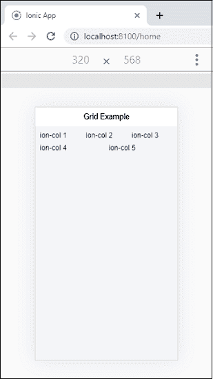
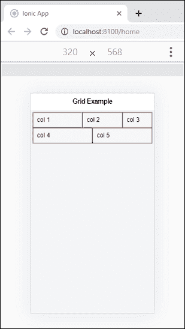
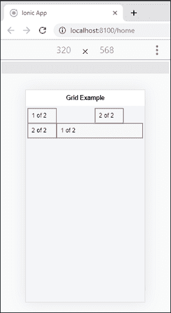
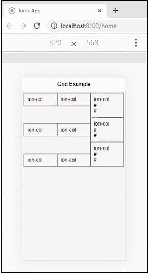
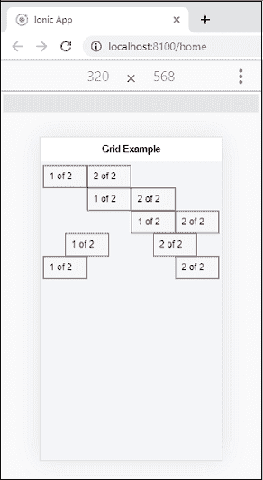

# Ionic栅格

> 原文：<https://www.javatpoint.com/ionic-grid>

Ionic grid 系统是一个功能强大的**基于移动的 flexbox 系统**，用于构建自定义布局。flexbox 是一个 CSS 特性，所有的设备都支持它。Ionic栅格主要由三个单元组成，即**栅格、行**和**列**。它允许您选择任意多的行和列。他们可以自动调整大小以适应可用空间，尽管它可以根据您的需求进行更改。Ionic网格由 **12 列**布局组成，根据屏幕大小有不同的断点。我们也可以通过使用 CSS 自定义列数。

## 网格列

网格列是一行内部的**单元**组件。网格的所有内容都在一列中。

## 网格行

网格行是包含不同列数的**水平**组件。它确保了柱子的正确定位。

**例**

这里，我们创建了一个简单的网格，向您展示了行和列的用法。

```

<ion-header>
  <ion-toolbar>
    <ion-title>
      Grid Example
    </ion-title>
  </ion-toolbar>
</ion-header>

<ion-content class="padding" color="light">
  <ion-grid>
    <ion-row>
      <ion-col>ion-col 1</ion-col>
      <ion-col>ion-col 2</ion-col>
      <ion-col>ion-col 3</ion-col>
    </ion-row>
    <ion-row>
      <ion-col>ion-col 4</ion-col>
      <ion-col>ion-col 5</ion-col>
    </ion-row>
  </ion-grid>
</ion-content>

```

**输出**

当我们执行该应用程序时，它将给出以下输出。



## 列大小

如果不想让列大小自动调整，可以选择**大小属性**根据需要设置列大小。下面的例子帮助我们准确理解大小属性的用法。

**例**

#### 注意:本示例将边框应用于列，以易于理解的方式显示它。

这里，第一行使用**定制尺寸**，而第二行使用**默认**列尺寸。

```

<ion-header>
  <ion-toolbar>
    <ion-title>
      Grid Example
    </ion-title>
  </ion-toolbar>
</ion-header>

<ion-content class="padding" color="light">
  <ion-grid>
    <ion-row>
      <ion-col size="5">col 1</ion-col>
      <ion-col >col 2</ion-col>
      <ion-col size="3">col 3</ion-col>
    </ion-row>
    <ion-row>
      <ion-col>col 4</ion-col>
      <ion-col>col 5</ion-col>
    </ion-row>
  </ion-grid>
</ion-content>

```

**输出**



## 重新排序列

您可以使用以下两个属性对网格列重新排序。

1.  抵消
2.  推拉

**偏移**

该属性用于**将**列移动到指定列号的**右侧**。它将列的左边距增加指定列的数量。

**按下并弹出**

推拉属性按照指定的列数调整列的**左侧**和**右侧**。

**例**

下面的例子清楚地理解了**偏移**和**推拉**属性的使用。

```

<ion-header>
  <ion-toolbar>
    <ion-title>
      Grid Example
    </ion-title>
  </ion-toolbar>
</ion-header>

<ion-content class="padding" color="light">
  <ion-grid>
    <ion-row>
      <ion-col size="3">
        <div>
          1 of 2
        </div>
      </ion-col>
      <ion-col size="3" offset="4">
        <div>
          2 of 2
        </div>
      </ion-col>
    </ion-row>
    <ion-row>
      <ion-col size="9" push="3">
        <div>
          1 of 2
        </div>
      </ion-col>
      <ion-col size="3" pull="9">
        <div>
          2 of 2
        </div>
      </ion-col>
    </ion-row>
  </ion-grid>
</ion-content>

```

**输出**

当您执行上面的Ionic应用程序时，您将获得以下输出。这里，第一列使用 offset 属性，第二列使用 push 和 pull 属性。



## 列对齐

Ionic网格允许您使用两种类型的列对齐，如下所示。

1.  竖向定线
2.  水平线向

**垂直对齐**

网格系统允许多种方式垂直对齐内容。它通过向行中添加不同的类来对齐行内的列。这些不同的类别是:

*   Ionic-对齐-项目-开始
*   Ionic-对齐-项目-中心
*   Ionic-对齐-项目-结束

**例**

```

<ion-header>
  <ion-toolbar>
    <ion-title>
      Grid Example
    </ion-title>
  </ion-toolbar>
</ion-header>

<ion-content class="padding" color="light">
  <ion-grid>
    <ion-row class="ion-align-items-start">
      <ion-col>ion-col</ion-col>
      <ion-col>ion-col</ion-col>
      <ion-col>
        ion-col
        <br>#
        <br>#
      </ion-col>
    </ion-row>
    <ion-row class="ion-align-items-center">
      <ion-col>ion-col</ion-col>
      <ion-col>ion-col</ion-col>
      <ion-col>
        ion-col
        <br>#
        <br>#
      </ion-col>
    </ion-row>
    <ion-row class="ion-align-items-end">
      <ion-col>ion-col</ion-col>
      <ion-col>ion-col</ion-col>
      <ion-col>
        ion-col
        <br>#
        <br>#
      </ion-col>
    </ion-row>
  </ion-grid>
</ion-content>

```

**输出**

在下面的输出中，第一行对齐列开始，第二行对齐居中，第三行对齐结束。



**水平对齐**

网格系统允许多种方式水平对齐内容。它通过向行中添加不同的类来对齐行内的列。这些不同的类别是:

*   Ionic-调整-内容-开始
*   Ionic调整内容中心
*   Ionic调整内容结束
*   Ionic调整内容
*   Ionic调整含量介于

**例**

```

<ion-header>
  <ion-toolbar>
    <ion-title>
      Grid Example
    </ion-title>
  </ion-toolbar>
</ion-header>

<ion-content class="padding" color="light">
    <ion-grid>
        <ion-row class="ion-justify-content-start">
          <ion-col size="3">
            <div>1 of 2</div>
          </ion-col>
          <ion-col size="3">
            <div>
              2 of 2
            </div>
          </ion-col>
        </ion-row>

        <ion-row class="ion-justify-content-center">
          <ion-col size="3">
            <div>1 of 2</div>
          </ion-col>
          <ion-col size="3">
            <div>2 of 2</div>
          </ion-col>
        </ion-row>

        <ion-row class="ion-justify-content-end">
          <ion-col size="3">
            <div>1 of 2</div>
          </ion-col>
          <ion-col size="3">
            <div>2 of 2</div>
          </ion-col>
        </ion-row>

        <ion-row class="ion-justify-content-around">
          <ion-col size="3">
            <div>1 of 2</div>
          </ion-col>
          <ion-col size="3">
            <div>2 of 2</div>
          </ion-col>
        </ion-row>

        <ion-row class="ion-justify-content-between">
          <ion-col size="3">
            <div>1 of 2</div>
          </ion-col>
          <ion-col size="3">
            <div>2 of 2</div>
          </ion-col>
        </ion-row>
      </ion-grid>
</ion-content>

```

**输出**

当您运行Ionic应用程序时，它会给出以下输出。



## 磨料粒度

默认情况下，网格采用屏幕的 100 %宽度**。如果需要根据屏幕大小设置最大宽度，在 **<Ionic栅格>** 元素中添加**固定**属性。下表显示了不同的网格大小。**

 **| 名字 | 价值 | 描述 |
| 特小号 | 100% | 它不设置 xs 屏幕的网格宽度。 |
| 钐 | 540 像素 | 当(最小宽度:576 像素)时，它将网格宽度设置为 540 像素。 |
| 钔 | 720 像素 | 它将网格宽度设置为 720px(最小宽度:768px)。 |
| 水准仪 | 960 像素 | 当(最小宽度:992px)时，它将网格宽度设置为 960px。 |
| 特大号 | 1140 像素 | 它将网格宽度设置为 1140px(最小宽度:1200px)。 |

* * ***