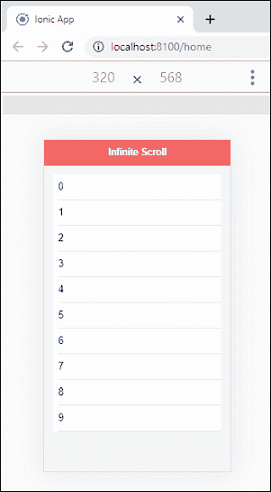
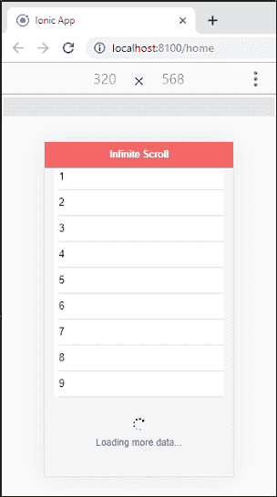

# Ionic无限卷轴

> 原文：<https://www.javatpoint.com/ionic-infinite-scroll>

无限滚动组件用于在用户从页面的**顶部**或**底部**滚动指定的**距离**时调用要执行的动作。当我们必须同时显示大量数据时，这非常有用。

每个移动应用程序都需要一种方法，以较少的点击次数显示大量的数据。在这种情况下，无限卷轴对他们来说起着至关重要的作用。无限滚动组件的工作原理就像我们在一个页面上加载 10 个项目一样。现在，当用户滚动这些项目并接近底部时，它会发出新的**数据请求**。此请求获取将添加到现有项目中的下一组记录项目。这个过程是**重复**，直到用户滚动时没有发现新数据。

当您滚动脸书、Instagram 或推特新闻提要区域时，您可以更清楚地理解它。页面总是加载新帖子，你会在屏幕底部看到一个**加载微调器**。

您可以使用标准的 **<Ionic无限滚动>** 和 **<Ionic无限滚动内容>** 组件来访问无限滚动。当用户接近定义的距离时，调用在<Ionic无限滚动>中指定的表达式**(Ionic时间)=“加载数据($事件)”**。当它完成所有任务后，会在无限滚动实例上调用 **complete()** 方法。**阈值**属性告诉滚动时从内容底部到调用无限输出内容的距离。

## 无限滚动内容

它是<ion-infinite-scroll>组件的子组件，用于显示内容。它还改变了滚动的外观，这取决于无限滚动？美国的州。它包含滚动选项，如**加载文本**、**加载文本**等。</ion-infinite-scroll>

#### 注意:<Ionic无限卷>组件在反应堆中不支持。

以下示例解释了Ionic滚动组件在应用程序中的工作方式。

**例**

**Home.page.html**

这个 HTML 页面调用事件来显示无限滚动的内容。这里，表达式**[disabled]=“Numtimeleft<= 0”**用于停止滚动。我们还定制了加载微调器和加载消息的类型，当方法被调用，数据加载正在进行时，它们就会显示出来。

```

<ion-header translucent>
  <ion-toolbar color="danger">
    <ion-title>Ionic Infinite Scroll</ion-title>
  </ion-toolbar>
</ion-header>

<ion-content class="ion-padding" color="light">
  <ion-list>
    <ion-item *ngFor="let item of items"> {{item}} </ion-item>
  </ion-list>
  <ion-infinite-scroll threshold="100px" (ionInfinite)="loadData($event)" [disabled]="numTimesLeft <= 0">
    <ion-infinite-scroll-content
      loadingSpinner="bubbles"
      loadingText="Loading more data...">
    </ion-infinite-scroll-content>
  </ion-infinite-scroll>
</ion-content>

```

**主页**

在这个文件中，我们将使用 **for loop** 方法在页面加载时添加伪数据。当列表到达页面底部时，调用 **loadData()** 方法。最后，调用 complete()方法来停止加载程序。

```

import { Component} from '@angular/core';

@Component({
  selector: 'app-home',
  templateUrl: 'home.page.html',
  styleUrls: ['home.page.scss'],
})
export class HomePage {
  items = [];
  numTimesLeft = 5;
  constructor() {
    this.addMoreItems();
  }
  loadData(event) {
    setTimeout(() => {
      console.log('Done');
      this.addMoreItems();
      this.numTimesLeft -= 1;
      event.target.complete();
    }, 500);
  }
  addMoreItems() {
    for (let i = 0; i < 10; i++) {
      this.items.push(i);
    }
  }
}

```

**输出**

当您运行该应用程序时，它将给出以下输出。



现在，当列表到达页面底部时，页面会重复，直到用户滚动时没有找到新数据。



* * *