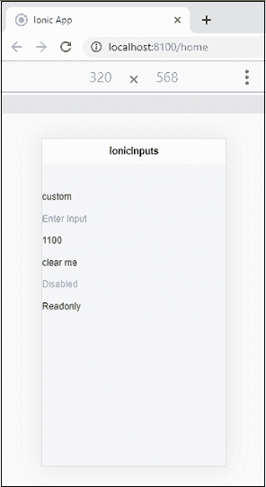
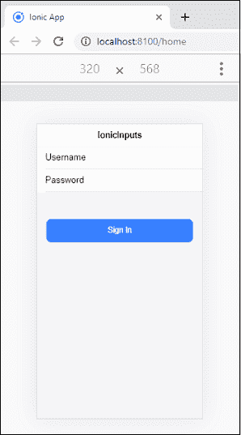
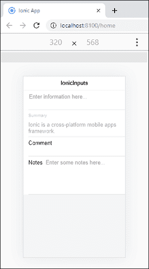

# Ionic 输入

> 原文：<https://www.javatpoint.com/ionic-inputs>

Ionic 输入是用于安全收集和处理用户输入的基本组件。它是 HTML 输入元素的包装器，包含自定义样式和附加功能。它的工作原理类似于 HTML 输入元素，但在桌面设备上非常有效，并且可以与移动设备上的键盘集成。

Ionic 输入仅接受**文本类型**输入，如“文本”、“密码”、“号码”、“电子邮件”、“搜索”、“电话”和“网址”。它还支持所有标准文本类型的输入事件，包括上键、按键、下键等。

有许多属性可用于设置输入字段的样式。这些列在下面。

*   固定内嵌标签
*   浮动标签
*   内嵌标签
*   占位符标签
*   堆叠标签

### 固定内嵌标签

它用于在输入元素的左侧放置一个标签。输入文本时，标签不会隐藏。您也可以将占位符文本与固定标签结合使用。您可以使用以下语法在<Ionic 标签>元素中添加**固定**属性。

```

<ion-label position="fixed">Username</ion-label>

```

### 浮动标签

它们是当选择输入时**激活或向上浮动**的标签。您可以使用以下语法在<Ionic 标签>元素中添加浮动属性。

```

<ion-label position="floating">Username</ion-label>

```

### 内嵌标签

如果<ion-label>没有任何属性，则称为内联标签。输入文本时，它不会隐藏。以下语法解释了内联标签。</ion-label>

```

<ion-label>Username</ion-label>

```

### 占位符标签

占位符作为**提示或标题**保存默认位置。当您在输入中输入文本时，占位符标签会自动隐藏。您可以使用以下语法在<Ionic 标签>元素中添加占位符属性。

```

<ion-input type="text" placeholder="Username"></ion-input>

```

### 堆叠标签

这种类型的标签总是出现在输入的顶部。您可以将占位符文本与堆叠标签结合使用。您可以通过以下语法在<ion-label>元素中添加堆叠属性。</ion-label>

```

<ion-label position="stacked">Username</ion-label>

```

以下示例显示了在 Ionic 框架中使用的不同类型的输入。

### 例子

```

<ion-header>
  <ion-toolbar>
    <ion-title>
      IonicInputs
    </ion-title>
  </ion-toolbar>
</ion-header>

<ion-content class="padding" color="light">
  <div>
    <!-- Default Input -->
    <ion-input></ion-input>

    <!-- Input with value -->
    <ion-input value="custom"></ion-input>

    <!-- Input with placeholder -->
    <ion-input placeholder="Enter Input"></ion-input>

    <!-- Number type input -->
    <ion-input type="number" value="1100"></ion-input>

    <!-- Input with clear button when the value is available -->
    <ion-input clearInput value="clear me"></ion-input>

    <!-- Disabled input -->
    <ion-input value="Disabled" disabled></ion-input>

    <!-- Readonly input -->
    <ion-input value="Readonly" readonly></ion-input>
  </div>
</ion-content>

```

**输出**



## 列表中的输入

以下示例有助于理解如何将输入元素用于列表组件。

### 例子

```

<ion-header>
  <ion-toolbar>
    <ion-title>
      IonicInputs
    </ion-title>
  </ion-toolbar>
</ion-header>

<ion-content class="padding" color="light" fullscreen>
  <ion-list>
    <ion-item>
      <ion-label>Username</ion-label>
      <ion-input type="text"></ion-input>
    </ion-item>

    <ion-item>
      <ion-label>Password</ion-label>
      <ion-input type="password"></ion-input>
    </ion-item> 
  </ion-list>

  <div padding>
    <ion-button color="primary" expand="block">Sign In</ion-button>
  </div>
</ion-content>

```

**输出**



## 多行文本输入

如果要写多行文字输入，可以使用 **<Ionic-文字区>** 组件。该组件允许 Ionic 更好地处理文本区域的用户体验和交互性。与原生文本区域元素不同， **<Ionic 文本区域>** 不支持从内部内容加载其值。您可以在**值属性**中设置文本区域值。

除了 Ionic 属性外，<ion-textarea>组件还接受所有本地文本区域属性。</ion-textarea>

### 例子

以下示例显示了<ion-textarea>组件在 Ionic 应用中的使用。</ion-textarea>

```

<ion-header>
  <ion-toolbar>
    <ion-title>
      IonicInputs
    </ion-title>
  </ion-toolbar>
</ion-header>

<ion-content class="padding" color="light" fullscreen>
  <!-- Textarea in an item with a placeholder -->
  <ion-item>
    <ion-textarea placeholder="Enter information here..."></ion-textarea>
  </ion-item>

  <!-- Disabled and readonly textarea in an item with a stacked label -->
  <ion-item>
    <ion-label position="stacked">Summary</ion-label>
    <ion-textarea disabled readonly value="Ionic is a cross-platform mobile apps framework.">
    </ion-textarea>
  </ion-item>

  <!-- Textarea that clears the value on edit -->
  <ion-item>
    <ion-label>Comment</ion-label>
    <ion-textarea clearOnEdit="true"></ion-textarea>
  </ion-item>

  <!-- Textarea with custom number of rows and cols -->
  <ion-item>
    <ion-label>Notes</ion-label>
    <ion-textarea rows="5" cols="10" placeholder="Enter some notes here..."></ion-textarea>
  </ion-item>
</ion-content>

```

**输出**



* * *