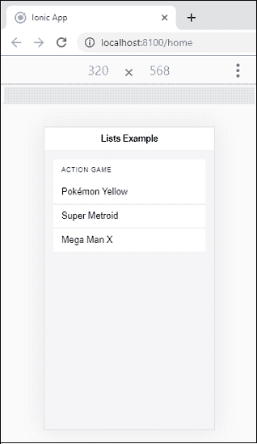
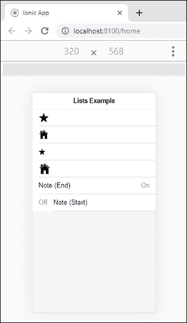
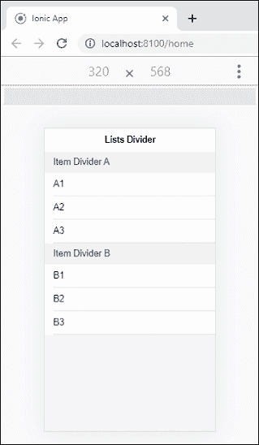
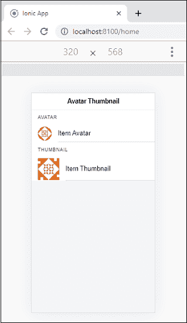
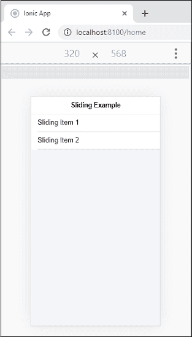
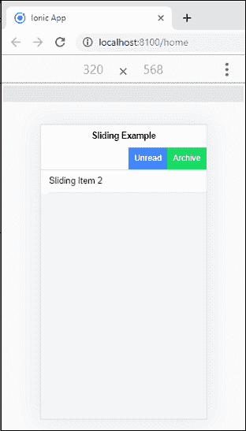

# Ionic 列表

> 原文：<https://www.javatpoint.com/ionic-list>

列表是任何网络或移动应用程序中最受欢迎的元素。它们由多行项目组成，包括文本、按钮、切换、图标、缩略图等。我们可以用它来显示菜单、标签等各种信息，或者打破纯文本文件的单调。

Ionic 列表通常包含具有相似数据内容的项目，如图像和文本。它支持多种交互，包括滑动项目、拖动以重新排列列表中的项目以及删除项目。我们可以使用标准的**<></Ionic 列表>** 元素来访问列表。

## 创建列表

我们可以使用以下语法创建列表。

```

<ion-content>
    <ion-list>
      <ion-item></ion-item>
      <ion-item></ion-item>
      </ion-list>
</ion-content>

```

ion 框架提供了不同类型的列表，如下所示。

*   列表标题
*   插入列表
*   图标列表
*   列表分隔符
*   头像列表
*   缩略图列表
*   滑动列表
*   多行列表

### 列表标题

每个列表都可以在列表顶部包含一个标题。我们可以通过使用<ion-list-header>元素来包含一个列表头。</ion-list-header>

### 插入列表

默认情况下，Ionic 列表不包含外部边距。当您需要一个列表来填充您自己的容器时，您可以将插入属性添加到<ion-list>组件中。inset 属性为它添加了一些边距，并根据您的容器调整列表大小。</ion-list>

**例**

在下面的例子中，我们可以理解 **<列表标题>** 和**插图**如何与 **<Ionic 列表>** 元素一起工作。

```

<ion-header>
    <ion-toolbar>
      <ion-title>
        Lists Example
      </ion-title>
    </ion-toolbar>
  </ion-header>   
  <ion-content color="light">
    <ion-list inset>
      <ion-list-header>Action Game</ion-list-header>
      <ion-item>Pok?mon Yellow</ion-item>
      <ion-item>Super Metroid</ion-item>
      <ion-item>Mega Man X</ion-item>
    </ion-list>
  </ion-content>

```

**输出**



### 列表图标

向列表中添加图标提供了关于每个项目内容的**提示**。我们还可以**设置图标的大小**，可以是**小**也可以是**大**。默认情况下，图标的大小很小，但可以使用大属性将其变大。最后是 **<Ionic 注释>** 元素，这是一个用作字幕的文本元素，提供更多的信息。它在项目中用作元数据文本。

**例**

```

<ion-header>
  <ion-toolbar>
    <ion-title>
      Lists Example
    </ion-title>
  </ion-toolbar>
</ion-header>

<ion-content color="light">
  <ion-list>
    <ion-item>
      <ion-icon name="star"></ion-icon>
    </ion-item>       
    <ion-item>
      <ion-icon name="home"></ion-icon>
    </ion-item>
    <ion-item>
      <ion-icon name="star" size="small"></ion-icon>
    </ion-item>
    <ion-item>
      <ion-icon name="home" size="large"></ion-icon>
    </ion-item>
    <!-- Notes in a List -->
    <ion-item>
      <ion-label>Note (End)</ion-label>
      <ion-note slot="end">On</ion-note>
    </ion-item>
    <ion-item>
      <ion-note slot="start">Off</ion-note>
      <ion-label>Note (Start)</ion-label>
    </ion-item>
  </ion-list>
</ion-content>

```

**输出**



### 项目分隔符

列表分割器用于将元素组织成**逻辑组**。Ionic 给了我们 **<Ionic 物品分割器>** 元素来分离列表中的物品。它们类似于列表头，但是没有必要将其放在列表的顶部。它应该放在相似项目的组之间。

**例**

```

<ion-header>
  <ion-toolbar>
    <ion-title>
      Lists Divider
    </ion-title>
  </ion-toolbar>
</ion-header>

<ion-content color="light">     
  <!-- Item Dividers in a List -->
    <ion-list>
      <ion-item-divider>
        <ion-label>Item Divider A</ion-label>
      </ion-item-divider>      
      <ion-item><ion-label>A1</ion-label></ion-item>
      <ion-item><ion-label>A2</ion-label></ion-item>
      <ion-item><ion-label>A3</ion-label></ion-item>

      <ion-item-divider>
        <ion-label>Item Divider B</ion-label>
      </ion-item-divider>
      <ion-item><ion-label>B1</ion-label></ion-item>
      <ion-item><ion-label>B2</ion-label></ion-item>
      <ion-item><ion-label>B3</ion-label></ion-item>
    </ion-list>
</ion-content>

```

**输出**



### 项目头像和缩略图

头像和缩略图都用于**添加图像**。主要区别是头像图像比图标大，但比缩略图小。

头像通常是包裹图像或图标的圆形组件。它可以用来代表一个人或一个物体。我们可以通过在物品内部使用 **<Ionic 头像>** 组件来添加头像。如果我们把头像放在一个<Ionic 项目>里面，那么它会调整大小以适合父组件。我们可以通过将**槽**分别设置为开始或结束来将**头像定位在项目的左侧或右侧。**

缩略图通常是包裹图像或图标的**方形**组件。它可用于显示一组较大的图像或提供全尺寸图像的预览。我们可以通过在项目内部使用<Ionic 缩略图>组件来添加缩略图。如果我们把缩略图放在一个 **<Ionic 项目>** 里面，那么它将调整大小以适合父组件。我们可以通过将**槽**分别设置为开始或结束来将**缩略图定位在项目的左侧或右侧。**

**例**

```

<ion-header>
  <ion-toolbar>
    <ion-title>
      Avatar Thumbnail
    </ion-title>
  </ion-toolbar>
</ion-header>

<ion-content color="light">     
  <!-- Avatar -->
    <ion-list>
      <ion-list-header>Avatar</ion-list-header>
      <ion-item>
        <ion-avatar slot="start">
          
        </ion-avatar>
        <ion-label>Item Avatar</ion-label>
      </ion-item>
      <ion-list-header>Thumbnail</ion-list-header>
  <!-- Thumbnail -->
      <ion-item>
        <ion-thumbnail slot="start">
          
        </ion-thumbnail>
        <ion-label>Item Thumbnail</ion-label>
      </ion-item>
    </ion-list>
</ion-content>

```

**输出**



### 滑动列表

滑动项包含一个可以向左或向右滑动**以显示隐藏的**按钮组的项。我们可以通过在<Ionic 列表>组件内添加 **<Ionic 项目滑动>** 组件来使用滑动项目。接下来，我们需要在滑动项内部添加 **<Ionic-项目-选项>** 组件来包含按钮。****

 ******滑动方向:**默认情况下，按钮在右侧(结束)。这意味着当滑动项从右向左(从结束到开始)滑动时，选项会显示出来。如果需要从左向右滑动选项(从开始到结束)，在<Ionic-项目-选项>元素上将**侧**属性设置为“开始”。

**例**

让我们在下面的例子中看看项目滑动是如何与 Ionic 列表一起工作的。本例包含两个项目，分别是**滑动项目 1** 和**滑动项目 2** 。第一项从**右向左滑动**，第二项从**左向右滑动**。

```

<ion-header>
  <ion-toolbar>
    <ion-title>
      Sliding Example
    </ion-title>
  </ion-toolbar>
</ion-header>

<ion-content color="light">
  <div></div>
  <ion-list>   
    <!-- Sliding item with icon start options on end side -->
    <ion-item-sliding>
      <ion-item>
        <ion-label>Sliding Item 1</ion-label>
      </ion-item>
      <ion-item-options side="end">
        <ion-item-option (click)="test()">Unread</ion-item-option>
        <ion-item-option color="success" (click)="test()">Archive</ion-item-option>
      </ion-item-options>
    </ion-item-sliding>
    <ion-item-sliding>
      <ion-item>
        <ion-label>Sliding Item 2</ion-label>
      </ion-item>
      <ion-item-options side="start">
        <ion-item-option (click)="test()">Unread</ion-item-option>
      </ion-item-options>
    </ion-item-sliding>
  </ion-list>
</ion-content>

```

**输出**

当你执行上面的 Ionic app 时，它会给出如下输出。



接下来，从右向左滑动项目 1。以下输出出现在您的浏览器中。



* * *****