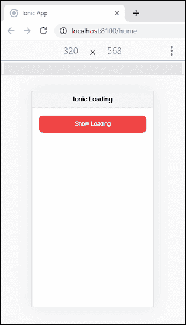

# Ionic负载

> 原文：<https://www.javatpoint.com/ionic-loading>

加载会创建一个覆盖图，可用于**阻止**其他用户交互。加载指示器出现在内容区域的顶部。可以通过**解除**的 app，恢复用户与 app 的交互。当某个进程正在进行时，我们可以显示一个加载器可视指示，例如从服务器获取数据或文件复制、粘贴事件等。加载器在应用中非常有用。从用户的角度来看，它使应用程序更加方便。

Ionic加载器还允许我们使用**消息参数**来显示一条消息，指示过程正在进行。它还包括一个可选的背景，可以通过在创建时设置属性**显示背景:假**来禁用。

Ionic加载有两种方法:创建和消除，它们以回调的形式返回承诺。让我们逐一了解这些方法。

## 创造

视觉加载指示器通过使用**加载控制器**创建。我们可以在 loading controller create()方法中定义各种加载选项。自定义**微调器名称**应在Ionic加载的微调器选项中传递。

## 解散

此方法用于**隐藏**装载机。通过输入加载选项的持续时间，可以在特定时间后自动取消。如果创建方法中没有添加持续时间选项，那么您需要调用 dismiss 方法来隐藏加载程序。它还调用**操作系统**功能，用于在装载指示灯熄灭后执行操作。

我们可以在下面的例子中理解这些方法。

```

showAutoHideLoader() {
    this.loadingCtrl.create({
      message: 'This Loader Will Auto Hide in five Seconds',
      duration: 5000
    }).then((res) => {
      res.present();

    res.onDidDismiss().then((dis) => {
      console.log('Loading dismissed! after five Seconds');
    });
  });
}

```

在某些情况下，我们可能需要单独的**显示**和**隐藏**方法，就像在服务器 API 调用中一样。我们可以在下面的例子中看到这些方法。

```

showLoader() {
    this.loaderToShow = this.loadingCtrl.create({
      message: 'This Loader will Not AutoHide'
    }).then((res) => {
      res.present();

      res.onDidDismiss().then((dis) => {
        console.log('Loading dismissed!');
      });
    });
    this.hideLoader();
  }

  hideLoader() {
    setTimeout(() => {
      this.loadingCtrl.dismiss();
    }, 4000);
  }
}

```

Ionic装载机有以下选项。

*   **消息:**该选项包含要在带有微调器的加载器上显示的文本。
*   **持续时间:**该选项用于给出自动隐藏加载器的持续时间(毫秒)。
*   **微调器:**此选项用于更改默认的微调器样式。
*   **backdropbail:**如果是真的，用户可以通过点击任意位置来关闭加载器。

让我们从下面的例子中看看加载组件在Ionic应用程序中是如何工作的。

**Home.page.html**

负责用户界面的是 HTML 文件。在这个文件中，我们将创建一个显示加载控制器的事件。为此，我们需要在 **<【Ionic含量】>** 区域内创建一个**按钮**，以便用户点击该按钮，作为响应，我们将显示装载控制器。

当用户点击按钮时，它将调用一个函数。该功能包含一个向用户显示加载控制器五秒钟的代码，在**五秒钟**后，加载控制器将被解除。现在，转到**主页. ts** 文件创建该功能。

```

<ion-header>
    <ion-toolbar color="light">
      <ion-title>Ionic Loading</ion-title>
    </ion-toolbar>
  </ion-header>

<ion-content fullscreen class="ion-padding">
    <ion-button expand="block" color="danger" (click)="showLoading()">Show Loading</ion-button>
</ion-content>

```

**主页**

如果要使用加载组件，首先**导入**加载控制器。然后，您需要在类内创建一个**构造器**，因为需要在类内注入加载控制器。现在，创建一个**显示加载()**功能，向用户显示加载控制器。在函数内部，我们必须传递定义加载控制器外观的 JSON 对象。

接下来，我们需要创建**解除功能**来解除加载控制器，并将**超时功能**设置为解除加载控制器的持续时间。

```

import { Component } from '@angular/core';
import { LoadingController } from '@ionic/angular';

@Component({
  selector: 'app-home',
  templateUrl: 'home.page.html',
  styleUrls: ['home.page.scss'],
})
export class HomePage {
  loaderToShow: any;
  constructor(public loadingCtrl: LoadingController) {}
showLoading() {
  this.loadingCtrl.create({
    message: 'Loading...'
    }).then((loading) => {
     loading.present();

     setTimeout(() => {
       loading.dismiss();
     }, 5000 );
    });
  }
}

```

**输出:**

当您执行上面的Ionic应用程序时，它将显示以下屏幕。



现在，当你点击显示加载按钮，它将开始显示加载指示。五秒钟后，它就会消失。


我们还可以使用 await 和 async 以另一种方式编写上述函数。下面的代码很容易解释这一点。

```

async showLoading() {
    const loading = await this.loadingCtrl.create({
    message: 'Loading...'
    });

    loading.present();

    setTimeout(() => {
      loading.dismiss();
    }, 5000 );
 }

```

我们还可以添加其他 JSON 属性，如下所示。

```

async showLoading() {
    const loading = await this.loadingCtrl.create({
    message: 'Loading...',
    duration: 5000,
    showBackdrop: false,
    spinner: 'lines'
    });
    loading.present();
}

```

* * *