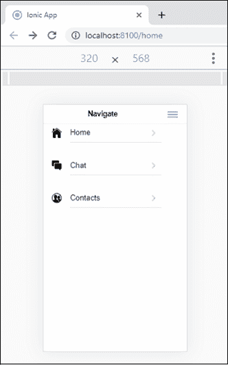

# 离子菜单

> 原文：<https://www.javatpoint.com/ionic-menus>

菜单组件是最常用的离子组件。这是一个**导航抽屉**，从当前视图的一侧向左或向右滑动。默认情况下，它会在当前视图的左侧滑动，但您也可以向右滑动。菜单可以根据模式进行不同的显示。但是，它可以更改为任何可用的菜单类型。您可以将任意数量的菜单附加到内容元素。

爱奥尼亚使用标准的 **<离子菜单>** 组件，使您能够轻松创建导航侧菜单。菜单组件可以通过**模板**控制，也可以通过**菜单控制器**编程控制。当菜单关闭时，菜单内容将被隐藏。

菜单组件包含以下元素

**菜单按钮:**是一个自动创建图标和功能的组件，用于在页面上打开菜单。

**菜单控制器:**用于控制菜单。它提供了显示菜单、启用菜单、切换菜单等方法。它会引用旁边的菜单，或者 ID。如果两边和 ID 都没有传递给它，它会抓取找到的第一个菜单。

**菜单切换:**用于切换菜单打开或关闭。仅当所选菜单处于活动状态时才可见。菜单在打开或关闭时处于活动状态。如果菜单被禁用或显示为分割窗格，它将被标记为非活动的，并且<离子菜单切换>元素会隐藏起来。

**分割窗格:**当您想要创建多视图布局时，它非常有用。它允许用户界面元素显示为宽度增加的视图端口。如果设备的屏幕宽度很小，拆分窗格将折叠，菜单将被隐藏。这是一个应用程序的理想选择，该应用程序将在浏览器中提供，并通过应用商店部署到手机和平板电脑上。

## 创建菜单

让我们看看如何在爱奥尼亚中创建侧菜单。

**第一步:**首先，创建空白的 ion 项目。默认情况下，本项目只包含**一页**，即**首页**。现在，我们将创建另外两个页面，这使得使用侧面菜单导航到其他页面变得很容易。以下命令在您的离子应用程序中创建页面。

```

ionic generate page Contacts
ionic generate page Chat

```

**第二步:**接下来，转到根组件，也就是 **app.component.ts** 。然后，创建一个函数**侧菜单()**，它包含一个对象数组。对象数组包括项目中的不同页面。它还包含每个页面的图标和网址。现在，包含以下代码片段。

```

import { Component } from '@angular/core';

import { Platform } from '@ionic/angular';
import { SplashScreen } from '@ionic-native/splash-screen/ngx';
import { StatusBar } from '@ionic-native/status-bar/ngx';

@Component({
  selector: 'app-root',
  templateUrl: 'app.component.html',
  styleUrls: ['app.component.scss']
})
export class AppComponent {
  navigate: any;
  constructor(
    private platform: Platform,
    private splashScreen: SplashScreen,
    private statusBar: StatusBar
  ) {
    this.sideMenu();
    this.initializeApp();
  }

  initializeApp() {
    this.platform.ready().then(() => {
      this.statusBar.styleDefault();
      this.splashScreen.hide();
    });
  }
  sideMenu() {
    this.navigate =
    [
      {
        title : 'Home',
        url   : '/home',
        icon  : 'home'
      },
      {
        title : 'Chat',
        url   : '/chat',
        icon  : 'chatboxes'
      },
      {
        title : 'Contacts',
        url   : '/contacts',
        icon  : 'contacts'
      },
    ];
  }
}

```

**第三步:**接下来，我们需要在**app.component.html**文件中添加 **<离子菜单>** 组件来创建侧菜单。在这个 HTML 文件中添加以下代码片段。

```

<ion-app>
  <ion-menu side="start" menuId="first" contentId="content">
    <ion-header>
      <ion-toolbar>
        <ion-title>Navigate</ion-title>
      </ion-toolbar>
    </ion-header>
    <ion-content>
      <ion-list *ngFor="let pages of navigate">
        <ion-menu-toggle auto-hide="true">
          <ion-item [routerLink]="pages.url" routerDirection="forward">
            <ion-icon [name]="pages.icon" slot="start"></ion-icon>
              {{pages.title}} 
          </ion-item>
        </ion-menu-toggle>
      </ion-list>
    </ion-content>
  </ion-menu>
  <ion-router-outlet Id="content"></ion-router-outlet>
</ion-app>

```

在上面的代码片段中，带有 side= "start" 的 **<离子菜单>将创建一个从左到右开始的侧菜单。它还包含内容标识属性，这是菜单的标识。**

第 **<行-项目【routerLink】=“pages . URL”routerDirection =“forward”>**其中 routerLink 允许导航到指定的 **url** 和**外部方向**确定页面更改时发生的动画。

**<离子-菜单-切换>** 组件用于打开和关闭侧菜单。所以当你点击菜单时，它会自动关闭侧面菜单。

**第四步:**在根组件中创建侧菜单后，我们可以在每个页面中打开或关闭它。为此，我们需要在每个页面的 html 中使用 **<【离子-菜单-按钮】>** 组件，该组件能够创建图标和功能来打开每个页面上的菜单

```

<ion-header>
  <ion-toolbar>
    <ion-buttons slot="start" color="primary">
      <ion-menu-button></ion-menu-button>
    </ion-buttons>
    <ion-title>
      Start Menu
    </ion-title>
  </ion-toolbar>
</ion-header>

```

**第五步:**现在，在你的终端执行 ion 项目。它将给出以下输出。


如果点击屏幕左上角的**三条蓝线**菜单按钮，会给出如下输出。



下表显示了在“离子”菜单组件中使用的重要方法。

| 塞内加尔 | 方法 | 签名 | 描述 |
| **1。** | 关闭() | 关闭(动画？:布尔值)= >承诺<boolean></boolean> | 它关闭菜单。如果菜单已经关闭，或者无法关闭，则返回 false。 |
| **2。** | isActive() | isaactive()= >承诺<boolean></boolean> | 如果菜单处于活动状态，则返回 true。 |
| **3。** | 等轴测() | isOpen() = >承诺<boolean></boolean> | 如果菜单是打开的，则返回 true。 |
| **4。** | 打开() | 打开(动画？:布尔值)= >承诺<boolean></boolean> | 它会打开菜单。如果菜单已经打开，或者无法打开，则返回 false。 |
| **5。** | setOpen() | setOpen(shouldOpen:布尔值，动画？:布尔值)= >承诺<boolean></boolean> | 它用于打开或关闭按钮。如果操作没有完成，它将返回 false。 |
| **6。** | 切换(() | 切换(动画？:布尔值)= >承诺<boolean></boolean> | 它用于切换菜单。如果操作没有成功完成，它将返回 false。 |

* * *