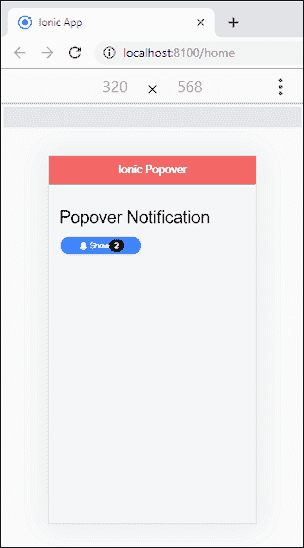
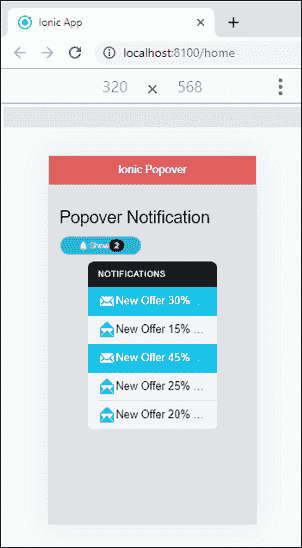

# Ionic波波夫

> 原文：<https://www.javatpoint.com/ionic-popover>

弹出窗口是出现在当前页面顶部以显示附加信息的**小覆盖图**。您可以将其用于任何事情，但它通常用于不适合导航栏的附加操作。它允许我们非常容易地向用户呈现或收集信息。它常用于以下情况。

*   它显示关于当前视图的附加信息。
*   您可以选择常用的工具和配置。
*   它给出了要在当前视图中执行的操作列表。

## 波波夫控制器

它负责在Ionic应用程序中创建 **popover** 。它使用 **create()** 方法创建 popover。您可以通过在创建方法中设置**弹出选项**来自定义控制器。

### Present()方法

当前()方法用于**在弹出实例上呈现**弹出通知。当前()方法中需要通过**点击事件**来定位 popover。如果你没有通过比赛，波波夫将被安置在视野的**中心**。

让我们一步一步地看看如何将数据从页面传递到 popover 组件。

**第一步:**创建**新项目**。你可以从[这里](ionic-installation)学习如何在Ionic 4 中创建一个项目。

**步骤 2:** 创建一个 **popover 自定义组件**。不需要创建页面，因为创建组件的目的只是列出新消息的通知。为此，请运行以下命令。

```

$ ionic g component notifications

```

**步骤 3:** 创建通知组件后，打开以下文件，插入给定的代码。您可以根据需要更改代码。

**notifications . component . SCS**

```

ion-list {
    &.list-ios {
        margin-bottom: 0;
    }
}

```

**notifications.component.html**

```

<ion-list class="ion-no-margin ion-no-padding">
    <ion-list-header color="dark" class="text-10">
      <ion-label class="fw700">Notifications</ion-label>
    </ion-list-header>

    <ion-item color="secondary" class="text-10">
      <ion-icon name="mail" color="light"></ion-icon>
      <ion-label>New Offer 30% OFF</ion-label>
    </ion-item>

    <ion-item color="light" class="text-10">
      <ion-icon name="mail-open" color="primary"></ion-icon>
      <ion-label>New Offer 15% OFF by month!</ion-label>
    </ion-item>

    <ion-item color="secondary" class="text-10">
      <ion-icon name="mail" color="light"></ion-icon>
      <ion-label>New Offer 45% OFF</ion-label>
    </ion-item>

    <ion-item color="light" class="text-10">
      <ion-icon name="mail-open" color="primary"></ion-icon>
      <ion-label>New Offer 25% OFF on Credit Card!</ion-label>
    </ion-item>

    <ion-item color="light" class="text-10">
      <ion-icon name="mail-open" color="primary"></ion-icon>
      <ion-label>New Offer 20% OFF by month!</ion-label>
    </ion-item>
</ion-list>

```

**步骤 4:** 接下来，在创建**通知组件**之后，配置 **app.module.ts** 文件。这里，您需要**导入**通知组件，然后将其添加到 **@NgModule** 中。

```

import { NgModule } from '@angular/core';
import { BrowserModule } from '@angular/platform-browser';
import { RouteReuseStrategy } from '@angular/router';

import { IonicModule, IonicRouteStrategy } from '@ionic/angular';
import { SplashScreen } from '@ionic-native/splash-screen/ngx';
import { StatusBar } from '@ionic-native/status-bar/ngx';

import { AppComponent } from './app.component';
import { AppRoutingModule } from './app-routing.module';
import { NotificationsComponent } from './notifications/notifications.component';

@NgModule({
  declarations: [AppComponent, NotificationsComponent],
  entryComponents: [NotificationsComponent],
  imports: [BrowserModule, IonicModule.forRoot(), AppRoutingModule],
  providers: [
    StatusBar,
    SplashScreen,
    { provide: RouteReuseStrategy, useClass: IonicRouteStrategy }
  ],
  bootstrap: [AppComponent]
})
export class AppModule {}

```

**第五步:**打开**首页. ts** 文件，添加以下代码。在这个文件中，我们可以将数据从主页传递到 popover 组件。

```

import { Component } from '@angular/core';
import { PopoverController } from '@ionic/angular';
import { NotificationsComponent } from '../notifications/notifications.component';

@Component({
  selector: 'app-home',
  templateUrl: 'home.page.html',
  styleUrls: ['home.page.scss'],
})
export class HomePage {
  constructor(public popoverCtrl: PopoverController) { }
  async notifications(ev: any) {
    const popover = await this.popoverCtrl.create({
        component: NotificationsComponent,
        event: ev,
        animated: true,
        showBackdrop: true
    });
    return await popover.present();
  }
}

```

**第六步:**打开**home.page.html**文件，添加如下代码。

```

<ion-header translucent>
  <ion-toolbar color="danger">
    <ion-title>Ionic Popover</ion-title>
  </ion-toolbar>
</ion-header>

<ion-content class="ion-padding" color="light">
  <h1>Popover Notification</h1>
  <ion-button size="small" shape="round" color="primary" (click)="notifications()">
    <ion-icon name="notifications"></ion-icon>Show
    <ion-badge color="dark" slot="end">2</ion-badge>
  </ion-button>
</ion-content>

```

**第 7 步:**现在，运行应用程序，会出现如下画面。



在上面的屏幕中，点击**显示**通知按钮，下面的屏幕出现在你的浏览器中。在这里，您可以看到 popover 通知。



* * *