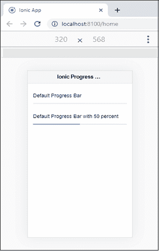
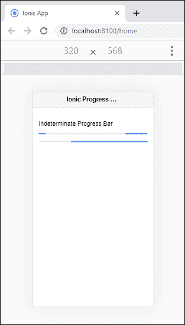
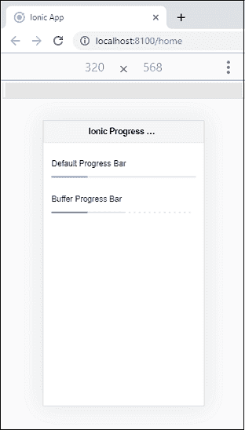
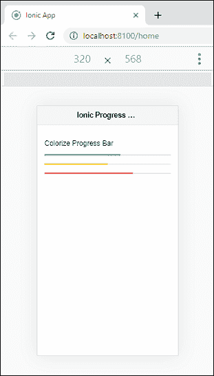
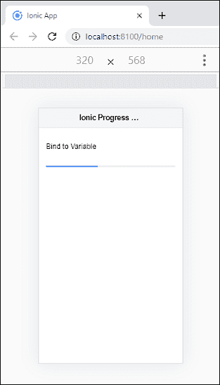

# 离子进度条

> 原文：<https://www.javatpoint.com/ionic-progress-bar>

离子进度条组件是一个**水平**进度条，用于可视化操作和活动的进度。我们可以使用标准的 **<离子进度条>** 组件来访问离子进度条。

离子键进度条有两种类型，如下所示。

1.  确定的
2.  模糊的

## 确定进度条

这是一种进度条，当操作的百分比已知时可以使用。确定进度条是一种默认进度条，value 属性表示进度。

**例**

以下示例解释了确定进度条，其中 value 属性表示进度。

```

<ion-header>
    <ion-toolbar color="light">
      <ion-title>Ionic Progress Bar</ion-title>
    </ion-toolbar>
  </ion-header>

<ion-content fullscreen class="ion-padding">
  <p>Default Progress Bar</p>
  <ion-progress-bar></ion-progress-bar>

  <br>

  <p>Default Progress Bar with 50 percent</p>
  <ion-progress-bar value="0.5"></ion-progress-bar>
</ion-content>

```

**输出:**

当上面的 Ionic app 执行时，会给出如下输出。



## 不确定进度条

这是一种进度条，它告诉操作正在进行中。这意味着不需要说明需要多长时间。如果您添加属性 **reversed="true"** ，您将收到一个用于指示预加载的查询。下面的例子解释得更清楚。

**例**

```

<ion-header>
    <ion-toolbar color="light">
      <ion-title>Ionic Progress Bar</ion-title>
    </ion-toolbar>
  </ion-header>

<ion-content fullscreen class="ion-padding">
  <p>Indeterminate Progress Bar</p>
  <ion-progress-bar type="indeterminate"></ion-progress-bar>
  <br>
  <ion-progress-bar type="indeterminate" reversed="true"></ion-progress-bar>
</ion-content>

```

**输出:**

当您运行上述代码片段时，它将给出以下输出。在这里，您将看到进度条都是以相反的方向动画显示的。



**Buffer:** 显示**圆圈**作为动画表示某种活动。如果 buffer 属性值小于 1，则可以显示额外的缓冲进度。我们可以从下面的例子中理解缓冲区属性的使用。

**例**

```

<ion-header>
    <ion-toolbar color="light">
      <ion-title>Ionic Progress Bar</ion-title>
    </ion-toolbar>
  </ion-header>

<ion-content fullscreen class="ion-padding">
  <p>Default Progress Bar</p>
  <ion-progress-bar value="0.25"></ion-progress-bar>
  <br>
  <p>Buffer Progress Bar</p>
  <ion-progress-bar value="0.25" buffer="0.5"></ion-progress-bar>
</ion-content>

```

**输出:**



## 彩色进度条

可以使用**颜色**属性为<ion-progress-bar>组件着色。可以从下面的例子来解释。</ion-progress-bar>

**例**

```

<ion-header>
    <ion-toolbar color="light">
      <ion-title>Ionic Progress Bar</ion-title>
    </ion-toolbar>
  </ion-header>

<ion-content fullscreen class="ion-padding">
  <p>Colorize Progress Bar</p>
  <ion-progress-bar value="0.60" color="success"></ion-progress-bar>
  <br>
  <ion-progress-bar value="0.50" color="warning"></ion-progress-bar>
  <br>
  <ion-progress-bar value="0.70" color="danger"></ion-progress-bar>
</ion-content>

```

**输出:**



## 用进度条绑定变量

我们还可以将进度条与值绑定。为此，我们需要添加**方括号**中的值，这将变量绑定到该值属性。下面的例子解释得更清楚。

**例**

**home.page.html**文件包含调用变量绑定到该属性的值属性。相应的逻辑写在**首页. ts** 文件中。

**Home.page.html**

```

<ion-header>
    <ion-toolbar color="light">
      <ion-title>Ionic Progress Bar</ion-title>
    </ion-toolbar>
  </ion-header>

<ion-content fullscreen class="ion-padding">
  <p>Bind to Variable</p>
  <br>
  <ion-progress-bar [value]="progress"></ion-progress-bar>
</ion-content>

```

**主页**

```

import { Component } from '@angular/core';

@Component({
  selector: 'app-home',
  templateUrl: 'home.page.html',
  styleUrls: ['home.page.scss'],
})
export class HomePage {
  progress = 0;
  constructor() {
    setInterval( () => {
      this.progress += .1;
      }, 1000 );
  }
}

```

**输出:**

当你执行上面的 Ionic app 时，它会给出如下输出。在这里，您会看到，随着值的超过，进度条也会超过。



* * *