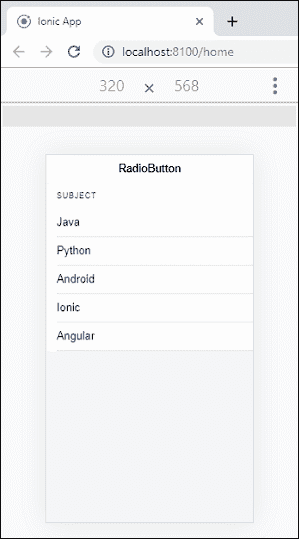
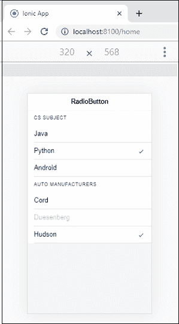

# Ionic 单选按钮

> 原文：<https://www.javatpoint.com/ionic-radio-button>

单选按钮是一种**输入**组件，它保存**布尔值**。它类似于 HTML 无线电输入。Ionic 单选按钮在每个平台上都有不同的风格，就像其他 Ionic 组件一样。无线电组件通常用作组内的一组相关选项，但也可以单独使用。单选按钮选项可以通过选择来**选中**，或者通过设置选中的属性以编程方式选中。它还使用**禁用的**属性来禁止用户更改该值。

一个 **<Ionic 收音机组>** 组件可用于对一组收音机进行分组。它允许您从一组中最多选择一个单选按钮。换句话说，当无线电组包含许多无线电选项时，那么在任何时候将只检查一个无线电选项。如果我们选择组内的任何一个无线电选项，它**取消选中**先前选择的无线电选项。如果收音机选项不在另一个收音机的组中，则可以同时检查两个收音机。

### 例子

在下面的例子中，我们可以看到单选按钮在 Ionic 应用程序中是如何工作的。

```

<ion-header>
  <ion-toolbar>
    <ion-title>
      RadioButton
    </ion-title>
  </ion-toolbar>
</ion-header>

<ion-content class="padding" color="light">
 <!-- Radio Button in a List -->
 <ion-list>
    <ion-radio-group>
      <ion-list-header>
        Subject
      </ion-list-header>

      <ion-item>
        <ion-label>Java</ion-label>
        <ion-radio value="java"></ion-radio>
      </ion-item>

      <ion-item>
        <ion-label>Python</ion-label>
        <ion-radio value="python"></ion-radio>
      </ion-item>
    </ion-radio-group>
    <ion-radio-group>
      <ion-item>
        <ion-label>Android</ion-label>
        <ion-radio value="android"></ion-radio>
      </ion-item>

      <ion-item>
        <ion-label>Ionic</ion-label>
        <ion-radio value="ionic"></ion-radio>
      </ion-item>

      <ion-item>
        <ion-label>Angular</ion-label>
        <ion-radio value="angular"></ion-radio>
      </ion-item>
    </ion-radio-group>
  </ion-list>
</ion-content>

```

**输出**



## 多单选按钮组

有时您希望创建一组以上的单选按钮。Ionic 单选按钮提供<ion-radio-group>元素来创建多组单选按钮。</ion-radio-group>

### 例子

以下示例说明了如何创建多组单选按钮。在这里，我们还将看到单选按钮的**选中的**和**禁用属性**的使用。

```

<ion-header>
  <ion-toolbar>
    <ion-title>
      RadioButton
    </ion-title>
  </ion-toolbar>
</ion-header>

<ion-content class="padding" color="light">
 <!-- Radio Button in a List -->
 <ion-list>
    <ion-radio-group>
      <ion-list-header>
        CS Subject
      </ion-list-header>
      <ion-item>
        <ion-label>Java</ion-label>
        <ion-radio value="java"></ion-radio>
      </ion-item>
      <ion-item>
        <ion-label>Python</ion-label>
        <ion-radio checked="true" value="python"></ion-radio>
      </ion-item>
    </ion-radio-group>
    <ion-radio-group>
      <ion-item>
        <ion-label>Android</ion-label>
        <ion-radio value="android"></ion-radio>
      </ion-item>
    </ion-radio-group>

    <ion-radio-group>
      <ion-list-header>
        Auto Manufacturers
      </ion-list-header>
      <ion-item>
        <ion-label>Cord</ion-label>
        <ion-radio value="cord"></ion-radio>
      </ion-item>
      <ion-item>
        <ion-label>Duesenberg</ion-label>
        <ion-radio disabled="true" value="duesenberg"></ion-radio>
      </ion-item>
      <ion-item>
        <ion-label>Hudson</ion-label>
        <ion-radio checked="true" value="hudson"></ion-radio>
      </ion-item>
    </ion-radio-group>
  </ion-list>
</ion-content>

```

**输出**

当您执行应用程序时，会出现以下屏幕。这里，组 1 是 **CS 主题**，其中第二项使用**勾选属性**，组 2 是**汽车制造**，其中第二项使用**禁用属性**。



* * *