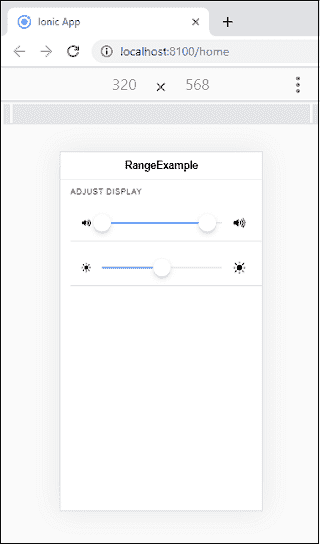

# Ionic范围

> 原文：<https://www.javatpoint.com/ionic-range>

Ionic范围滑块用于通过移动**滑块旋钮**来选择和显示值的级别。默认情况下，只有一个旋钮控制范围的值，但它也可以接受双旋钮。

### 范围标签

通过将属性 **slot=“开始”**和 slot= **“结束”**添加到元素中，可以将标签放置在范围的两侧。

### 最大值和最小值

最大值和最小值可以分别使用 max 和 min 属性在该范围内传递。默认情况下，该范围设置了**最小值=0** 和**最大值=0** 值。

### 步骤和快照

steps 属性用于指定范围值的值粒度。当值不是以 1 为增量时，它会很有用。如果将**步属性**设置在范围内，它会显示每一步范围内的**刻度线**。**捕捉属性**用于根据步长属性值自动将旋钮移动到最近的刻度线。

### 双旋钮

如果量程组件上的**双旋钮**属性设置为**真**，将启用量程上的两个旋钮。这意味着该值将是一个包含两个属性的对象:**下**和**上**。

我们可以从下面的例子中理解Ionic范围。

### 例子

```

<ion-header>
  <ion-toolbar>
    <ion-title>
      RangeExample
    </ion-title>
  </ion-toolbar>
</ion-header>
<ion-content>
  <ion-list>
    <ion-list-header>
      Adjust Display
    </ion-list-header>

    <ion-item>
      <ion-range id="dual-range" dual-knobs>
      </ion-range>
    </ion-item>

    <ion-item>
      <ion-range min="-200" max="200" pin="true">
      </ion-range>
    </ion-item>
  </ion-list>
</ion-content>

```

**输出:**


## 向范围添加图标

图标用于清晰显示数据。我们可以将图标放在 range 元素两侧的 range 输入前后。以下示例显示了范围内图标的使用。

### 例子

```

<ion-header>
  <ion-toolbar>
    <ion-title>
      RangeExample
    </ion-title>
  </ion-toolbar>
</ion-header>
<ion-content>
  <ion-list>
    <ion-list-header>
      Adjust Display
    </ion-list-header>

    <ion-item>
      <ion-range id="dual-range" dual-knobs>
        <ion-icon slot="start" size="small" name="volume-high"></ion-icon>
        <ion-icon slot="end" name="volume-high"></ion-icon>
      </ion-range>
    </ion-item>

    <ion-item>
      <ion-range min="-200" max="200" pin="true">
        <ion-icon slot="start" size="small" name="sunny"></ion-icon>
        <ion-icon slot="end" name="sunny"></ion-icon>
      </ion-range>
    </ion-item>
  </ion-list>
</ion-content>

```

**输出:**



## 造型系列

我们还可以使用 color 属性来设置范围的样式。以下示例显示了带有Ionic范围成分的颜色的使用。

### 例子

```

<ion-header>
  <ion-toolbar color="success">
    <ion-title>
      RangeExample
    </ion-title>
  </ion-toolbar>
</ion-header>
<ion-content class="padding" color="light" fullscreen>
    <ion-list>
      <ion-list-header>
        Adjust Display
      </ion-list-header>

      <ion-item>
        <ion-range value="20">
          <ion-icon slot="start" size="small" name="contrast"></ion-icon>
          <ion-icon slot="end" name="contrast"></ion-icon>
        </ion-range>
      </ion-item>

      <ion-item>
        <ion-range min="-200" max="200" pin color="secondary">
        </ion-range>
      </ion-item>

      <ion-item>
        <ion-range id="dual-range" dual-knobs pin color="dark"></ion-range>
      </ion-item>

      <ion-item>
        <ion-range min="1000" max="2000" step="100" value="1400" snaps color="danger">
          <ion-icon slot="start" size="small" color="danger" name="thermometer"></ion-icon>
          <ion-icon slot="end" color="danger" name="thermometer"></ion-icon>
        </ion-range>
      </ion-item>
    </ion-list>
  </ion-content>

```

**输出:**


* * *