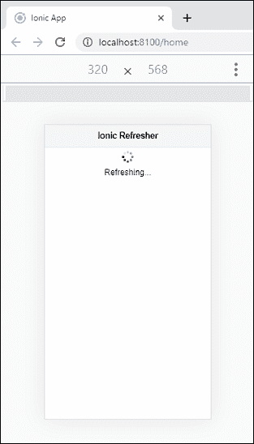
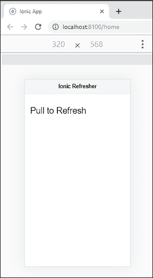
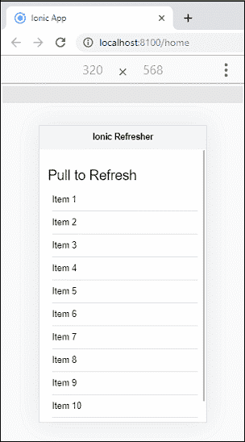

# Ionic复习

> 原文：<https://www.javatpoint.com/ionic-refresher>

刷新意味着更新当前显示的页面，以便用户可以看到最新的内容。在网络术语中也称为**重新加载**。

在很多安卓应用中，我们看到了一个用户友好的功能**拉刷新**。该功能允许用户**将**页面下拉或拖动到某个极限，然后当前页面视图会自动得到刷新。拉动刷新模式消除了点击或点击某处的任何需要。

通过使用 **<Ionic-复习>** 组件添加下拉功能，Ionic提供了相同的功能。<Ionic刷新>组件在内容组件上提供拉取刷新功能。Ionic允许用户使用触摸在数据列表中使用这种模式来检索更多数据。更新后的数据应在复习器的输出事件中进行修改。一旦页面刷新结束，调用刷新器上的 **complete()** 功能。

它是<ion-refresher>组件的一个子组件，包含在拉至刷新期间显示的文本、图标和刷新。一个Ionic键为不同的平台提供不同的拖动图标和刷新微调图标。该组件包含以下属性:</ion-refresher>

*   拉动图标
*   拉动文本
*   刷新 pinner
*   刷新文本

以下示例解释了刷新在Ionic应用程序中的工作方式。

### 例子

**Home.page.html**

在这个 HTML 文件中，我们需要添加<ion-refresher>组件，我们称之为**刷新事件**。在该组件中，添加包含自定义更新属性的<Ionic更新内容>子组件。</ion-refresher>

```

<ion-header>
  <ion-toolbar color="light">
    <ion-title>Ionic Refresher</ion-title>
  </ion-toolbar>
</ion-header>

<ion-content class="ion-padding">
  <ion-refresher slot="fixed" disabled="false" (ionRefresh)="doRefresh($event)">
    <ion-refresher-content
    pullingIcon="arrow-dropdown"
    pullingText="Pull to refresh"
    refreshingSpinner="circles"
    refreshingText="Refreshing..."></ion-refresher-content>
  </ion-refresher>
</ion-content>

```

**主页**

该页面负责处理事件，该事件在 HTML 文件的<ion-refresher>组件中使用。</ion-refresher>

```

import { Component } from '@angular/core';

@Component({
  selector: 'app-home',
  templateUrl: 'home.page.html',
  styleUrls: ['home.page.scss'],
})
export class HomePage {
  constructor() { }
  doRefresh(event) {
    console.log('Pull Event Triggered!');
  }
}

```

**输出:**

当你执行应用程序时，你会得到输出。然后，在内容区域下拉或拖动指针，出现以下屏幕。



## 自定义刷新属性

此示例解释了自定义属性的使用，如**拉因子、拉最小值和拉最大值**。如果下拉因子小于 1，下拉动画会变慢。如果大于 1，下拉速度为**上升**。它的默认值是 1，等于光标速度。最大拉力和最小拉力设置拉力的最大和最小距离，直到刷新器进入刷新状态。

### 例子

**Home.page.html**

```

<ion-header>
  <ion-toolbar color="light">
    <ion-title>Ionic Refresher</ion-title>
  </ion-toolbar>
</ion-header>

<ion-content class="ion-padding">
  <h1>Pull to Refresh</h1>
  <ion-refresher slot="fixed" disabled="false" (ionRefresh)="doRefresh($event)" pullFactor="0.5" pullMin="100" pullMax="200">
    <ion-refresher-content
    pullingIcon="arrow-dropdown"
    pullingText="Pull to refresh"
    refreshingSpinner="circles"
    refreshingText="Refreshing..."></ion-refresher-content>
  </ion-refresher>
  <ion-list>  
    <ion-item *ngFor="let item of dummyList; let i=index">  
      Item {{ i+1 }}
    </ion-item>  
  </ion-list>
</ion-content>

```

**主页**

此页面处理刷新组件中发生的事件。在这里，我们将设置拉至刷新的时间，该时间完成后，微调器加载图标将消失。

```

import { Component } from '@angular/core';

@Component({
  selector: 'app-home',
  templateUrl: 'home.page.html',
  styleUrls: ['home.page.scss'],
})
export class HomePage {
  dummyList: any [] = [];
  constructor() {}
  doRefresh(event) {
    console.log('Pull Event Triggered!');
    setTimeout(() => {
      this.dummyList = Array(10);
      event.target.complete();
    }, 2000);
  }
}

```

**输出:**

当您执行该应用程序时，它将给出以下输出。



现在，在内容区域下拉或拖动指针，出现以下屏幕。在这里，您可以找到页面视图的最新更新。



* * *