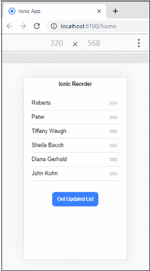
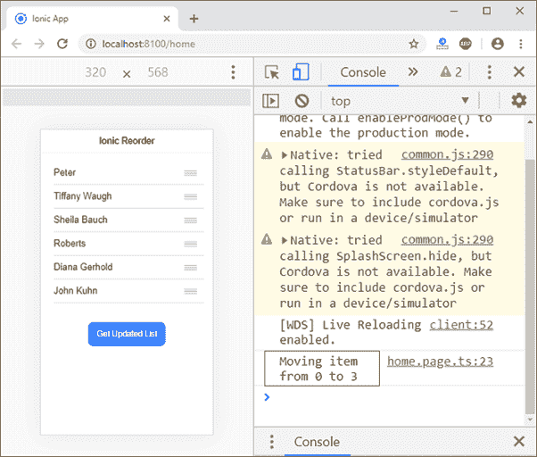

# Ionic重排

> 原文：<https://www.javatpoint.com/ionic-reorder>

Ionic键为重新排序功能提供了一个<ion-reorder>组件。它允许您通过**拖动**和**放下**列表项，从而改变列表元素的顺序。 **<Ionic重排序>** 组件需要与 **<Ionic重排序组>** 配合使用，提供可视化的拖拽界面。<Ionic重新排序组>作为<Ionic重新排序>中列表元素的包装器。</ion-reorder>

Once the user drags and drops a list of items to a new position, the **ionItemReorder** event is dispatched. The corresponding handler should be implemented, which calls the **complete()** method. The ionItemReorder event contains several properties that include all relevant information about the reorder information. This information includes **from** an index **to** new indexes. This feature is essential in many places like Song Ques, Todo list items, etc. Let us understand how the reorder component work with the following example.

### 例子

在这个例子中，我们将讨论如何实现一个重新排序组件来允许项目被拖放到一个新的位置。这里，我们还将通过调用 complete()方法来更新列表项。

**Home.page.html**

HTML 页面包含<ion-reorder-group>组件中的列表项，这些列表项使用角度 ***ngFor 指令**进行项目数组的迭代。在<Ionic重排序组>中，我们将**禁用**属性**设置为假**，这将启用拖放功能。Ionic重新排序是一个能够完成项目重新排序的事件。</ion-reorder-group>

```

<ion-header translucent>
  <ion-toolbar>
    <ion-title>Ionic Reorder</ion-title>
  </ion-toolbar>
</ion-header>

<ion-content class="ion-padding">
  <ion-list>
    <ion-reorder-group (ionItemReorder)="onRenderItems($event)" disabled="false">
      <ion-item *ngFor="let item of listItems">
        <ion-label>
          {{item}}
        </ion-label>
        <ion-reorder></ion-reorder>
      </ion-item>
    </ion-reorder-group>
  </ion-list>
  <ion-list class="ion-text-center">
    <ion-button (click)="getList()">Get Updated List</ion-button>
  </ion-list>
</ion-content>

```

**主页**

该页面包含了 **onRenderItems($event)** 的实现。它包含从和**到**的被拖动项目的**索引。然后，它使用**拼接()**方法，从数组中移除拖动的项目，并将其分配给变量**拖动项目**。之后，它调用 complete()方法来完成重新排序操作。**

```

import { Component } from '@angular/core';

@Component({
  selector: 'app-home',
  templateUrl: 'home.page.html',
  styleUrls: ['home.page.scss'],
})
export class HomePage {
  listItems: any;

  constructor() {
    this.listItems = [
      'Roberts',
      'Peter',
      'Tiffany Waugh',
      'Sheila Bauch',
      'Diana Gerhold',
      'John Kuhn'
    ];
  }

  onRenderItems(event) {
    console.log(`Moving item from ${event.detail.from} to ${event.detail.to}`);
    const draggedItem = this.listItems.splice(event.detail.from, 1)[0];
    this.listItems.splice(event.detail.to, 0, draggedItem);
    // this.listItems = reorderArray(this.listItems, event.detail.from, event.detail.to);
    event.detail.complete();
  }

  getList() {
    console.table(this.listItems);
  }
}

```

**输出:**

当您执行该应用程序时，它将给出以下输出。



接下来，将列表中的任何项目拖放到新位置。例如，我们拖动**罗伯特项目**并将其放到**第四个位置**，如下图所示。您还会在控制台中收到一条消息**将项目从 0 移动到 3** 。



* * *