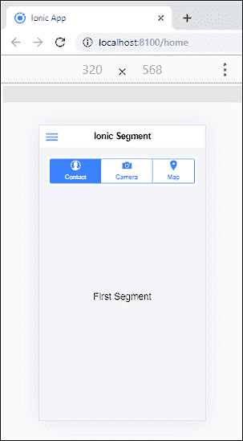
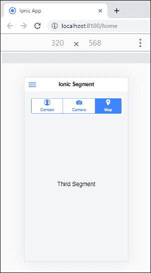

# 离子片段

> 原文：<https://www.javatpoint.com/ionic-segment>

线段是显示在**水平行**中的相关按钮的集合。可以放在**工具栏**或者**主内容**里面。“离子”部分的功能与“离子”选项卡相同，您可以选择一个选项卡来取消选择所有其他选项卡。

当用户在内容的不同视图之间切换时，段组件非常有用。当点击控件在应用程序中的页面间导航时，应该使用标签栏而不是一段。线段可以充当**过滤器**，根据线段的值显示或隐藏元素。我们可以通过使用标准的 **<离子片段>** 元素来访问离子片段。

以下示例详细说明了如何在您的离子应用程序中使用段。

### 例子

**Home.page.html**

此页面用于显示用户视图的内容。这里，我们将使用<ion-content>元素内部的<ion-segment>。段内的选项，如 **ionChange** ，调用事件来更改段选项卡，**n model**是一个角度指令，将 HTML 控件的值绑定到应用程序数据。</ion-segment></ion-content>

```

<ion-header>
  <ion-toolbar>
    <ion-buttons slot="start">
      <ion-menu-button></ion-menu-button>
    </ion-buttons>
    <ion-title>Ionic Segment</ion-title>
  </ion-toolbar>
</ion-header>

<ion-content class="ion-padding" color="light">
  <ion-toolbar>
    <ion-segment (ionChange)="segmentChanged($event)" [(ngModel)]="segment" color="primary">
      <ion-segment-button value="0">
        <ion-label>Contact</ion-label>
        <ion-icon name="contact"></ion-icon>
      </ion-segment-button>
      <ion-segment-button value="1">
        <ion-label>Camera</ion-label>
        <ion-icon name="camera"></ion-icon>
      </ion-segment-button>
      <ion-segment-button value="2">
        <ion-label>Map</ion-label>
        <ion-icon name="pin"></ion-icon>
      </ion-segment-button>
    </ion-segment>
  </ion-toolbar>

  <ion-slides #slides (ionSlideDidChange)="slideChanged()" scrollbar="true">
    <ion-slide>First Segment</ion-slide>
    <ion-slide>Second Segment</ion-slide>
    <ion-slide>Third Segment</ion-slide>
  </ion-slides>
</ion-content>

```

**主页**

此页面包含更改段选项卡和幻灯片选项的代码。

```

import { Component, ViewChild} from '@angular/core';
import {IonSlides } from '@ionic/angular';

@Component({
  selector: 'app-home',
  templateUrl: 'home.page.html',
  styleUrls: ['home.page.scss'],
})
export class HomePage {
  @ViewChild('slides', { static: true }) slider: IonSlides;
  segment = 0;
  constructor() { }
  async segmentChanged(ev: any) {
    await this.slider.slideTo(this.segment);
  }
  async slideChanged() {
    this.segment = await this.slider.getActiveIndex();
  }
}

```

**主页. SCS**

```

:root {
  --ion-safe-area-top: 20px;
  --ion-safe-area-bottom: 22px;
}
ion-slide {
  height: calc(100vh - 140px);
}

```

**输出**

当您执行上面的 ion 应用程序时，它将给出以下输出。这里可以看到**三种类型的**段位**联系人、摄像头、**和**地图**。默认情况下，总是选择第一个线段。



现在，当您选择**地图段**时，屏幕上会出现以下输出。



* * *