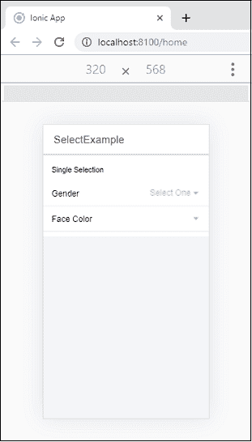
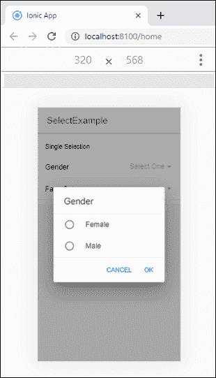
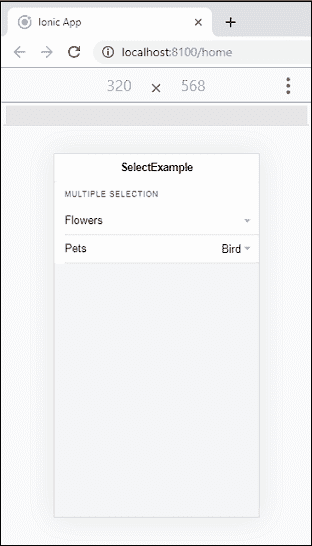
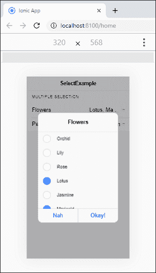
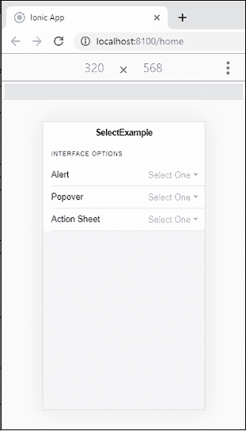
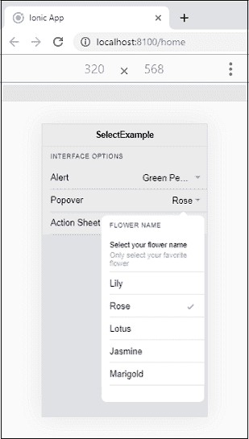

# 离子选择

> 原文：<https://www.javatpoint.com/ionic-select>

“离子选择”组件提供了一个带有选择选项的选择菜单，供用户在一组多个选项中进行选择。选择类似于本地<select>元素的表单控件。当您点击选择时，立即出现一个包含所有选项的对话框。对于不同的平台，选择菜单看起来会有所不同，因为它的样式由浏览器处理。我们可以通过使用标准的元素来访问离子选择。</select>

选择组件始终与子 **<离子选择选项>** 元素一起使用。如果<离子选择选项>没有值属性，那么它的文本将被用作值。

如果 **<离子选择>** 组件设置了值属性，所选选项将基于该**值**决定。另一方面，如果没有设置该值，选择属性将用于<离子选择选项>。

选择组件使用界面**自动控制器应用编程接口**打开警报中的选项覆盖。通过将**动作单**或**弹出**到接口属性，可以使用**动作单控制器应用编程接口**或**弹出控制器应用编程接口**进行更改。

选择组件可以有两种类型:

1.  单一选择
2.  多重选择

### 单一选择

默认情况下，选择仅允许您选择一个选项。在此选择中，警报界面显示单选按钮样式的选项列表。选择组件的值仅接收选定选项的值。

**选择按钮**

报警界面支持**取消**和**确定**两个按钮。可以使用**取消文本**和**确定文本**属性自定义按钮文本。

**例**

以下示例有助于理解单个选择组件的使用。

```

<ion-header>
  <ion-toolbar>
    <ion-title>
      SelectExample
    </ion-title>
  </ion-toolbar>
</ion-header>
<ion-content class="padding" color="light" fullscreen>
  <ion-list>
    <ion-list-header>Single Selection</ion-list-header>

    <ion-item>
      <ion-label>Gender</ion-label>
      <ion-select placeholder="Select One">
        <ion-select-option value="f">Female</ion-select-option>
        <ion-select-option value="m">Male</ion-select-option>
      </ion-select>
    </ion-item>

    <ion-item>
      <ion-label>Face Color</ion-label>
        <ion-select value="brown" okText="Okay" cancelText="Dismiss">
        <ion-select-option value="light">Light</ion-select-option>
        <ion-select-option value="fair">Fair</ion-select-option>
        <ion-select-option value="wheatish">Wheatish</ion-select-option>
        <ion-select-option value="dark">Dark</ion-select-option>
      </ion-select>
    </ion-item>
  </ion-list>
</ion-content>

```

**输出:**

当您执行上述代码片段时，它将给出以下输出。



如果点击选择，将立即出现一个包含所有选项的对话框。我们将获得以下输出。



### 多重选择

多重选择使用多重属性，允许您从一组选择选项中选择多个选项。在此选择中，警报界面显示了**复选框样式的**选项列表。这里，选择组件的值接收所有选定选项值的数组。

**例**

```

<ion-header>
  <ion-toolbar>
    <ion-title>
      SelectExample
    </ion-title>
  </ion-toolbar>
</ion-header>
<ion-content class="padding" color="light" fullscreen>
  <ion-list>
    <ion-list-header>Multiple Selection</ion-list-header>
    <ion-item>
      <ion-label>Flowers</ion-label>
      <ion-select multiple="true" cancelText="Nah" okText="Okay!">
        <ion-select-option value="orchid">Orchid</ion-select-option>
        <ion-select-option value="lily">Lily</ion-select-option>
        <ion-select-option value="rose">Rose</ion-select-option>
        <ion-select-option value="lotus">Lotus</ion-select-option>
        <ion-select-option value="jasmine">Jasmine</ion-select-option>
        <ion-select-option value="marigold ">Marigold</ion-select-option>
      </ion-select>
    </ion-item>

    <ion-item>
      <ion-label>Pets</ion-label>
      <ion-select multiple="true">
        <ion-select-option value="bird" selected>Bird</ion-select-option>
        <ion-select-option value="cat">Cat</ion-select-option>
        <ion-select-option value="dog">Dog</ion-select-option>
        <ion-select-option value="lion">Lion</ion-select-option>
      </ion-select>
    </ion-item>
  </ion-list>
</ion-content>

```

**输出:**



如果点击选择，将立即出现一个包含所有选项的对话框。现在，您可以根据需要选择多个选项。



## 接口选项

默认情况下，选择组件使用接口 AtertController API。但是，我们也可以通过将动作表或 popover 传递给接口属性来更改它，以便使用动作表控制器 API 或 popover 控制器 API。下面的例子解释得更清楚了。

### 例子

**Home.page.html**

```

<ion-header>
  <ion-toolbar>
    <ion-title>
      SelectExample
    </ion-title>
  </ion-toolbar>
</ion-header>
<ion-content class="padding" color="light" fullscreen>
  <ion-list>
    <ion-list-header>Interface Options</ion-list-header>      
    <ion-item>
      <ion-label>Alert</ion-label>
      <ion-select [interfaceOptions]="customAlertOptions" interface="alert" multiple="true" placeholder="Select One">
        <ion-select-option value="bacon">Bacon</ion-select-option>
        <ion-select-option value="olives">Black Olives</ion-select-option>
        <ion-select-option value="xcheese">Extra Cheese</ion-select-option>
        <ion-select-option value="peppers">Green Peppers</ion-select-option>
        <ion-select-option value="mushrooms">Mushrooms</ion-select-option>
      </ion-select>
    </ion-item>

    <ion-item>
      <ion-label>Popover</ion-label>
      <ion-select [interfaceOptions]="customPopoverOptions" interface="popover" placeholder="Select One">
        <ion-select-option value="lily">Lily</ion-select-option>
        <ion-select-option value="rose">Rose</ion-select-option>
        <ion-select-option value="lotus">Lotus</ion-select-option>
        <ion-select-option value="jasmine">Jasmine</ion-select-option>
        <ion-select-option value="marigold ">Marigold</ion-select-option>
      </ion-select>
    </ion-item>

    <ion-item>
      <ion-label>Action Sheet</ion-label>
      <ion-select [interfaceOptions]="customActionSheetOptions" interface="action-sheet" placeholder="Select One">
        <ion-select-option value="red">Red</ion-select-option>
        <ion-select-option value="yellow">Yellow</ion-select-option>
        <ion-select-option value="orange">Orange</ion-select-option>
        <ion-select-option value="green">Green</ion-select-option>
      </ion-select>
    </ion-item>  
  </ion-list>
</ion-content>

```

**主页**

```

import { Component } from '@angular/core';

@Component({
  selector: 'app-home',
  templateUrl: 'home.page.html',
  styleUrls: ['home.page.scss'],
})
export class HomePage {
  customAlertOptions: any = {
    header: 'Pizza Toppings',
    subHeader: 'Select your toppings',
    message: '$2.00 per topping',
    translucent: true
  };

  customPopoverOptions: any = {
    header: 'Flower Name',
    subHeader: 'Select your flower name',
    message: 'Only select your favorite flower'
  };

  customActionSheetOptions: any = {
    header: 'Colors',
    subHeader: 'Select your favorite color'
  };
}

```

**输出:**

当你执行上面的 Ionic app 时，它会给出如下输出。



现在，当您选择**弹出**选项时，出现以下屏幕。在这里，您还可以检查其他选项，如警报和行动表。



* * *