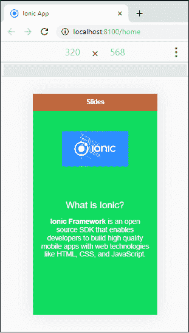

# 离子载玻片

> 原文：<https://www.javatpoint.com/ionic-slides>

幻灯片组件包含可通过**滑动**或**拖动**内容屏幕来更改的页面。这是一个**多段**集装箱。它可以包括任意数量的幻灯片组件。它在创建图库、教程和基于页面的布局时非常有用。

**离子载玻片:**是离子载玻片的**子组件**。你可以把模板写成 **<【离子滑盖】>** 。幻灯片内容应写在该组件中，该组件应与幻灯片一起使用。

以下示例说明了如何将幻灯片组件与离子应用程序一起使用。

### 例子

**Home.page.html**

在这个例子中，我们已经创建了**四个**滑动页面。这些滑动页面放置在<离子滑轨>组件的子级<离子滑轨>中。

```

<ion-header translucent>
  <ion-toolbar color="danger">
    <ion-title>Slides</ion-title>
  </ion-toolbar>
</ion-header>

<ion-content fullscreen class="ion-padding" scroll-y="false" color="success">
  <ion-slides>

    <ion-slide>
      
      <h2>Welcome to the <b>JavaTpoint</b></h2>
      <p>JavaTpoint offers Corporate Training, Summer Training, Online Training and Winter Training on Java, Android, Python, Oracle, PHP, and many more technologies.</p>
    </ion-slide>

    <ion-slide>
      
      <h2>What is Ionic?</h2>
      <p><b>Ionic Framework</b> is an open source SDK that enables developers to build high quality mobile apps with web technologies like HTML, CSS, and JavaScript.</p>
    </ion-slide>

    <ion-slide>
      
      <h2>What is Ionic Pro?</h2>
      <p><b>Ionic Pro</b> is a powerful set of services and features built on top of Ionic Framework that brings a totally new level of app development agility to mobile dev teams.</p>
    </ion-slide>

    <ion-slide>
      
      <h2>Ready to Play?</h2>
      <ion-button fill="clear">Continue <ion-icon slot="end" name="arrow-forward"></ion-icon></ion-button>
    </ion-slide>

  </ion-slides>
</ion-content>

```

**主页. SCS**

此页面包含您在应用程序中使用的元素样式。

```

:root {
  --ion-safe-area-top: 20px;
  --ion-safe-area-bottom: 22px;
}
.swiper-slide {
  display: block;
}
ion-slide > h2 {
  margin-top: 2.8rem;
}
ion-slide > img {
  max-height: 50%;
  max-width: 60%;
  margin: 36px 0;
}

```

**输出:**

当您执行上述代码片段时，它将给出以下输出。


接下来，如果你滑动或拖动页面，它将给出下一页如下图所示。你可以为你所有的滑动页面这样做。



## 自定义动画

默认情况下，离子幻灯片组件使用**内置的**幻灯片动画效果。但是，您也可以为幻灯片组件使用自定义动画。这可以通过使用 options 属性来完成，如下所示。

```

<ion-slides pager="true" [options]="slideOpts">

```

您可以从[这里](https://swiperjs.com/api/)找到不同的滑块参数选项。

以下示例解释了自定义动画效果如何与幻灯片组件一起使用。

**Home.page.html**

```

<ion-header translucent>
  <ion-toolbar color="danger">
    <ion-title>Slides</ion-title>
  </ion-toolbar>
</ion-header>

<ion-content fullscreen class="ion-padding" scroll-y="false" color="success">
  <ion-slides pager="true" [options]="slideOpts">

    <ion-slide>
      
      <h2>Welcome to the <b>JavaTpoint</b></h2>
      <p>JavaTpoint offers Corporate Training, Summer Training, Online Training and Winter Training on Java, Android, Python, Oracle, PHP, and many more technologies.</p>
    </ion-slide>

    <ion-slide>
      
      <h2>What is Ionic?</h2>
      <p><b>Ionic Framework</b> is an open source SDK that enables developers to build high quality mobile apps with web technologies like HTML, CSS, and JavaScript.</p>
    </ion-slide>

    <ion-slide>
      
      <h2>What is Ionic Pro?</h2>
      <p><b>Ionic Pro</b> is a powerful set of services and features built on top of Ionic Framework that brings a totally new level of app development agility to mobile dev teams.</p>
    </ion-slide>

    <ion-slide>
      
      <h2>Ready to Play?</h2>
      <ion-button fill="clear">Continue <ion-icon slot="end" name="arrow-forward"></ion-icon></ion-button>
    </ion-slide>

  </ion-slides>
</ion-content>

```

**主页**

```

import { Component } from '@angular/core';

@Component({
  selector: 'app-home',
  templateUrl: 'home.page.html',
  styleUrls: ['home.page.scss'],
})
export class HomePage {
  slideOpts = {
    initialSlide: 1,
    speed: 300,
    effect: 'flip',
  };
  constructor() {}
}

```

**输出:**

当您执行离子应用程序时，它会给出您在滑块选项中设置的初始滑动页面。现在，您可以从这个页面滑动其他页面。


* * *