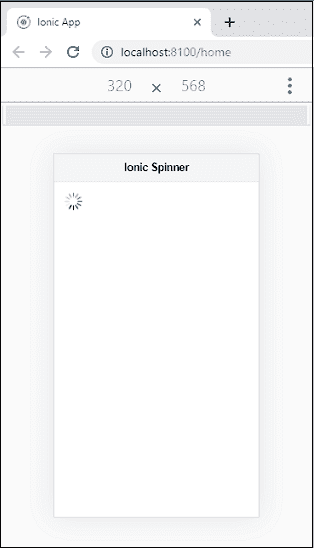
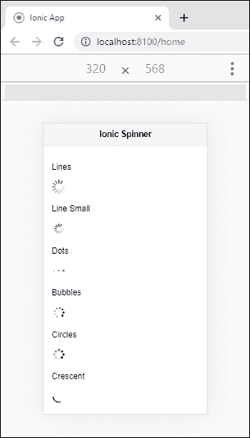
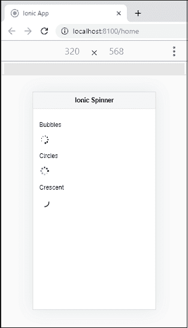
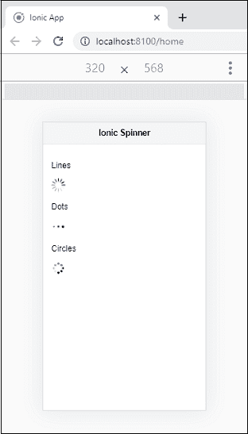
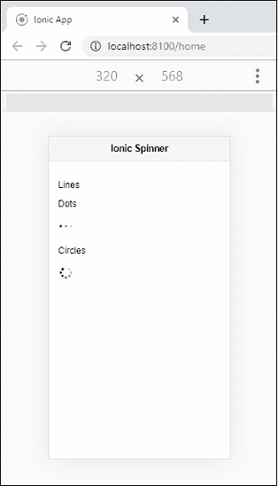
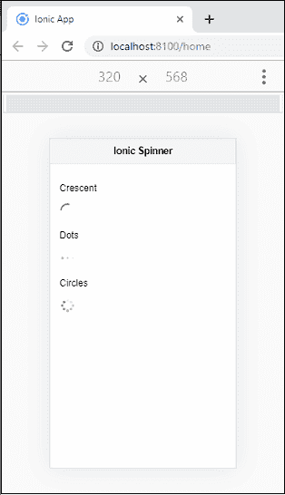

# Ionic 旋转器

> 原文：<https://www.javatpoint.com/ionic-spinner>

Ionic 旋转器组件提供了几个 **SVG** 旋转器。微调器是**视觉指示器**，指示应用程序正在加载内容或执行另一个过程，因此用户需要等待。

不同平台的默认微调器不同。例如， **iOS** 应用程序有默认的 Spinner **行**，而**安卓**应用程序有默认的 Spinner **新月**。如果平台不是 iOS 也不是安卓，默认的 Spinner 将是新月形的。我们可以使用标准的 **<Ionic 旋转器>** 组件来访问 Ionic 旋转器。

### 例子

此示例显示了默认微调器在 Ionic 应用程序中的使用。

```

<ion-header>
  <ion-toolbar color="light">
    <ion-title>Ionic Spinner</ion-title>
  </ion-toolbar>
</ion-header>

<ion-content fullscreen class="ion-padding">
  <ion-spinner></ion-spinner>
</ion-content>

```

**输出:**

当您执行上述代码片段时，它将给出以下输出。这里您可以看到默认的微调器加载，这是一条线。



#### 注意:我们也可以使用属性名称来更改默认的 Spinner。以下示例解释了在 Ionic 应用程序中使用的不同类型的 Spinner。

### 例子

```

<ion-header>
    <ion-toolbar color="light">
      <ion-title>Ionic Spinner</ion-title>
    </ion-toolbar>
</ion-header>

<ion-content fullscreen class="ion-padding">
  <p>Lines</p>
  <ion-spinner name="lines"></ion-spinner>

  <p>Line Small</p>
  <ion-spinner name="lines-small"></ion-spinner>

  <p>Dots</p>
  <ion-spinner name="dots"></ion-spinner>

  <p>Bubbles</p>
  <ion-spinner name="bubbles"></ion-spinner>

  <p>Circles</p>
  <ion-spinner name="circles"></ion-spinner>

  <p>Crescent</p>
  <ion-spinner name="crescent"></ion-spinner>
</ion-content>

```

**输出:**



## 暂停微调器

Ionic 微调器还允许我们使用一个属性来暂停微调器组件的动画。默认情况下，**暂停**属性为假。如果为真，微调动画将暂停。下面的例子有助于更清楚地理解它。

### 例子

在本例中，我们已经在圆形微调器中设置了暂停属性。

```

<ion-header>
  <ion-toolbar color="light">
    <ion-title>Ionic Spinner</ion-title>
  </ion-toolbar>
</ion-header>

<ion-content fullscreen class="ion-padding">
  <p>Bubbles</p>
  <ion-spinner name="bubbles"></ion-spinner>

  <p>Circles</p>
  <ion-spinner name="circles" paused></ion-spinner>

  <p>Crescent</p>
  <ion-spinner name="crescent"></ion-spinner>
</ion-content>

```

**输出:**

当上述代码执行时，您将获得以下输出。这里可以看到**圆旋转器**会暂停。



## 凝固时间

Ionic 还允许我们设置微调组件的持续时间。这意味着当达到您设置的时间时，微调组件的可视加载指示将消失。

### 例子

**Home.page.html**

```

<ion-header>
    <ion-toolbar color="light">
      <ion-title>Ionic Spinner</ion-title>
    </ion-toolbar>
  </ion-header>

<ion-content fullscreen class="ion-padding">
  <p>Lines</p>
  <ion-spinner *ngIf="show"></ion-spinner>

  <p>Dots</p>
  <ion-spinner name="dots"></ion-spinner>

  <p>Circles</p>
  <ion-spinner name="circles"></ion-spinner>
</ion-content>

```

**主页**

这里，我们已经为 Spinner 组件设置了超时持续时间。

```

import { Component } from '@angular/core';

@Component({
  selector: 'app-home',
  templateUrl: 'home.page.html',
  styleUrls: ['home.page.scss'],
})
export class HomePage {
  show = true;
  constructor() {
    setTimeout (() => {
      this.show = false;
    }, 3000 );
  }
}

```

**输出:**

当您执行上述代码片段时，它将给出以下输出。



每当达到您设定的时间限制时，线微调器加载的视觉指示器将消失。我们可以在下图中看到。



## 设置旋转器的样式

我们还可以为 Spinner 组件设置不同的样式或颜色。以下示例解释了在 Spinner 组件中不同颜色样式的使用。

### 例子

```

<ion-header>
    <ion-toolbar color="light">
      <ion-title>Ionic Spinner</ion-title>
    </ion-toolbar>
  </ion-header>

<ion-content fullscreen class="ion-padding">
  <p>Crescent</p>
  <ion-spinner name="crescent" color="dark"></ion-spinner>

  <p>Dots</p>
  <ion-spinner name="dots" color="danger"></ion-spinner>

  <p>Circles</p>
  <ion-spinner name="circles" color="success"></ion-spinner>

</ion-content>

```

**输出:**

当您运行 Ionic 应用程序时，它将显示以下屏幕。在这里，您可以看到每个 Spinner 组件的样式都是不同的。



* * *