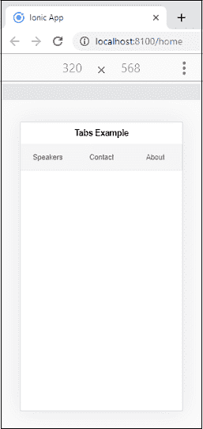
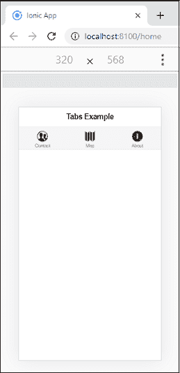
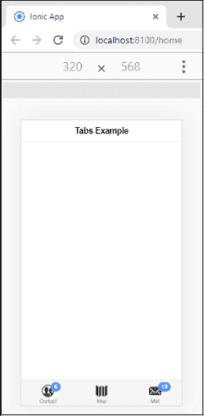

# 离子标签

> 原文：<https://www.javatpoint.com/ionic-tabs>

离子键主要用于**移动导航**。对于不同的操作系统，离子键的样式是不同的。**例如**在安卓设备中放在屏幕顶部，而在 iOS 设备中放在底部。我们可以使用标准的 **<离子标签>** 组件来访问离子标签。该组件作为**路由器出口**来处理导航。它不提供任何在选项卡之间切换的机制。如果需要在选项卡之间进行切换，使用 **<离子选项卡栏>** 作为<离子选项卡>的直接子元素。

您也可以将<ion-tabs>和<ion-tab-bar>用作独立元素。两者并不依赖于彼此来工作，但是可以一起使用来实现基于选项卡的导航，其行为类似于本地应用程序。<ion-tab-bar>组件需要一个槽来投影到<ion-tabs>组件中的正确位置。</ion-tabs></ion-tab-bar></ion-tab-bar></ion-tabs>

### 离子标签栏

它是一个包含一组选项卡按钮的用户界面组件。必须在选项卡内部提供此选项卡，以便与每个选项卡进行通信。

### 离子标签按钮

它是一个用户界面组件，位于标签栏内。它指定图标和标签的布局，并连接到选项卡视图。

### 简单选项卡

使用<ion-tabs>和<ion-tab-bar>组件可以创建简单的选项卡菜单。以下示例显示了如何在 Ionical 中创建选项卡。</ion-tab-bar></ion-tabs>

### 例子

```

<ion-header>
  <ion-toolbar>
    <ion-title>
      Tabs Example
    </ion-title>
  </ion-toolbar>
</ion-header>

<ion-content class="padding" >
  <ion-tabs>
    <ion-tab-bar slot="top" color="light">
      <ion-tab-button tab="speakers">
        <ion-label>Speakers</ion-label>
      </ion-tab-button>

      <ion-tab-button tab="map">
        <ion-label>Contact</ion-label>
      </ion-tab-button>

      <ion-tab-button tab="about">
        <ion-label>About</ion-label>
      </ion-tab-button>
    </ion-tab-bar>
  </ion-tabs>
</ion-content>

```

**输出**



## 添加图标

ion 还提供了一个<ion-icon>元素，用于向选项卡添加图标。我们可以用下面的例子来理解。</ion-icon>

**例**

```

<ion-header>
    <ion-toolbar>
      <ion-title>
        Tabs Example
      </ion-title>
    </ion-toolbar>
  </ion-header>

  <ion-content class="padding" color="light">
    <ion-tabs>
      <ion-tab-bar slot="top">
        <ion-tab-button tab="contact">
          <ion-icon name="contacts"></ion-icon>
          <ion-label>Contact</ion-label>
        </ion-tab-button>

        <ion-tab-button tab="map">
          <ion-icon name="map"></ion-icon>
          <ion-label>Map</ion-label>
        </ion-tab-button>

        <ion-tab-button tab="about">
          <ion-icon name="information-circle"></ion-icon>
          <ion-label>About</ion-label>
        </ion-tab-button>
      </ion-tab-bar>
    </ion-tabs>
  </ion-content>

```

**输出**



## 标签徽章

它是一个包含一个**数字**或任何其他**字符**的属性。它可以用作**通知**，告知有一个额外的项目与一个元素相关联，并指示有多少项目相关联。

**例**

```

<ion-header>
    <ion-toolbar>
      <ion-title>
        Tabs Example
      </ion-title>
    </ion-toolbar>
  </ion-header>

  <ion-content class="padding">
    <ion-tabs>
      <ion-tab-bar slot="bottom" color="light">
        <ion-tab-button tab="contact">
          <ion-icon name="contacts"></ion-icon>
          <ion-label>Contact</ion-label>
          <ion-badge>6</ion-badge>
        </ion-tab-button>

        <ion-tab-button tab="map">
          <ion-icon name="map"></ion-icon>
          <ion-label>Map</ion-label>
        </ion-tab-button>

        <ion-tab-button tab="mail">
          <ion-icon name="mail"></ion-icon>
          <ion-label>Mail</ion-label>
          <ion-badge>10</ion-badge>
        </ion-tab-button>
      </ion-tab-bar>
    </ion-tabs>
  </ion-content>

```

**输出**



* * *