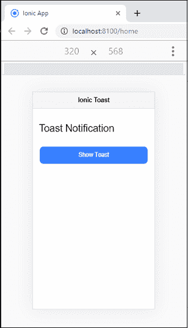
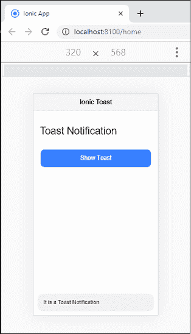
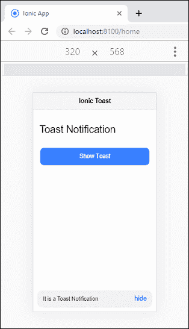
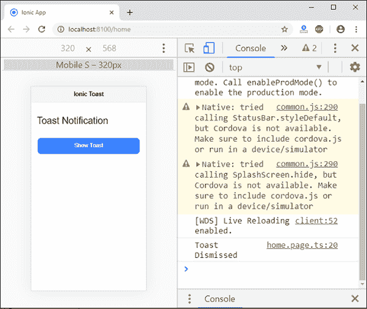
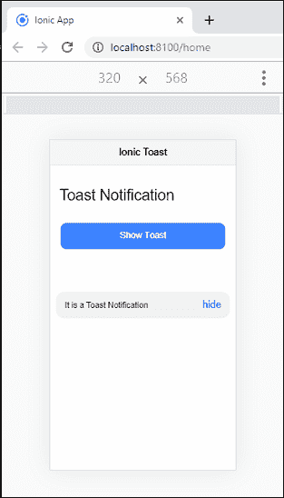

# 离子吐司

> 原文：<https://www.javatpoint.com/ionic-toast>

敬酒是现代应用中常用的一种通知。您可以使用它来显示系统消息，也可以使用它来提供有关操作的反馈。祝酒通知出现在应用程序内容的顶部。可以通过**解除**的 app，恢复用户与 app 的交互。

## 烤面包控制器

吐司控制器是一个组件，用于创建吐司组件。敬酒控制器使用**两种方法**创建敬酒通知。这些方法是:

1.  创造
2.  解散

### 创造

它用于创建吐司覆盖。所有的吐司选项都应该在 create 方法中传递。用于显示**消息**的消息属性。如果您想在吐司上显示关闭按钮，请将**显示关闭按钮**选项设置为**真**。

**例**

以下示例使用吐司控制器方法 **create()** 来显示吐司通知。在 HTML 文件中，按钮组件调用 **openToast()** 函数来显示 Toast 通知。函数的逻辑是在应用程序的 **ts 文件**中创建的。openToast()函数还包含属性的**消息**和**持续时间**。message 属性将显示通知消息，duration 属性将在指定时间后取消通知。

**Home.page.html**

```

<ion-header>
    <ion-toolbar color="light">
      <ion-title>Ionic Toast</ion-title>
    </ion-toolbar>
  </ion-header>

<ion-content fullscreen class="ion-padding">
  <h1>Toast Notification</h1>
  <br>
  <ion-button (click)="openToast()" expand="block">Show Toast</ion-button>
</ion-content>

```

**主页**

```

import { Component } from '@angular/core';
import { ToastController } from '@ionic/angular';

@Component({
  selector: 'app-home',
  templateUrl: 'home.page.html',
  styleUrls: ['home.page.scss'],
})
export class HomePage {
  constructor(public toastCtrl: ToastController) { }

  async openToast() {
    const toast = await this.toastCtrl.create({
      message: 'It is a Toast Notification',
      duration: 5000
    });
    toast.present();
  }
}

```

**输出:**

当您执行该应用程序时，它将给出以下输出。



现在，点击**显示吐司**按钮，你会得到通知信息。通知信息在**五秒**后消失。



### 解散

通过设置在吐司选项的持续时间内显示的毫秒数，可以在特定时间后自动取消吐司通知。如果您将“ **showCloseButton** ”设置为 **true** ，关闭按钮将会关闭吐司。如果你想在创作后解散吐司，叫**解散()**法。

**例**

**主页**

在这个文件中，我们将使用**消除**方法。一点击**隐藏按钮**，解散方法就消失了祝酒通知。

```

import { Component } from '@angular/core';
import { ToastController } from '@ionic/angular';

@Component({
  selector: 'app-home',
  templateUrl: 'home.page.html',
  styleUrls: ['home.page.scss'],
})
export class HomePage {
  constructor(public toastCtrl: ToastController) { }

  async openToast() {
    const toast = await this.toastCtrl.create({
      message: 'It is a Toast Notification',
      showCloseButton: true,
      closeButtonText: 'hide',
    });
    toast.present();
    toast.onDidDismiss().then((val) => {
      console.log('Toast Dismissed');
    });
  }
}

```

**输出:**

当你执行上面的 Ionic app 时，它会给出如下输出。现在，点击**显示吐司按钮**，通知信息出现在底部。点击隐藏**按钮**，敬酒通知将消失，相应消息显示在**控制台**中。




## 配置

您可以将吐司通知放置在视口的顶部、底部和中间。**位置属性**的值可以在创建方法中设置。位置值为顶部、**底部**、**中间**。默认情况下，敬酒通知的位置显示在视口的底部。

### 例子

在下面的例子中，我们将看到位置属性的使用。这里，敬酒通知的位置设置在中间。

```

import { Component } from '@angular/core';
import { ToastController } from '@ionic/angular';

@Component({
  selector: 'app-home',
  templateUrl: 'home.page.html',
  styleUrls: ['home.page.scss'],
})
export class HomePage {
  constructor(public toastCtrl: ToastController) { }

  async openToast() {
    const toast = await this.toastCtrl.create({
      message: 'It is a Toast Notification',
      animated: false,
      showCloseButton: true,
      closeButtonText: 'hide',
      position: 'middle',
    });
    toast.present();
    toast.onDidDismiss().then((val) => {
      console.log('Toast Dismissed');
    });
  }
}

```

**输出:**

当您运行上述代码片段时，您将获得输出。接下来，点击按钮，你会得到如下画面。在这里，您可以看到敬酒通知显示在中间。



* * *