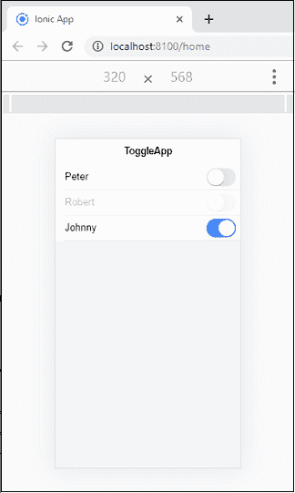
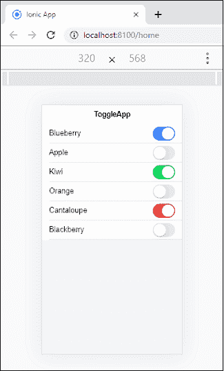

# Ionic 切换

> 原文：<https://www.javatpoint.com/ionic-toggle>

Ionic 开关是一种保存布尔值的输入组件。它改变单个选项的状态。它允许用户通过按压或滑动来切换设置上的**或**关闭**。也可以通过使用**选中的**属性以编程方式进行检查。您也可以将不同类型的属性(如**禁用**、**值**应用于切换以控制其行为。**

以下示例显示了如何在 Ionic 应用程序中使用 **<Ionic 切换>** 组件。在这里，我们可以看到默认切换、选中切换和禁用切换。

### 例子

```

<ion-header>
  <ion-toolbar>
    <ion-title>
      ToggleApp
    </ion-title>
  </ion-toolbar>
</ion-header>

<ion-content class="padding" color="light">
  <ion-item>
    <!-- Default Toggle -->
    <ion-label>Peter</ion-label>
    <ion-toggle></ion-toggle>
  </ion-item>
  <ion-item>
    <!-- Disabled Toggle -->
    <ion-label>Robert</ion-label>
    <ion-toggle disabled></ion-toggle>
  </ion-item>
    <ion-item>
      <!-- Checked Toggle -->
      <ion-label>Johnny</ion-label>
      <ion-toggle checked></ion-toggle>
    </ion-item>
</ion-content>

```

**输出**



## 设置切换样式

肘节元素的样式非常简单。它使用了 Ionic 框架中所有可用的颜色。以下示例显示列表和切换元素使用不同的颜色。

### 例子

```

<ion-header>
  <ion-toolbar>
    <ion-title>
      ToggleApp
    </ion-title>
  </ion-toolbar>
</ion-header>

<ion-content class="padding" color="light" fullscren>
  <!-- Styling Toggles in a List -->
  <ion-list>
    <ion-item>
      <ion-label>Blueberry</ion-label>
      <ion-toggle slot="end" name="blueberry" checked></ion-toggle>
    </ion-item>

    <ion-item>
      <ion-label>Apple</ion-label>
      <ion-toggle slot="end" name="apple" color="secondary"></ion-toggle>
    </ion-item>

    <ion-item>
      <ion-label>Kiwi</ion-label>
      <ion-toggle slot="end" name="kiwi" color="success" checked></ion-toggle>
    </ion-item>

    <ion-item>
      <ion-label>Orange</ion-label>
      <ion-toggle slot="end" name="banana" color="warning"></ion-toggle>
    </ion-item>

    <ion-item>
      <ion-label>Cantaloupe</ion-label>
      <ion-toggle slot="end" name="cantaloupe" color="danger" checked></ion-toggle>
    </ion-item>

    <ion-item>
      <ion-label>Blackberry</ion-label>
      <ion-toggle slot="end" name="blackberry" color="dark"></ion-toggle>
    </ion-item>
  </ion-list>
</ion-content>

```

**输出**



* * *