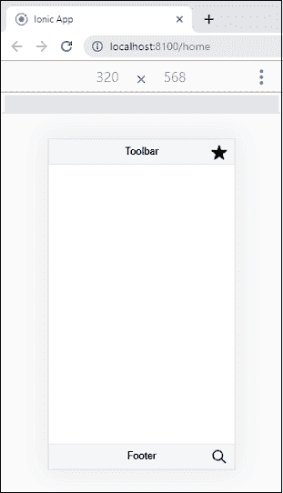
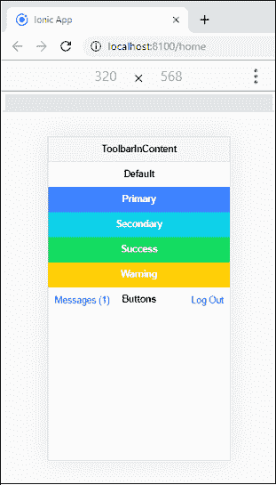
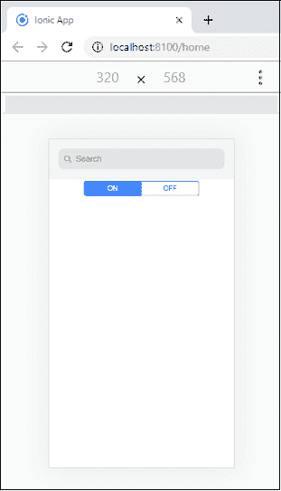

# Ionic工具栏

> 原文：<https://www.javatpoint.com/ionic-toolbar>

工具栏是一个通用栏，在应用程序中用作**页眉**、子页眉、**页脚**或子页脚。它位于内容的上方或下方。您可以在页面中添加多个工具栏，并且 **<Ionic内容>** 会相应调整。当工具栏放置在 **<Ionic头>** 内时，它将固定在内容的顶部。另一方面，当它放在 **<Ionic页脚>** 内时，它会固定在内容的底部。如果内容是**全屏**，它会在页眉或页脚的工具栏后面滚动。如果工具栏放在<Ionic内容>中，它会随着内容滚动。

Ionic工具栏包含以下组件:

### Ionic集管

它是包含工具栏组件的父组件。<ion-header>元素必须是页面的前三个根元素之一。</ion-header>

### Ionic页脚

它是位于页面底部的根组件。<ion-footer>可以是<ion-toolbar>的包装器，确保内容区域大小正确。</ion-toolbar>T3】</ion-footer>

### Ionic标题

它是一个设置工具栏标题的组件。

### Ionic按钮

它是一个容器元素，可以使用名为 slot 的属性将其放置在工具栏内部。插槽可以包含开始和结束属性。

### Ionic按钮

“后退”按钮用于在点击时在应用程序历史中向后导航。知道基于模式呈现什么以及何时基于导航堆栈显示内容是明智的。

### 例子

这个例子展示了工具栏中页眉和页脚的用法。

```

<ion-header>
  <ion-toolbar color="light">
    <ion-title>Toolbar</ion-title>
    <ion-buttons slot="primary">
      <ion-button>
        <ion-icon slot="icon-only" name="star"></ion-icon>
      </ion-button>   
    </ion-buttons>
  </ion-toolbar>
</ion-header>

<ion-content></ion-content>

<ion-footer>
  <ion-toolbar color="light">
    <ion-title>Footer</ion-title>
    <ion-buttons slot="primary">
      <ion-button>
        <ion-icon slot="icon-only" name="search"></ion-icon>
      </ion-button>
    </ion-buttons>
  </ion-toolbar>
</ion-footer>

```

**输出:**



### 例子

这个例子展示了<ion-content>元素中<ion-toolbar>的用法。</ion-toolbar></ion-content>T3】

```

<ion-header>
  <ion-toolbar color="light">
    <ion-title>ToolbarInContent</ion-title>
  </ion-toolbar>
</ion-header>

<ion-content fullscreen>
  <ion-toolbar>
    <ion-title>Default</ion-title>
  </ion-toolbar>

  <ion-toolbar color="primary">
    <ion-title>Primary</ion-title>
  </ion-toolbar>

  <ion-toolbar color="secondary">
    <ion-title>Secondary</ion-title>
  </ion-toolbar>

  <ion-toolbar color="success">
    <ion-title>Success</ion-title>
  </ion-toolbar>

  <ion-toolbar color="warning">
    <ion-title>Warning</ion-title>
  </ion-toolbar>

  <ion-toolbar>
    <ion-buttons slot="secondary">
      <ion-button>Messages (1)</ion-button>
    </ion-buttons>

    <ion-title>Buttons</ion-title>

    <ion-buttons slot="primary">
      <ion-button>Log Out</ion-button>
    </ion-buttons>
  </ion-toolbar>
</ion-content>

```

**输出:**



### 例子

这个例子展示了<ion-searchbar>和<ion-segment>元素与<ion-toolbar>元素的用法。</ion-toolbar></ion-segment></ion-searchbar>

```

<ion-header>
  <ion-toolbar color="light">
    <ion-searchbar (input)="getItems($event)"></ion-searchbar>
  </ion-toolbar>
</ion-header>

<ion-content>
  <ion-toolbar>
    <ion-segment>
      <ion-segment-button value="new">
        ON
      </ion-segment-button>
      <ion-segment-button value="hot">
        OFF
      </ion-segment-button>
    </ion-segment>
  </ion-toolbar>
</ion-content>

```

**输出:**



* * *