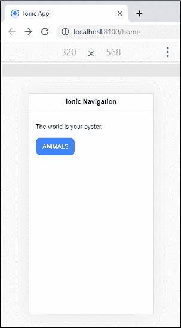
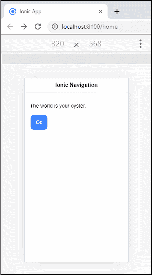
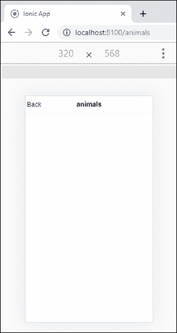
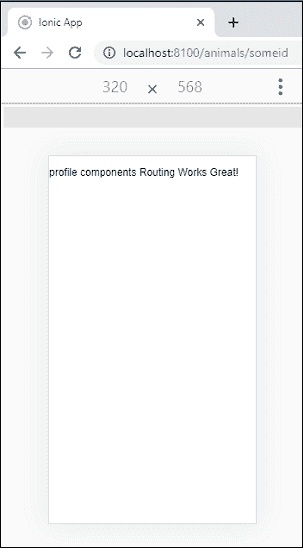
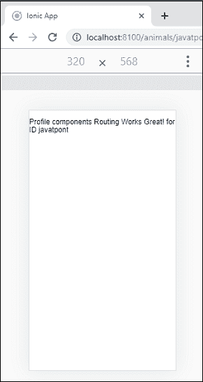

# Ionic导航和路由

> 原文：<https://www.javatpoint.com/ionic-navigation-and-routing>

导航意味着用户可以在Ionic应用程序的不同页面之间移动。在 ion 4 中，导航已经收到了许多变化。例如，v4 能够与官方的**角路由器**集成，而不是使用Ionic自己的**导航控制器**。它为整个应用程序提供了更一致的路由体验。角度路由器是角度应用程序中最重要的库。如果不可用，应用程序将无法在浏览器重新加载时保持导航状态。因此，有了 Ionic 框架和 Angular Router，您可以创建丰富的应用程序，这些应用程序是可链接的，并且具有丰富的动画。

传统网站使用线性历史，用户导航到需要的页面，可以按**后退按钮**后退。但是，在 Ionic Framework 中，应用程序可以通过允许并行导航来实现这一点。意味着它有多个导航栈，可以随时交换。

最新版本的 ion 使用**导航栈**来实现页面之间的导航。它可以简单地作为一堆页面工作，其中一个页面位于另一个页面之上。正如我们所知，堆栈只能访问顶部元素。ion 有一个类似的概念，你只能在导航栈的顶部查看页面。如果要导航到另一个页面，您需要执行以下两个操作之一:

*   **推送:**推送堆栈上的页面。这意味着将元素放在顶部。因此，当您导航到一个页面时，您正在将该页面推到堆栈的顶部。
*   **弹出:**弹出一个页面，直到你的目标页面在顶部。但是，有必要将您的页面放在导航堆栈上，这是您之前导航到的。因此，当你从一个页面导航时，你是从栈顶弹出这个页面。

让我们一步一步地看看如何在Ionic应用程序的不同页面之间导航。

### 案例 1

以下示例解释了应用程序中的基本导航。

**第一步:**创建**新项目**。你可以从[这里](ionic-installation)学习如何在Ionic 4 中创建一个项目。

**第二步:**创建**新页面**。此页面用于导航。

```

$ ionic g page animals

```

**第三步:**新创建的页面自动将其路径添加到 **app-routing.module.ts** 文件中，如下所示。

```

{ path: 'animals', loadChildren: './animals/animals.module#AnimalsPageModule' }{ path: 'animals', loadChildren: './animals/animals.module#AnimalsPageModule' }

```

在**app.component.html**中，**T4【Ionic路由器】出口>组件负责在应用程序中渲染页面。它专门用于Ionic路由，其工作原理与常规角路由器组件相同。**

**第四步:**创建页面后，打开**home.page.html**文件，添加以下代码。

```

<ion-header>
  <ion-toolbar>
    <ion-title>
      Ionic Navigation
    </ion-title>
  </ion-toolbar>
</ion-header>

<ion-content>
  <div class="ion-padding">
    <p>The world is your oyster.</p>
    <ion-button href="/animals">ANIMALS</ion-button>
  </div>
</ion-content>

```

**第五步:**现在，运行项目。出现以下屏幕。



当您点击**动物按钮**时，您将导航到动物页面。可以在下面的屏幕中显示。


### 案例 2

用户还可以通过**编程方式**在页面之间导航，这可以从下面的示例中理解。

**步骤-1:** 在**home.page.html**文件中添加以下按钮。

```

<ion-button (click)="go()">Go</ion-button>

```

**步骤 2:** 打开**首页. ts** 文件，插入以下代码。

```

import { Component } from '@angular/core';
import { Router } from '@angular/router';

@Component({
  selector: 'app-home',
  templateUrl: 'home.page.html',
  styleUrls: ['home.page.scss'],
})
export class HomePage {
  constructor(private router: Router) {}

  go() {
    this.router.navigate(['animals']);
  }
}

```

**第三步:**打开**animals.page.html**并添加以下按钮在上一页导航。

```

<ion-buttons slot="start" (click)="goBack()">Back</ion-buttons>

```

**第四步:**打开**动物页面**文件，插入以下代码。

```

import { Component, OnInit } from '@angular/core';
import { Router } from '@angular/router';

@Component({
  selector: 'app-animals',
  templateUrl: './animals.page.html',
  styleUrls: ['./animals.page.scss'],
})
export class AnimalsPage implements OnInit {

  constructor(private router: Router) { }

  ngOnInit() {
  }
  goBack() {
    this.router.navigate(['home']);
  }
}

```

**第五步:**执行 app。出现以下屏幕。



现在，点击**开始按钮**，你将导航到动物页面。在此页面，当您点击**后退按钮**时，页面自动导航至首页。



### 案例 3

导航也可以使用**网址**进行。你可以借助下面的例子来理解它。

**步骤 1:** 在**动物页面**内新建**组件**。要创建组件，请执行以下命令。

```

$ ionic g c animals/profile

```

**第二步:**接下来，打开**动物模块**文件，导入**轮廓组件**。然后，添加轮廓组件的路线以及 **id** 。在 **animals.module.ts** 文件中添加以下代码片段。

```

import { NgModule } from '@angular/core';
import { CommonModule } from '@angular/common';
import { FormsModule } from '@angular/forms';
import { Routes, RouterModule } from '@angular/router';

import { IonicModule } from '@ionic/angular';

import { AnimalsPage } from './animals.page';
import { ProfileComponent } from './profile/profile.component';

const routes: Routes = [
  {
    path: '',
    component: AnimalsPage
  },
  {
    path: ':id',
    component: ProfileComponent
  }
];

@NgModule({
  imports: [
    CommonModule,
    FormsModule,
    IonicModule,
    RouterModule.forChild(routes)
  ],
  declarations: [AnimalsPage, ProfileComponent]
})
export class AnimalsPageModule {}

```

**步骤-3:** 打开**home.page.html**文件，添加如下按钮。在这里，我们将在路由路径中传递一些**随机 id** 。

```

<ion-button href="/animals/someid">ANIMALS</ion-button>

```

**第 4 步:**打开**首页. ts** 文件，插入以下代码。

```

import { Component } from '@angular/core';
import { Router } from '@angular/router';

@Component({
  selector: 'app-home',
  templateUrl: 'home.page.html',
  styleUrls: ['home.page.scss'],
})
export class HomePage {
  constructor(private router: Router) {}

  go() {
    this.router.navigateByUrl('/animals');
  }
}

```

**第四步:**现在，执行 app，会得到如下画面。


点击**动物按钮**，您将在**档案**组件上导航。



### 案例 4

您也可以通过从 **URL** 中提取 id 来使上面的示例更加动态。要做到这一点，我们需要使用一种叫做**反无人机**的角度服务。下面的例子解释得更清楚。

**步骤 1:** 打开 **profile.component.ts** 文件，插入以下代码。

```

import { Component, OnInit } from '@angular/core';
import { ActivatedRoute } from '@angular/router';

@Component({
  selector: 'app-profile',
  templateUrl: './profile.component.html',
  styleUrls: ['./profile.component.scss'],
})
export class ProfileComponent implements OnInit {
  id: any;

  constructor(private route: ActivatedRoute) { }

  ngOnInit() {
    this.id = this.route.snapshot.paramMap.get('id');
  }
}

```

**第二步:**打开**profile.component.html**文件，添加如下代码。在这里，我们将显示 id，它将总是返回在 URL 中传递的新 id。

```

<p>
  Profile components Routing Works Great! for ID {{ id }}
</p>

```

**第三步:**现在，执行 app，会得到如下输出。每次导航到不同的 URL，都会在 UI 中显示不同的 id。



* * *